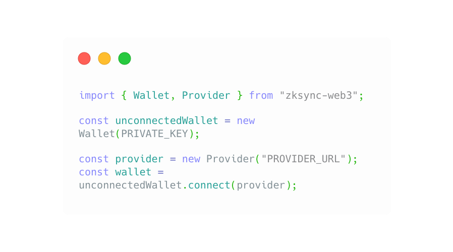

   

      

         

         <h1 >zkSync Era   documentation</h1>
         
Welcome to the docs! Here you will find guides, references and resources that will help you build with zkSync Era.

         

         

         

            
         

         

      

   

<section class=".info-section">
  

    <a href="/dev/fundamentals/zksync" class="card">
      

        <h3>About zkSync Era</h3>
        
Learn everything that makes zkSync thick. 

      

    </a>
    <a href="/dev/developer-guides/hello-world" class="card">
      

        <h3>Getting started</h3>
        
A series of quick starts to get you off localhost.

      

    </a>
    <a href="/api" class="card">
      

        <h3>SDK References</h3>
        
References for your favourite SDKs.

      

    </a>
  

</section>

    Explore Products

<section>
  

      <a href="/api/hardhat" class="card">
         

            <h3>Hardhat Plugins</h3>
            
Explore Hardhat plugins in your Solidity and Vyper apps. 

         

      </a>
   <a href="/api/tools/block-explorer" class="card">
      

        <h3>Block Explorer</h3>
        
Interact with zkSync Era blockchain. 

      

   </a>
   <a href="https://portal.zksync.io/bridge" class="card">
      

        <h3>zkSync Era Portal</h3>
        
Bridge, deposit and withdraw ERC20 tokens.

      

   </a>
      <a href="/api/tools/block-explorer/contract-verification" class="card">
         

            <h3>Contract verification</h3>
            
Write, verify and deploy your smart contracts. 

         

      </a>
  

</section>