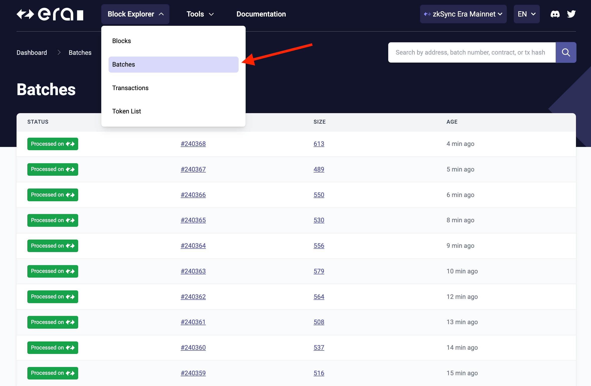

# Browse batches

Batches contain multiple transactions that are processed together in one [block](../../../dev/developer-guides/transactions/blocks.md#blocks) before they're added to the main blockchain. 

By putting several transactions into a single batch, we reduce the number of transactions that need to be processed and validated, this results in faster transaction processing times and lower fees for users interacting with zkSync Era.

On the block explorer home screen, you'll see the 10 most recent batches by default. If you want to see all the recent batches or get details on a specific batch, you can go to the batches page, which is also accessible from the top menu.

## See all batches

You can view the details of a specific batch by clicking on its batch number. To explore more batches, go to the "[Batches](https://explorer.zksync.io/batches/)" section in the navigation menu and use the pagination to navigate to the next page. 

If you've left the homepage, you can still search for a batch by typing in its batch number. 

Batches are similar to blocks and have properties like block headers and transactions.

1. The block header

- This shows brief information about this specific batch, as well as a link to the previous batch in the chain.

2. Transactions

- Lists of all the transactions that were included in this batch.

Check for the [block header](./block-view.md#block-headers) and [transaction](./block-view.md#transactions) batch properties.
