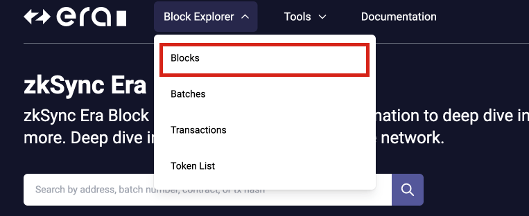

# Browse blocks

The block explorer home screen shows the 10 most recent blocks by default. To see a more complete overview of recent blocks, you can view all blocks. You can also click on a specific block number to see details about that particular block.
You can access the blocks page from the top menu as well.

## See all blocks

To see details of a specific block, just click on its block number. If you want to view more blocks, go to the [Blocks](https://explorer.zksync.io/blocks/) section in the navigation menu and use pagination to navigate to the next page.

If you are not on the homepage, you can still search for a block by typing in its block number. A block has two main sections.

A block has two main parts:

1. Block Header: It provides a summary of the block's information, along with a link to the previous block in the chain.

2. Transactions: It lists all the transactions that were included in the block.

### Block headers

This table will help you understand what you'll see in a block. To learn more about blocks, check out the documentation on [Blocks](../../../dev/developer-guides/transactions/blocks.md).

| Value        | Description                                                                |
| ------------ | -------------------------------------------------------------------------- |
| Block number | The number of the current block. `null` if pending. [More info on block.number](../../../dev/developer-guides/transactions/blocks.md#block-number-and-timestamp-considerations)    |
| Block size   | The size of the block.                                                     |
| Timestamp    | The UNIX timestamp for when the block was collated. [More info on block.timestamp](../../../dev/developer-guides/transactions/blocks.md#block-number-and-timestamp-considerations)|
| Root hash    | The Cryptographic hash of the block header.                                |
| Status       | The status of the block, could be `sealed`, `included`, `finalized`, or `unfinalized`. |

### Transactions

In this part, you can find a list of all the transactions included in this block. Transactions are processed in the order they are received, but we plan to introduce a "priority heap" in the future to sort transactions differently.

| Value             | Description                                                                                                                                              |
| ----------------- | ------------------------------------------------------------------------------------------------------------------------------------------------------------------------------ |
| Timestamp         | The block generation time in seconds since the Unix epoch.                                                                                               |
| Hash              | The hash of the transaction serving as the transaction’s ID.                                                                                             |
| From              | The account or smart contract, sending the transaction.                                                                                                  |
| To                | The account or smart contract, the transaction targeted.                                                                                                 |
| Fee               | The rate of fees associated with this transaction processing.                                                                                            |
| Tokens transferred| Details about the tokens(both `to` and `from` addresses) involved in the transactions, it includes, details like the assets, balance in the wallet address, and token address. |
| Contract address  | The rate of fees collected by the network.                                                                                                               |
