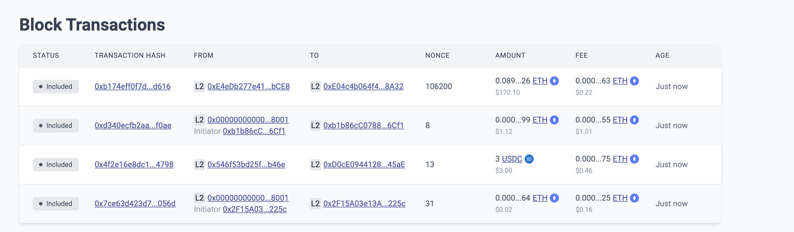

# View Blocks

By default, the block explorer home screen displays the 5 most recent blocks on the chain. Click on a specific block number for information about that block, or View All Blocks for a more detailed overview of recent blocks. 
The blocks page can also be accessed from the top menu.

## View all blocks

The view all blocks page shows updated details from the most recent blocks. Use the pagination to navigate to the next page.

However, if you have already left the homepage, you can always search for any Ethereum, DAI, LINK, wBTC, and USDC block by typing in the block number.
Each block is packed with information. 

There are two main sections inside a block:

1. The Block Header
- This shows brief information about this specific block, as well as a link to the previous block in the chain.
2. Transactions
- Consists of lists of all the transactions that were included in this block. 

### Block headers
The following table should help explain what you’ll see in a block.
For more details on blocks, see the docs on [Blocks](../../../dev/developer-guides/transactions/blocks.md).

| Value            | Description      |
| ----------------------- | --------- |
| Block number            | The height on the chain.|
| Block size              | The size of the block.  |
| Timestamp               | The ISO timestamp when the block was created and was included in the blockchain.  |
| Root hash               | The Cryptographic hash of the block header. |
| status                  | The status of the block, could be `sealed`, `finalized`, or `unfinalized`.  |

### Transactions

This section lists all the transactions that are included in this block. 
Transactions are chosen from the network mempool in order of highest fee first.

| Value            | Description      |
| ----------------------- | --------- |
| Block                   | The the block containing the transaction.|
| Timestamp               | The ISO timestamp when the transaction was created.  |
| Hash                    | The hash of the transaction serving as the transaction’s ID |
| From                    | The account sending the transaction. |
| To                      | The account or smart contract the transaction targeted. |
| Call data               | The function hash and 32 byte argument passed to the contract. |
| Fee                     | The rate of fees collected by the network. |
| Tokens transfered       | Details about the tokens(both `to` and `from` addresses) involved in the transactions, it includes, details like the assets, balance in the wallet address, and token address. |
| Contract address        | The rate of fees collected by the network. |