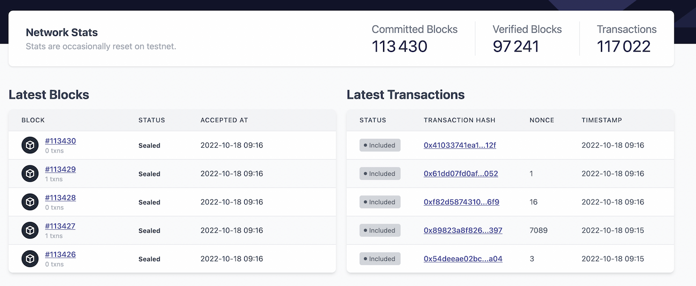

# 浏览区块

区块资源管理器的主屏幕，默认显示链上的10个最近的区块。
查看所有区块，可以更全面地了解最近的区块，或者点击特定的区块编号，了解该区块的详细信息。
区块页面也可以通过顶部菜单访问。

## 查看所有区块

你可以点击某个区块的编号，查看该特定区块的所有细节。如果你想浏览更多的区块，请点击导航菜单上的[区块](https://explorer.zksync.io/blocks/)部分。使用分页法导航到下一页。

然而，如果你已经离开了主页，你可以随时通过输入区块编号来搜索任何区块。

一个区块内有两个主要部分。

1. 区块标题

- 这显示了关于这个特定区块的简要信息，以及与链中前一个区块的链接。

2. 交易

- 由包含在该区块中的所有交易的列表组成。

### 区块标题

下表应该有助于解释你在区块中会看到什么。
关于区块的更多细节，请参见[区块](.../.../dev/developer-guides/transactions/blocks.md)的文档。

| Value        | Description                                                                |
| ------------ | -------------------------------------------------------------------------- |
| Block number | The unique sequential number for this block.                               |
| Block size   | The size of the block.                                                     |
| Timestamp    | The block generation time in seconds since the Unix epoch.                 |
| Root hash    | The Cryptographic hash of the block header.                                |
| Status       | The status of the block, could be `sealed`, `finalized`, or `unfinalized`. |

### 交易

这一部分列出了包含在这个区块中的所有交易。
交易是以先入先出的方式进行的，但在未来，我们将引入一个 "优先级堆"，这将允许对交易进行排序。

| Value             | Description                                                                                                                                                                    |
| ----------------- | ------------------------------------------------------------------------------------------------------------------------------------------------------------------------------ |
| Block             | 一个区块中的交易量                                                                                                                                 |
| Timestamp         | 从Unix epoch开始的区块生成时间，单位是秒。                                                                                           |
| Hash              | 交易的哈希值，作为交易的ID。                                                                                                     |
| From              | 账户或智能合约，发送交易。                                                                                                           |
| To                | 账户或智能合约，交易对象。                                                                                                          |
| Fee               | 与此交易处理相关的费用率。                                                                                                     |
| Tokens transferred | 关于交易中涉及的代币（包括 "to "和 "from "地址）的详细信息，它包括资产、钱包地址的余额和代币地址等细节。 |
| Contract address  | 网络收取的费用比率。                                                                                                                           |
