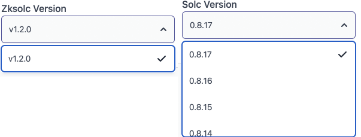
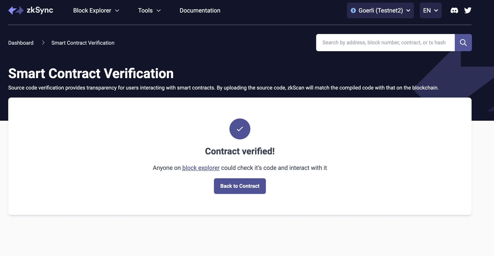

# 合约验证

## 什么是合约验证？

当你在网络上部署一个智能合约时，你基本上是在部署由Solidity编译器产生的字节码。

验证一个合约需要确定链上字节码在编译时是否与给定的源代码相匹配。如果匹配，我们就可以说我们已经确认了字节码的源代码的完整性。因此而得名--验证。

## 智能合约在zkSync中是如何验证的？

在验证过程中，使用zkSync对部署的字节码和智能合约的Solidity源代码进行比较。该算法对源代码进行编译，以比较生成的字节码和部署的字节码。
<br>
如果双方在各方面都匹配，合同就被验证了。

代码验证需要六个参数。

- 合约地址
- 合约名称
- 源代码，包括所有导入的源代码
- 用来产生部署的字节码的编译器的版本
- 关于编译器优化的数量的信息（如果有）。
- 构造函数参数

如果这些信息中的任何一条是错误的，验证过程就会失败。

## 源代码隐私

当你的智能合约部署在zkSync上并在区块资源管理器上得到验证时，用户可以检查经过验证的源代码并与之互动。

## 使用zkSync区块浏览器验证合约

要想开始，请点击顶部标题中的**工具**标签，将弹出一个下拉菜单并选择**智能合约验证**，之后你将看到以下屏幕。


### 输入合约细节

要核实合同，请输入以下细节。

- 合同地址。提供的地址必须与创建合同时产生的`0x'地址一致。
- 合同名称：该名称必须与合同中提供的名称相同。
- 优化。这将检查在编译合同时是否使用了优化。如果您在编译期间启用了优化，请勾选**是**，否则选择**否**。
- Solidity 编译器版本(Solc): 这指定了用于编译智能合约的编译器的确切版本。点击下拉菜单，指定使用的编译器版本。我们鼓励你使用`0.8.16`版本。.
- zkSync编译器版本（Zksolc）。使用的zkSync编译器版本，默认设置为`v1.2.0`。.

<br>



- 输入 Solidity 合同代码。从您的编辑器中复制代码并将其粘贴到文本区。
  
  <br>
  **Note:** 如果您的 Solidity 代码利用了一个库或从另一个合同中继承了依赖关系，您可能需要将其扁平化。<br>
  我们建议使用[Hardhat flatten](https://medium.com/coinmonks/flattening-smart-contracts-using-hardhat-dffe7dbc7b3f)、[Truffle flattener](https://github.com/NomicFoundation/truffle-flattener)或[POA Solidity flattener](https://github.com/poanetwork/solidity-flattener)。

- 构造函数参数。如果合同要求构造函数参数，你应该在这里添加它们，但要以[ABI hex-encoded form](https://solidity.readthedocs.io/en/develop/abi-spec.html)。

<br>

### 你如何获得你的构造函数参数？

> **Note: 获取构造函数参数数据的最简单方法是在部署时将其打印到控制台。

例如，如果使用我们的[教程](./././dev/building-on-zksync/hello-world.md)，你可以找到这一行。

```js
const greeterContract = await deployer.deploy(artifact, [greeting]);
```

如果你将下一行添加为

```js
console.log(greeterContract.interface.encodeDeploy([greeting]));
```

那么你将收到构造函数参数数据。

- 最后，点击**验证智能合约**按钮。

<br>如果一切顺利，你会看到一个成功的消息.

<br>


