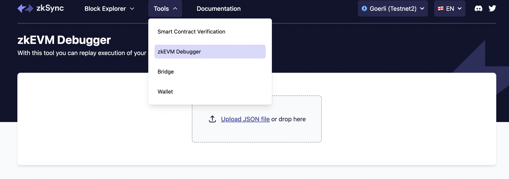

## 使用zkEVM调试器

### 概述

契约执行的缺点是很难确定一个事务做了什么。一个事务收据有一个状态代码，表明执行是否成功，但没有办法确定哪些数据被更新或哪些外部合约被触发。zkSync zkEVM调试器弥补了这一点，它可以复制你的智能合约的执行，并捕捉EVM到底做了什么的数据，让你检查每个指令。

可以从顶部菜单进入[调试器页面](https://explorer.zksync.io/tools/debugger)。

### 调试步骤

以下是调试或跟踪交易的步骤。

1. 上传一个JSON文件。点击 "Upload JSON file "按钮，你会看到一个带有保存提示的模式窗口，或者直接将文件拖放到上传对话框中。要了解文件类型的规范，请阅读[EVM跟踪规范](https://eips.ethereum.org/EIPS/eip-3155)。
2. 文件上传。显示一个加载器屏幕，表示正在加载跟踪文件。
3. 3.上传成功后，调试器状态变为活动状态。
4. 要继续调试，请点击 "Start "按钮。

这些是调试时需要注意的一些**键盘快捷键。

- `Cmd + K`。这将打开搜索栏。
- 箭头左/右"。这将使你进入下一条或上一条指令。
- 箭头顶部/底部"。它将带您到本合约中的下一个上一个函数。
- Shift + 箭头"。它将带你到下一个或上一个合同
