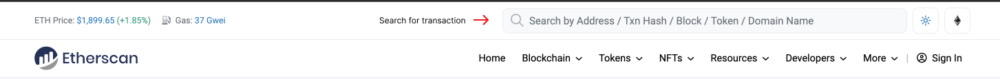
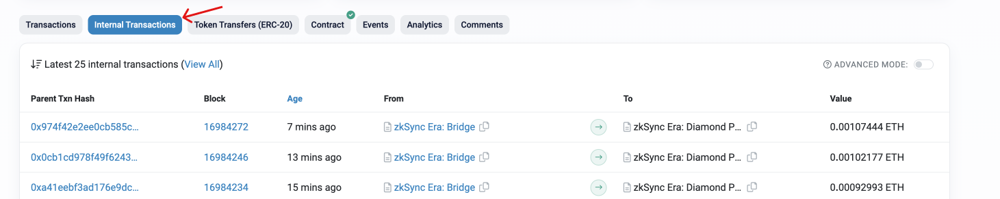
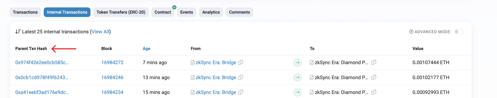

---
head:
  - - meta
    - name: "twitter:title"
      content: Withdrawal Delay | zkSync Docs
---

# Withdrawal delay

In order to prevent a quick drain of the protocol in the case a critical bug is discovered and exploited, we are introducing a block execution delay. Each L2 block committed to L1 will have a time lock before it is executed and finalized. This means that there is enough time to verify the effects of the transactions included in a block before the block becomes final. The zkSync team will be monitoring each block and investigating any anomaly (e.g. rapid outflow, unusually large withdrawals, etc).

To introduce this time lock, no changes were made to the audited smart contracts. Instead, we have used an existing Validator role that we control and that we further restricted by pointing it to an intermediate smart contract with a time lock. The time lock is initially configured for a **24-hour** delay, which will gradually decrease as the system matures. Changing the delay requires multiple signatures collected from several cold wallets owned by zkSync leadership.

This design has the following advantages:

- Even if an attacker finds a critical bug in ZK circuits and also successfully compromises the servers running our sequencer, there is plenty of time to detect an exploit, investigate, and freeze the protocol via governance.
- No changes were introduced to the zkSync Era contracts, so even if the intermediate contract is compromised we revert back to the original state.
- Delayed execution affects not only the standard zkSync ETH and ERC20 bridges but also any custom bridge built by a different team.
- Implementing the logic in an external governor-controlled contract makes it easy to remove this limitation later.

## Why can't I find my withdrawal on Etherscan?

There are several reasons why your withdrawal may be successful but you cannot see your tokens, or the transaction, on Etherscan. For example:

1. **Delay in block confirmation**: as mentioned in the [withdrawal delay](#withdrawal-delay) section above, successful withdrawals may be subject to an ongoing confirmation process. Consequently, you won't be able to see your transaction on Etherscan until the confirmation process completes.

2. **Transaction reverted**: a withdrawal may fail to appear on Etherscan if the transaction is reverted due to a conflict or issue with the smart contract that executed the transaction. In such cases, the transaction is canceled and it won't be included on Etherscan.

3. **Wrong address**: if a user mistakenly sends tokens to an incorrect address, the transaction will not be visible on Etherscan, and the tokens will not arrive in the intended recipient's wallet.

### Transactions in Etherscan

The **Transactions** section in Etherscan displays transactions between two Ethereum addresses. Each transaction has details such as the transaction hash, the block number, the timestamp, the sender and receiver addresses, the amount of Ether or tokens involved, and the transaction fee. These transactions are confirmed by the network and are typically sent from one external address to another.

On the other hand, **Internal Transactions** are initiated by a smart contract or other internal code execution within the Ethereum network. Although these transactions can be prompted by user activity, they are not sent directly from one address to another but are instead part of the internal workings of a smart contract. Internal transactions may involve the transfer of ETH or ERC20 tokens between different addresses within the contract.

::: tip
Withdrawals from the zkSync Era network are typically internal transactions managed by the [zkSync Era Diamond Proxy](https://etherscan.io/address/0x32400084c286cf3e17e7b677ea9583e60a000324) contract. These transactions are recorded in the **Internal Transactions** section in Etherscan due to their internal nature.
:::

In summary, the **Transactions** section in Etherscan displays transactions between external addresses, while the **Internal Transactions** section displays transactions that occur within smart contracts.

### How to check your internal transactions

1. Launch your web browser and visit [Etherscan.io](https://etherscan.io/).

2. In the search bar at the top of the page, enter the Ethereum wallet address you used to withdraw funds. This should be the address you withdrew funds from, not the destination address.

3. Click **Enter**.

4. Scroll down to the **Internal Transactions** section.

5. Look for the internal transaction that corresponds to your withdrawal. You should see a transaction that shows the withdrawal amount coming from the bridge.

::: tip
Withdrawal transactions from zkSync Era appear as transactions from **zkSync Era: Diamond Proxy** to your wallet address.
:::

6. Once you've located the transaction, click on the **Parent Tx Hash** to view more details about the transaction, including the block number, gas used, and sender and recipient addresses.

If for any reason you're still unable to see your withdrawal transaction after following these steps, please contact us on Discord and we will look into it.
