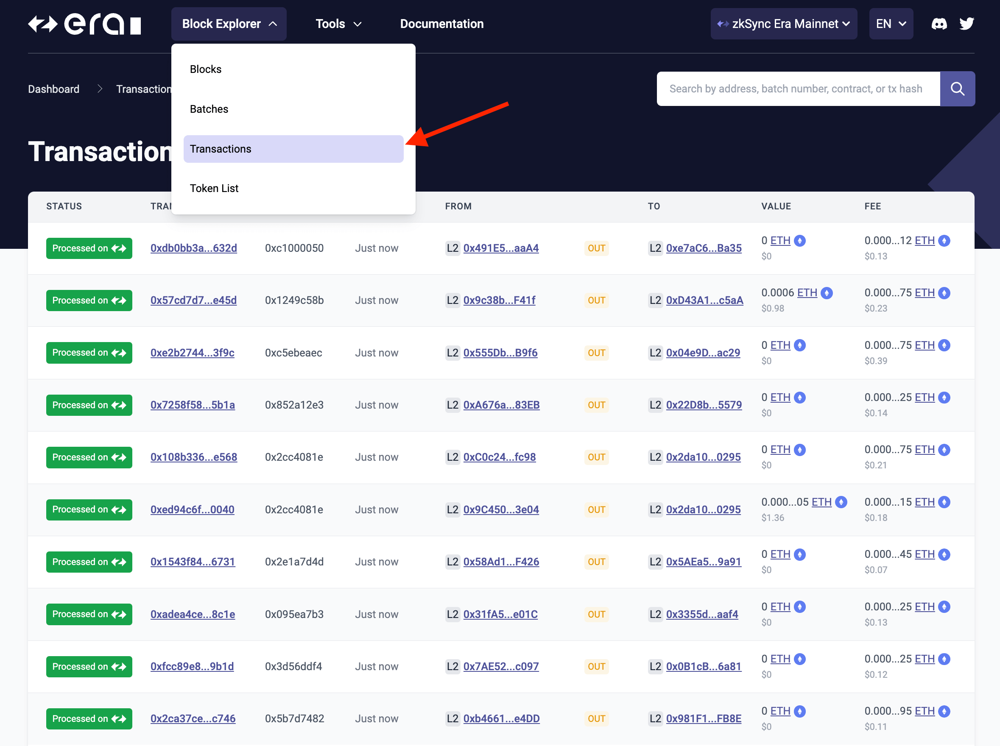
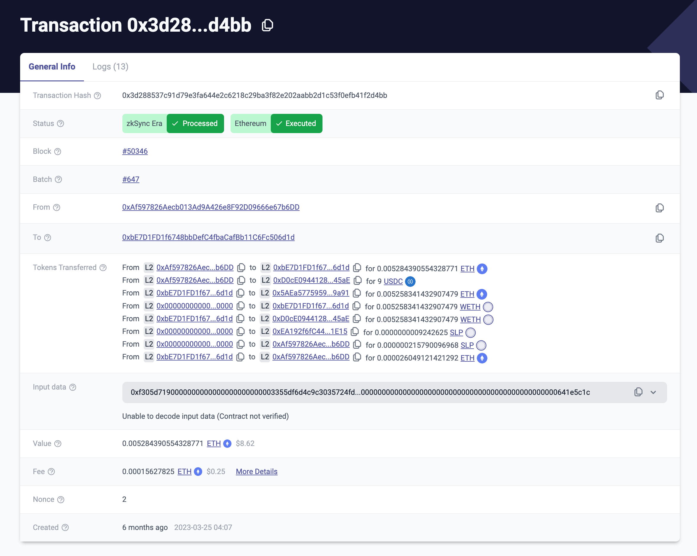

---
head:
  - - meta
    - name: "twitter:title"
      content: Block Explorer Menu | zkSync Docs
---

# Block explorer menu

The [zkSync Era block explorer menu](https://explorer.zksync.io/) displays real-time and historical graphical data on [blocks](#blocks), [batches](#batches), [transactions](#transactions), and [tokens](#token-list).

## Blocks

- Click [**Blocks**](https://explorer.zksync.io/blocks/) in the block explorer menu to go to the Blocks page.

- Blocks are listed by block number, newest first, with status details and age.

- Blocks are paginated in groups of 10 and you can scroll through the pages at the bottom, or add a specific block number to the URL.

  For example [https://explorer.zksync.io/block/41849](https://explorer.zksync.io/block/41849).

- Click on any block number to see more details about a block.

- **Block Size** denotes the number of transactions in a block.

- **Batch** displays the batch number in which the block is submitted to L1.

- The block details page lists all transactions included in the block.

## Batches

- Click [**Batches**](https://explorer.zksync.io/batches/) in the block explorer menu to go to the Batches page.

- Batches are listed by batch number, newest first, with status details, size, and age.

- Click on any batch number to see more details about a batch.

- **Batch Size** denotes the number of transactions in a batch.

- **Commit tx hash** is the hash of the L1 transaction hash on Etherscan.

- **Committed**, **Proven**, and **Executed** are verification stages the batch goes through and go to Etherscan L1 details.

- The batch details page lists all transactions included in the batch.

## Transactions

- Click [**Transactions**](https://explorer.zksync.io/transactions/) in the block explorer menu to go to the Transactions page.

- Transactions are listed by status and transaction hash, newest first, method, age, initiator address, recipient, value and fee.

- Click on a transaction hash to see more details.

| Data point         | Description                                                                                                                                                                                                                                                  |
| ------------------ | ------------------------------------------------------------------------------------------------------------------------------------------------------------------------------------------------------------------------------------------------------------ |
| Transaction Hash   | Unique 66 character identifier generated when transaction submitted to L2.                                                                                                                                                                                   |
| Status             | One of `Indexing`, `zkSync Era Processed, Ethereum Sending`, `zkSync Era Processed, Ethereum Validating`, `zkSync Era Processed, Ethereum Executing`, `zkSync Era Processed, Ethereum Executed` or `Failed` with links to Etherscan (if they exist already). |
| Block              | Block number containing the transaction.                                                                                                                                                                                                                     |
| Batch              | Batch number containing the transaction.                                                                                                                                                                                                                     |
| From               | The account or smart contract address sending the transaction.                                                                                                                                                                                               |
| To                 | The transaction recipient.                                                                                                                                                                                                                                   |
| Tokens Transferred | Details on all tokens transferred by the transaction.                                                                                                                                                                                                        |
| Input data         | Any additional data used by the transaction for verified contracts.                                                                                                                                                                                          |
| Value              | Amount of Ether being transferred from one address to another within a transaction.                                                                                                                                                                          |
| Fee                | Fee for the tx in ETH and USD value. Click **More Details** to see info on refunds.                                                                                                                                                                          |
| Nonce              | Sender nonce.                                                                                                                                                                                                                                                |
| Created            | Timestamp of when the transaction was added to the block.                                                                                                                                                                                                    |

## Token list

- Click [**Token List**](https://explorer.zksync.io/tokenlist) in the block explorer menu to go to the Token List page.

- Use the token addresses for bridging tokens.
