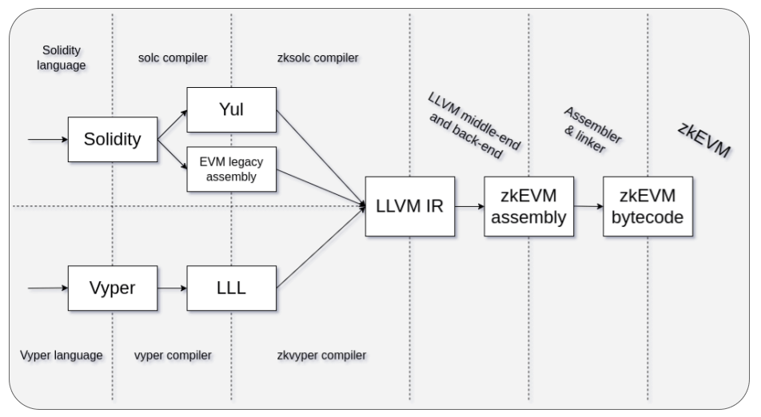

---
head:
  - - meta
    - name: "twitter:title"
      content: Compiler Overview | zkSync Docs
---

# Overview

This section introduces the zkEVM LLVM-based compiler toolchain for smart contract languages with Ethereum Virtual Machine
(EVM) support. The toolchain works on top of existing compilers and requires their output, which typically includes
intermediate representations (IRs), abstract syntax trees (ASTs), and auxiliary contract metadata and documentation.

::: info
At the time of writing, we support Solidity and Vyper.
:::

The toolchain consists of the following:

1. [High-level source code compilers](#high-level-source-code-compilers): `solc` and `vyper`.
2. [IR compilers, front ends to LLVM](#ir-compilers): `zksolc` and `zkvyper`.
3. [The LLVM framework](../../zk-stack/components/compiler/toolchain/llvm.md) with a zkEVM back end which emits zkEVM text assembly.
4. [The assembler](#assembler) which produces the zkEVM bytecode from text assembly.
5. [Hardhat plugins](#hardhat-plugins) which set up the environment.

## High-level Source Code Compilers

High-level source code is processed by third-party compilers. These compilers do the following:

1. Process and validate the high-level source code.
2. Translate the source code into IR and metadata.
3. Pass the IR and metadata to our IR compilers via the standard I/O streams.

We are using two high-level source code compilers at the time of writing:

- [solc](https://github.com/ethereum/solc-bin): the official Solidity compiler. For more info, see the latest [Solidity documentation](https://docs.soliditylang.org/en/latest/).
- [vyper](https://github.com/vyperlang/vyper/releases): the official Vyper compiler. For more info, see the latest [Vyper documentation](https://docs.vyperlang.org/en/latest/index.html).

::: info Security and best practices
Follow the [security considerations and best practices](../../build/quick-start/best-practices.md) to build smart contracts on zkSync Era.
:::

## IR Compilers

Our toolchain includes LLVM front ends, written in Rust, that process the output of high-level source code compilers:

- [zksolc](https://github.com/matter-labs/zksolc-bin) which calls `solc` as a child process. For more info, see the latest [zksolc documentation](../../zk-stack/components/compiler/toolchain/solidity.md).
- [zkvyper](https://github.com/matter-labs/zkvyper-bin): which calls `vyper` as a child process. For more info, see the latest [zkvyper documentation](../../zk-stack/components/compiler/toolchain/vyper.md).

These IR compilers perform the following steps:

1. Receive the input, which is usually standard or combined JSON passed by the Hardhat plugin via standard input.
2. Save the relevant data, modify the input with zkEVM settings, and pass it to the underlying high-level source code compiler which is called as a child process.
3. Receive the IR and metadata from the underlying compiler.
4. Translate the IR into LLVM IR, resolving dependencies with the help of metadata.
5. Optimize the LLVM IR with the powerful LLVM framework optimizer and emit zkEVM text assembly.
6. Print the output matching the format of the input method the IR compiler is called with.

Our IR compilers leverage I/O mechanisms which already exist in the high-level source code
compilers. They may modify the input and output to some extent, add data for features unique to zkEVM,
and remove unsupported feature artifacts.

## Assembler

The [assembler](https://github.com/matter-labs/era-zkevm-assembly), which is written in Rust, compiles zkEVM assembly
to zkEVM bytecode. This tool is not a part of our LLVM back end as it uses several cryptographic libraries which are
easier to maintain outside of the framework.

## Hardhat Plugins

We recommend using our IR compilers via [their corresponding Hardhat plugins](../tooling/hardhat/getting-started.md).
Add these plugins to the Hardhat's config file to compile new projects or migrate
existing ones to zkSync Era. For a lower-level approach, download our compiler binaries via the
links above and use their CLI interfaces.

### Installing and configuring plugins

Add the plugins below to the Hardhat's config file to compile new projects or migrate
existing ones to zkSync Era. For a lower-level approach, download our compiler binaries
[links above](#ir-compilers) and use their CLI interfaces.

- [hardhat-zksync-solc documentation](../tooling/hardhat/hardhat-zksync-solc.md)
- [hardhat-zksync-vyper documentation](../tooling/hardhat/hardhat-zksync-vyper.md)

::: warning

- Using compilers running in Docker images is no longer supported.
- Instead, use the `compilerSource: "binary"` in the Hardhat config file to use the compiler binary.
- To compile with binaries, use `zksolc <contract>.sol --bin`.
  :::
