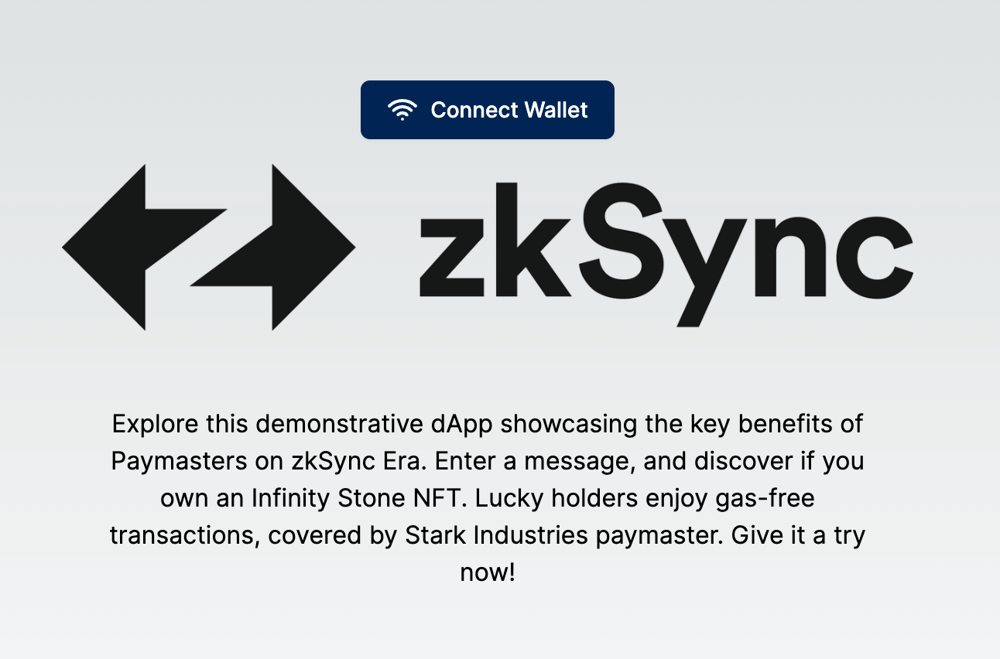
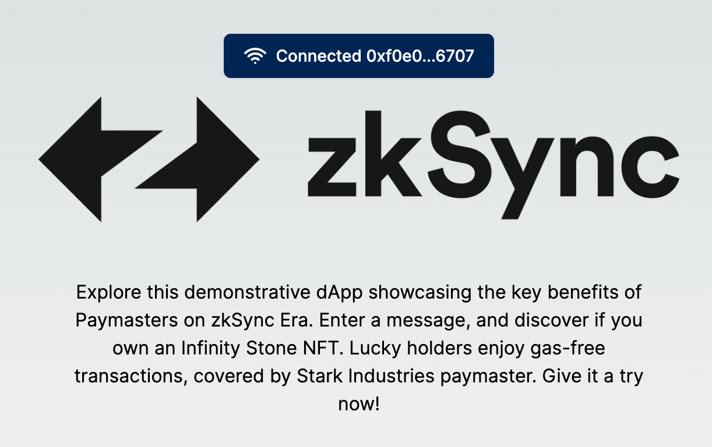
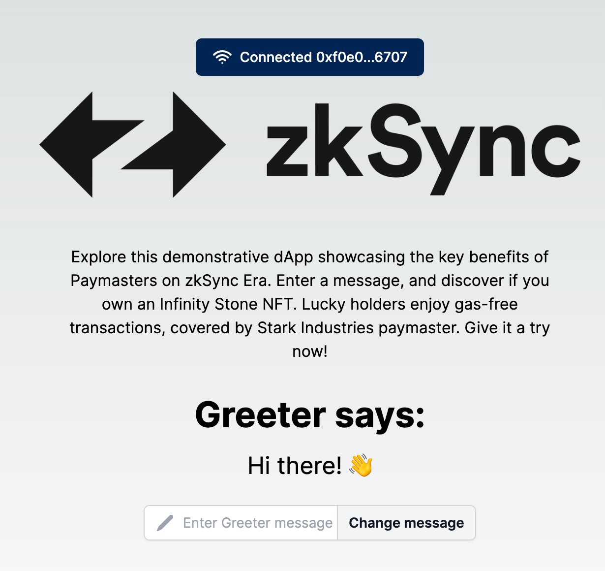

---
head:
  - - meta
    - name: "twitter:title"
      content: Gated NFT Paymaster Tutorial | zkSync Docs
---

# Gated NFT Paymaster

Discover how to construct a tailored paymaster that enables users to sidestep gas fees when they own a particular NFT. By the end of this tutorial, you'll:

- Write a `mint` function for the `ERC721.sol` contract.
- Design and implement the validation logic for the `ERC721GatedPaymaster.sol` contract.
- Deploy `Greeter.sol`, `ERC721.sol`, and `ERC721GatedPaymaster.sol` contracts.
- Connect our frontend application with users' MetaMask wallets.
- Initialize our contracts to facilitate interaction on the client side.
- Fetch data to display in a React component.
- Harness the capabilities of our paymaster based on NFT possession.

### Introduction

Welcome to this hands-on tutorial on creating and interacting with an `ERC721GatedPaymaster` and interacting with a front-end application. If you've ever been curious about the mechanisms that allow for gasless transactions on zkSync Era and our native account abstraction capabilities you're in the right place!

You'll gain a thorough understanding of how to create, compile, and deploy smart contracts on zkSync Era, delve into the intricacies of paymasters and validation logic, and seamlessly integrate them within a frontend application. On completion, you'll have a fully functional `ERC721GatedPaymaster` contract and an interactive frontend to go with it.

## Prerequisites

- Make sure your machine satisfies the [system requirements](https://github.com/matter-labs/era-compiler-solidity/tree/main#system-requirements).
- A [Node.js](https://nodejs.org/en/download) installation running Node.js version 16.
- Some familiarity with deploying smart contracts on zkSync. If not, please refer to the first section of the [quickstart tutorial](../../quick-start/hello-world.md).
- Some background knowledge on the concepts covered by the tutorial would be helpful too. Have a look at the following docs:
  - [Account abstraction protocol](../../developer-reference/account-abstraction.md).
  - [Introduction to system contracts](../../developer-reference/system-contracts.md).
  - [Smart contract deployment](../../developer-reference/contract-deployment.md) on zkSyn Era.
  - [Gas estimation for transactions](../../developer-reference/fee-model.md#gas-estimation-for-transactions) guide.
- You should also know [how to get your private key from your MetaMask wallet](https://support.metamask.io/hc/en-us/articles/360015289632-How-to-export-an-account-s-private-key).

### Complete Project

Download the complete project [here](https://github.com/matter-labs/tutorials/tree/main/gated-nft).

## Build time

### Step 1 — Setup the Project

:::info

- This tutorial uses `React` and `Next.js` for the frontend framework (though the principles apply to other frameworks too).
- We've provided a template for a hassle-free start. The primary focus is on mastering the `zksync-ethers` SDK and paymaster validations.
  :::

1. Clone the template and `cd` into the folder.

```bash
git clone https://github.com/matter-labs/tutorials
cd tutorials/gated-nft
```

2. Install dependencies:

```bash
yarn install
```

Your project structure should now resemble:

```text
├── LICENSE
├── README.md
├── frontend
├── package.json
├── yarn.lock
└── zksync
```

The project makes use of Yarn workspaces so we can seamlessly manage our dependencies between our frontend and smart contracts. While `/frontend` houses React components, styles, and logic, `/zksync` contains everything related to smart contract development and deployment. This tutorial will start in the `/zksync` directory as we need to write, compile and deploy our contracts before we can interact with them!

## Step 2 — Contract Development

### Implementing `ERC721.sol` Mint Function

:::tip
📍 Quick Tip: Always be in the `/zksync` directory for this phase.
:::

Let’s first break down the project structure within `/zksync`:

```text
├── LICENSE
├── README.md
├── contracts
├── deploy
├── hardhat.config.ts
├── package.json
├── test
└── yarn.lock
```

The template provides a ready-to-use `hardhat.config.ts` file that targets zkSync Era Testnet. If you are unfamiliar with zkSync Era Hardhat configurations please refer to the documentation [here](../../tooling/hardhat/getting-started.md#hardhat-configuration).

1. To configure your private key, copy the `.env.example` file, rename the copy to `.env`, and add your wallet private key.

```text
WALLET_PRIVATE_KEY=YourPrivateKeyHere...
```

Your private key will be used for paying the costs of deploying the smart contract.

::: warning
A heads up! Make sure your account has zkSync Era Sepolia Testnet or Sepolia ETH to successfully deploy the contracts.
:::

2. Navigate to `/contracts` directory and open up the `ERC721.sol` contract. We will implement the missing logic for the `mint` function.

The contract code defines an ERC721 collection and allows the owner to mint a collectible to a provided recipient.

The skeleton contract looks like this:

```solidity
// SPDX-License-Identifier: MIT
pragma solidity ^0.8.0;

import "@openzeppelin/contracts/token/ERC721/extensions/ERC721URIStorage.sol";
import "@openzeppelin/contracts/access/Ownable.sol";
import "@openzeppelin/contracts/utils/Strings.sol";

contract InfinityStones is ERC721URIStorage, Ownable {
    uint256 public tokenId;
    string public baseURI;
    mapping (string => bool) public stoneExists;
    mapping (address => uint256[]) private _ownedTokens;

    string[] public stones = [
        "Space Stone",
        "Mind Stone",
        "Reality Stone",
        "Power Stone",
        "Time Stone",
        "Soul Stone"
    ];

    constructor() ERC721("InfinityStones", "ISTN") {}

    function mint(address recipient, string memory stoneName) public onlyOwner {
        // TODO: TO BE IMPLEMENTED
        // REQUIREMENTS:
        // 1. Only the owner of the contract can mint
        // 2. The stone name must be one of the 6 stones
        // 3. The stone name must not have been minted before
        // 4. The stoneName cannot be empty
        // 5. The recipient must be a valid non-zero address
        // 6. We must add the token to the list of tokens owned by the recipient
    }

    function setBaseURI(string memory _baseURI) public onlyOwner {
        baseURI = _baseURI;
    }

    function tokenURI(uint256 _tokenId) public view override returns (string memory) {
        require(_exists(_tokenId), "ERC721URIStorage: URI query for nonexistent token");
        return bytes(baseURI).length > 0 ? string(abi.encodePacked(baseURI, "/", Strings.toString(_tokenId))) : "";
    }

    function tokensOfOwner(address owner) public view returns (uint256[] memory) {
        return _ownedTokens[owner];
    }
}
```

The function contains outlined requirements to assist in our implementation. We need to first make some checks to ensure that the `stoneName` is not empty, that the recipient address is not a zero address, and ensure that the `stoneName` has not been minted before. Let's start with that.

```solidity
function mint(address recipient, string memory stoneName) public onlyOwner {
    require(bytes(stoneName).length > 0, "stoneName must not be empty");
    require(recipient != address(0), "recipient must not be the zero address");
    require(!stoneExists[stoneName], "This stone already exists");

    // TODO: MORE TO BE IMPLEMENTED
}
```

Great! A few criteria are met, but we aren't done yet. We still need to ensure the `stoneName` is 1 of 6 stones, and update our owners mapping. Lets do that now.

```solidity
function mint(address recipient, string memory stoneName) public onlyOwner {
    require(bytes(stoneName).length > 0, "stoneName must not be empty");
    require(recipient != address(0), "recipient must not be the zero address");
    require(!stoneExists[stoneName], "This stone already exists");

    for(uint i=0; i<stones.length; i++) {
        if(keccak256(bytes(stoneName)) == keccak256(bytes(stones[i]))) {
            stoneExists[stoneName] = true;
            _safeMint(recipient, tokenId);
            _ownedTokens[recipient].push(tokenId);
            _setTokenURI(tokenId, stoneName);
            tokenId++;
            break;
        }
    }
}
```

We have now fully implemented our `mint` function on the `ERC721.sol` contract. We can now proceed to implement the validation logic on the `ERC721GatedPaymaster.sol` contract. Let's open that file up and move to the next steps.

### Implementing `validateAndPayForPaymasterTransaction` Function

The skeleton contract looks like this:

```solidity
// SPDX-License-Identifier: MIT
pragma solidity ^0.8.0;

import "@openzeppelin/contracts/token/ERC721/IERC721.sol";
import "@openzeppelin/contracts/access/Ownable.sol";

import "@matterlabs/zksync-contracts/l2/system-contracts/Constants.sol";

import {IPaymaster, ExecutionResult, PAYMASTER_VALIDATION_SUCCESS_MAGIC} from "@matterlabs/zksync-contracts/l2/system-contracts/interfaces/IPaymaster.sol";
import {IPaymasterFlow} from "@matterlabs/zksync-contracts/l2/system-contracts/interfaces/IPaymasterFlow.sol";
import {TransactionHelper, Transaction} from "@matterlabs/zksync-contracts/l2/system-contracts/libraries/TransactionHelper.sol";

/// @author Matter Labs
/// @notice This smart contract pays the gas fees on behalf of users that are the owner of a specific NFT asset
contract ERC721GatedPaymaster is IPaymaster, Ownable {
    IERC721 private immutable nft_asset;

    modifier onlyBootloader() {
        require(
            msg.sender == BOOTLOADER_FORMAL_ADDRESS,
            "Only bootloader can call this method"
        );
        // Continue execution if called from the bootloader.
        _;
    }

    // The constructor takes the address of the ERC721 contract as an argument.
    // The ERC721 contract is the asset that the user must hold in order to use the paymaster.
    constructor(address _erc721) {
        nft_asset = IERC721(_erc721); // Initialize the ERC721 contract
    }

    // The gas fees will be paid for by the paymaster if the user is the owner of the required NFT asset.
    function validateAndPayForPaymasterTransaction(
        bytes32,
        bytes32,
        Transaction calldata _transaction
    )
        external
        payable
        onlyBootloader
        returns (bytes4 magic, bytes memory context)
    {
        // TODO: TO BE IMPLEMENTED
        // REQUIREMENTS:
        // 1. Only the bootloader can validate and pay for the paymaster transaction.
        // 2. The standard paymaster input must be at least 4 bytes long.
        // 3. We must use a valid paymaster input selector (e.g. General or Approval-based).
        // 4. The user address from the transaction must own the required NFT asset to use the paymaster.
        // 5. We need to calculate the minimum required ETH value to pay for the transaction.
        // 6. We need to to use the Bootloader to execute the transaction.
    }

    function postTransaction(
        bytes calldata _context,
        Transaction calldata _transaction,
        bytes32,
        bytes32,
        ExecutionResult _txResult,
        uint256 _maxRefundedGas
    ) external payable override onlyBootloader {
    }

    function withdraw(address payable _to) external onlyOwner {
        // send paymaster funds to the owner
        uint256 balance = address(this).balance;
        (bool success, ) = _to.call{value: balance}("");
        require(success, "Failed to withdraw funds from paymaster.");
    }

    receive() external payable {}
}
```

:::info

- Only the [bootloader](../../../zk-stack/components/zkEVM/bootloader.md) is allowed to call the `validateAndPayForPaymasterTransaction` and `postTransaction` functions.
- To implement that, the `onlyBootloader` modifier is used on these functions.
  :::

#### Parsing the Paymaster Input

The paymaster pays the transaction fees only if the user possesses one of NFT's from our previous contract.

The input that the paymaster receives is encoded in the `paymasterInput` within the `validateAndPayForPaymasterTransaction` function.

As described in [the paymaster documentation](../../developer-reference/account-abstraction.md#paymasters), there are standardized ways to encode user interactions with `paymasterInput`. To cover the gas costs of a user, we need to ensure the user has the appropriate NFT in their account.

1. Firstly, we check that the `paymasterInput` is encoded and uses the `General` flow, and that the account address has a balance of at least 1 of the required NFTs.

```solidity
 magic = PAYMASTER_VALIDATION_SUCCESS_MAGIC;
require(
    _transaction.paymasterInput.length >= 4,
    "The standard paymaster input must be at least 4 bytes long"
);

bytes4 paymasterInputSelector = bytes4(
    _transaction.paymasterInput[0:4]
);

if (paymasterInputSelector == IPaymasterFlow.general.selector) {
    address userAddress = address(uint160(_transaction.from));

    require(
        nft_asset.balanceOf(userAddress) > 0,
        "User does not hold the required NFT asset and therefore must pay for their own gas!"
    );

    //
    // ...
    //
} else {
    revert("Unsupported paymaster flow");
}
```

2. Next, we check the price of transaction fees, and transfer the correspondent gas fee from the paymaster to the bootloader to cover the transaction fees.

```solidity
// Note, that while the minimal amount of ETH needed is tx.gasPrice * tx.gasLimit,
// neither paymaster nor account are allowed to access this context variable.
uint256 requiredETH = _transaction.gasLimit *
    _transaction.maxFeePerGas;

(bool success, ) = payable(BOOTLOADER_FORMAL_ADDRESS).call{
    value: requiredETH
}("");
```

The full `validateAndPayForPaymasterTransaction` function should resemble the following:

```solidity
function validateAndPayForPaymasterTransaction(
    bytes32,
    bytes32,
    Transaction calldata _transaction
)
    external
    payable
    onlyBootloader
    returns (bytes4 magic, bytes memory context)
{
    magic = PAYMASTER_VALIDATION_SUCCESS_MAGIC;
    require(
        _transaction.paymasterInput.length >= 4,
        "The standard paymaster input must be at least 4 bytes long"
    );

    bytes4 paymasterInputSelector = bytes4(
        _transaction.paymasterInput[0:4]
    );

    if (paymasterInputSelector == IPaymasterFlow.general.selector) {
        address userAddress = address(uint160(_transaction.from));

        require(
            nft_asset.balanceOf(userAddress) > 0,
            "User does not hold the required NFT asset and therefore must pay for their own gas!"
        );

        uint256 requiredETH = _transaction.gasLimit *
            _transaction.maxFeePerGas;

        (bool success, ) = payable(BOOTLOADER_FORMAL_ADDRESS).call{
            value: requiredETH
        }("");
    } else {
        revert("Invalid paymaster flow");
    }
}
```

Amazing! We have successfully written the smart contracts let's proceed to deploy them using the deployment scripts provided.

#### Contract Deployment

The deployment scripts provided will deploy the `ERC721.sol`, `ERC721GatedPaymaster.sol`, and `Greeter.sol` contracts. You will need to provide the deployment script with an address to receive the NFT which we will be required to make use of the paymaster. But before we deploy the contracts we first need to compile the contracts.

1. Navigate to the root directory of the repository and run:

```bash
yarn compile:contracts
```

The output of the command should resemble the following:

```bash
Successfully compiled 43 Solidity files
```

2. Deploy the contracts to zkSync Era Testnet. This will also programmatically verify the contracts on zkSync Era Testnet.

```bash
yarn deploy:contracts
```

You will be prompted to input the recipient public address to receive a NFT.

```bash
Running deploy script for the ERC721 contract...
You first need to add a RECIPIENT_ADDRESS to mint the NFT to...
Please provide the recipient address to receive an NFT: <INSERT_PUBLIC_ADDRESS_HERE>
```

After inserting the recipient address the script will continue:

```bash
Running deploy script for the ERC721 contract...
You first need to add a RECIPIENT_ADDRESS to mint the NFT to...
Please provide the recipient address to receive an NFT: 0xf0e0d7709a335C2DD712F4F0F907017886B26707
NFT Contract address: 0xb38b08fC34313A5Be7975FFE2C63F78f843325c1
The Power Stone has been given to 0xf0e0d7709a335C2DD712F4F0F907017886B26707
Balance of the recipient: 1
New baseURI is https://ipfs.io/ipfs/QmPtDtJEJDzxthbKmdgvYcLa9oNUUUkh7vvz5imJFPQdKx
Your verification ID is: 34297
Contract successfully verified on zkSync block explorer!
contracts/ERC721.sol:InfinityStones verified! VerificationId: 34297
Done!
Running deploy script for the ERC721GatedPaymaster contract...
The deployment is estimated to cost 0.0001577065 ETH
Paymaster address: 0x83F1C9e8f03C5A756e3eed38823A14d1D6dA6f98
Funding paymaster with ETH
Paymaster ETH balance is now 5000000000000000
Your verification ID is: 34298
Contract successfully verified on zkSync block explorer!
contracts/ERC721GatedPaymaster.sol:ERC721GatedPaymaster verified! VerificationId: 34298
Done!
Running deploy script for the Greeter contract
The deployment is estimated to cost 0.000140617 ETH
Constructor args:0x000000000000000000000000000000000000000000000000000000000000002000000000000000000000000000000000000000000000000000000000000000094869207468657265210000000000000000000000000000000000000000000000
Greeter was deployed to 0x19720a45b7aB632Cc380A33E0964bc90013CCB2e
Your verification ID is: 34299
Contract successfully verified on zkSync block explorer!
Done!
```

We have successfully compiled and deployed our smart contracts to zkSync Era Testnet! Let's move over to the `/frontend` directory to interact with these smart contracts.

## Step 3 — Frontend Development

:::tip
📍 Quick Tip: Always be in the `/frontend` directory for this phase.
:::

Let’s first break down the project structure within `/frontend`:

```text
.
├── README.md
├── app
│   ├── assets
│   ├── components
│   ├── constants
│   ├── context
│   ├── favicon.ico
│   ├── globals.css
│   ├── hooks
│   ├── layout.tsx
│   ├── page.tsx
│   └── types
├── next-env.d.ts
├── next.config.js
├── package.json
├── postcss.config.js
├── public
├── tailwind.config.js
└── tsconfig.json
```

1. Let's spin up our frontend to see what we need to implement:

```bash
yarn dev
```

This will start a local server running on `http://localhost:3000/`. You should see something that looks similar to:



### Connecting our `WalletButton` Component

The first component we are going to interact with is the `WalletButton` component.

1. Navigate to `app/components/WalletButton.tsx`

```bash
cd app/components/WalletButton.tsx
```

2. Let implement the requirements for the `connectWallet` function

The `connectWallet` function requirements indicates that we need to ensure we are connected to the correct network, connect to the users MetaMask account, store some variables using React's Context API, and then call `initContracts` function to instantiate our contracts. Let's proceed to do that:

```typescript
const connectWallet = async () => {
  if (!networkOk) await switchNetwork();
  try {
    if ((window as any).ethereum) {
      const provider = new Web3Provider((window as any).ethereum);
      web3Context.setProvider(provider);

      const data = await provider.send("eth_requestAccounts", []);

      const signerInstance = provider.getSigner();
      web3Context.setSigner(signerInstance);

      setWallet({ address: data[0], acc_short: shortenAddress(data[0]) });

      await initContracts(provider, signerInstance);
    }
  } catch (error) {
    console.error("Error connecting DApp to your wallet");
    console.error(error);
  }
};
```

3. Great! Let's continue within our `WalletButton` component and implement the `initContracts` function.

The `initContracts` function should instantiate our Greeter and NFT token contracts, check if the connected wallet contains our specific NFT, and if so fetch the NFT metadata from IPFS and store some variables using React's Context API. Copy and paste the below code snippet.

```typescript
const initContracts = async (provider: Web3Provider, signer: Signer) => {
  if (provider && signer) {
    const greeterContract = new Contract(GREETER_ADDRESS, GREETER_CONTRACT_ABI, signer);

    web3Context.setGreeterContractInstance(greeterContract);

    const fetchedGreeting = await greeterContract.greet();
    web3Context.setGreetingMessage(fetchedGreeting);

    const nftContract = new Contract(NFT_CONTRACT_ADDRESS, NFT_CONTRACT_ABI, signer);

    const address = await signer.getAddress();
    const balance = await nftContract.balanceOf(address);
    if (balance > 0) {
      let ownedStones: PowerStoneNft[] = [];
      const ownedTokensResponse = await nftContract.tokensOfOwner(address);

      for (let i = 0; i < ownedTokensResponse.length; i++) {
        const tokenId = ownedTokensResponse[i];

        const tokenURI = await nftContract.tokenURI(tokenId);
        if (tokenURI == undefined || tokenURI == "") {
          continue;
        }

        const response = await fetch(tokenURI);
        if (!response.ok) {
          continue;
        }

        ownedStones.push((await response.json()) as PowerStoneNft);
      }

      web3Context.setNfts(ownedStones);
    } else {
      web3Context.setNfts([]);
    }
  }
};
```

We can now return to our running local page and click the 'Connect Wallet' button which should connect to your MetaMask account as depicted in the below image.



We have connected our wallet to our application but we now need to add our `GreeterMessage` and `Input` components.

### Importing the `GreeterMessage` and `Input` Components

1. Navigate to `app/page.tsx`

Scrolling to the button you can see the requirements outlined. We need to import our components and pass the specified props. Let's first import our components at the top of the file:

```typescript
import Greeting from "./components/GreeterMessage";
import Input from "./components/Input";
```

2. Add the components to the return statement and pass desired props

```jsx
<Greeting greeting={web3Context.greeting} />
<Input
    greeterInstance={web3Context.greeterContractInstance}
    setGreetingMessage={web3Context.setGreetingMessage}
    provider={web3Context.provider}
    nfts={web3Context.nfts}
/>
```

Now if we check our local page we can see our rendered Greeter message and Input box!



### Fetching the Gas details and adding the `Modal` Component

1. Navigate to `app/components/Input.tsx` component

We need to write our `estimateGas` function as we will want to pass those details to our `Modal` component to display.

2. Implement `estimateGas` function

We want to display the current gas price, estimate the amount of gas required to execute our `setGreeting` transaction, and store these variables to be used later.

```typescript
async function getEstimate() {
  if (!provider) return;
  let gasPrice = await provider.getGasPrice();
  let price = ethers.utils.formatEther(gasPrice.toString());
  setPrice(price);

  if (!greeterInstance) return;
  let gasEstimate = await greeterInstance.estimateGas["setGreeting"](message);
  let gas = ethers.utils.formatEther(gasEstimate.toString());
  setGas(gas);

  let transactionCost = gasPrice.mul(gasEstimate);
  let cost = ethers.utils.formatEther(transactionCost.toString());
  setCost(cost);
}
```

3. Add `Modal` component to return statement

```jsx
{
  isOpen && (
    <Modal closeModal={closeModal} greeterInstance={greeterInstance} message={message} setGreetingMessage={setGreetingMessage} cost={cost} price={price} gas={gas} nfts={nfts} />
  );
}
```

This will open the `Modal` component once the "Change message" button is clicked.

### Setup our Paymaster Hook

We are ready to implement our paymaster hook which will be used if the connected wallet possesses one of the applicable NFT's we minted earlier.

1. Navigate to `app/hooks/usePaymaster.tsx`

The requirements outline we need to prepare and return the `paymasterParams` to then be passed alongside the `setGreeting` transaction.

```typescript
const usePaymaster = async ({ greeterInstance, message, price }: PaymasterProps) => {
  let gasPrice = ethers.utils.parseEther(price);
  const paymasterParams = utils.getPaymasterParams(PAYMASTER_CONTRACT_ADDRESS, {
    type: "General",
    innerInput: new Uint8Array(),
  });

  const gasLimit = await greeterInstance.estimateGas.setGreeting(message, {
    customData: {
      gasPerPubdata: utils.DEFAULT_GAS_PER_PUBDATA_LIMIT,
      paymasterParams: paymasterParams,
    },
  });

  return {
    maxFeePerGas: gasPrice,
    maxPriorityFeePerGas: ethers.BigNumber.from(0),
    gasLimit: gasLimit,
    customData: {
      gasPerPubdata: utils.DEFAULT_GAS_PER_PUBDATA_LIMIT,
      paymasterParams: paymasterParams,
    },
  };
};
```

We have prepared our `paymasterParams` to be used in our application! Let's navigate to our last component that needs to be implemented, the `Checkout` component.

### Implement `updateGreeting` function in the `Checkout` component

This function is responsible for initiating the transaction that will interact with our Greeter.sol contract to update the message. It will check if the connected wallet contains our specific NFT and if so, call our `usePaymaster` hook created above to pass along the `paymasterParams` to facilitate a gasless transaction for the user. Without the NFT, the user will be required to pay the gas fee.

1. Import `usePaymaster` hook in the `Checkout` component

```typescript
import usePaymaster from "../hooks/usePaymaster";
```

2. Implement the `updateGreeting` function

```typescript
const updateGreeting = async ({ message }: GreeterData) => {
  try {
    if (greeterInstance == null) {
      return;
    }

    let txHandle;
    if (hasNFT) {
      const params = await usePaymaster({ greeterInstance, message, price });
      txHandle = await greeterInstance.setGreeting(message, params);
    } else {
      txHandle = await greeterInstance.setGreeting(message);
    }

    await txHandle.wait();

    const updatedGreeting = await greeterInstance.greet();
    setGreetingMessage(updatedGreeting);
  } catch (error) {
    console.error("Failed to update greeting: ", error);
  }
};
```

Amazing we have successfully implemented all our frontend requirements! Now its time to test the application.

## Step 4 — Test the Application

Navigate to `http://localhost:3000` and refresh the page. Click on "Connect Wallet" to link your MetaMask account. Ensure you connect the address that received the minted NFT during contract deployment; otherwise, you'll bear the gas fees!

1. Input your own message into the `Input` component
2. Click the "Change message" button
3. If you have the right NFT you should be presented with the below image:


4. Enjoy a gasless transaction!

## Conclusion

As we conclude, you've not only set up and run a seamless integration between a frontend and zkSync Era Testnet but have also gained hands-on expertise. You've connected your MetaMask, engaged with smart contracts, and seen the magic of paymasters unfold right on your local server.

If you want to continue to learn about paymaster or see additional examples checkout the [paymaster-examples repo](https://github.com/matter-labs/paymaster-examples) for further inspiration.
