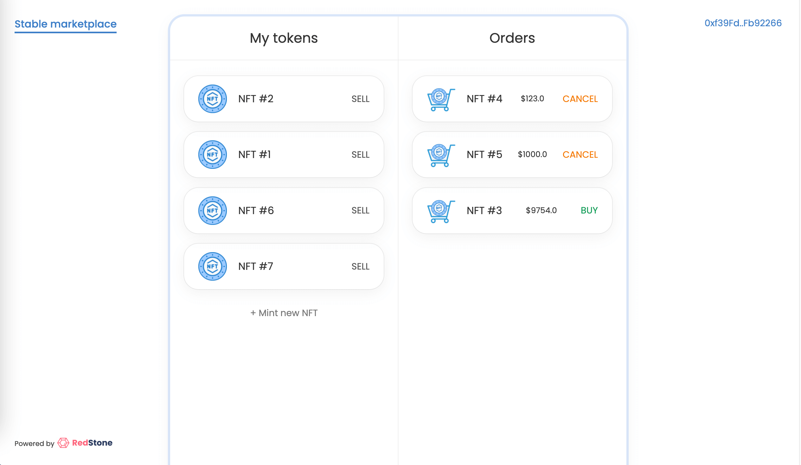
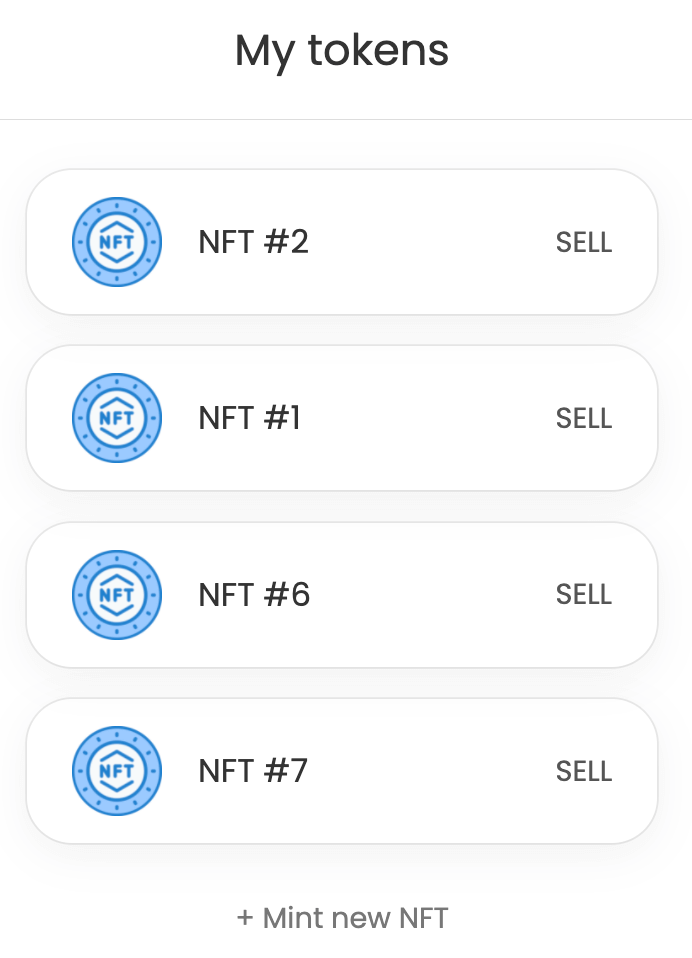
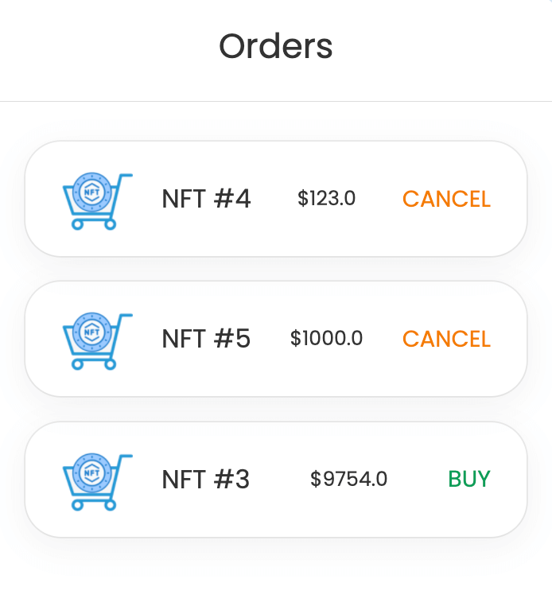
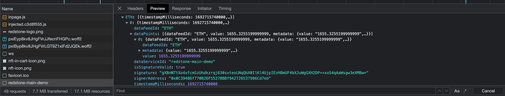

---
head:
  - - meta
    - name: "twitter:title"
      content: Redstone | zkSync Docs
---

# Redstone

### Introduction

In this tutorial, we'll construct a stable price NFT marketplace on the zkSync network. Utilizing Hardhat for smart contract compilation and testing, ethers.js for contract interaction, and React for the frontend, we'll create a seamless NFT trading platform. A crucial component of our marketplace is the integration of RedStone Oracles to obtain reliable price data.

[RedStone](https://docs.redstone.finance/docs/introduction) is a data ecosystem that delivers frequently updated, reliable and diverse data for your dApps and smart contracts.

- Data providers can avoid the requirement of continuous on-chain data delivery
- Allow end users to self-deliver signed Oracle data on-chain
- Use the decentralized Streamr network to deliver signed oracle data to the end users
- Use token incentives to motivate data providers to maintain data integrity and uninterrupted service

### Prerequisites

- **Knowledge Base**: Familiarity with smart contracts, Hardhat, `ethers.js`, and React.
- **Environment Setup**: Have [Node.js](https://nodejs.org/) installed.
- **Tooling**: This guide utilizes [`hardhat`](https://hardhat.org/) and [`ethers.js`](https://docs.ethers.io/v5/).

### Step 1 — Setting Up the Development Environment

1\. Clone the Repository:

```bash
git clone https://github.com/zkSync-Community-Hub/tutorials
```

2\. Navigate to the Project Directory:

```bash
cd tutorials/tutorials/zkSync-RedStone-stable-price-marketplace-tutorial/code
```

3\. Install Dependencies:

```bash
yarn install
```

4\. Setup Local zkSync Node:

Set up a local zkSync node in a Dockerized setup following the instructions [here](../../test-and-debug/dockerized-l1-l2-nodes.md).

### Step 2 — Understanding the Contract Structure

**ExampleNFT.sol**

[`ExampleNFT`](https://github.com/zkSync-Community-Hub/tutorials/blob/d01c44af89bff8d8c322ae9d6ebc823a3111b447/tutorials/zkSync-RedStone-stable-price-marketplace-tutorial/code/contracts/ExampleNFT.sol#L2) is a simplistic ERC721 contract with sequential token ID assignment, extending `ERC721Enumerable` from OpenZeppelin for enhanced enumeration capability.

```solidity
function mint() external {
    _mint(msg.sender, nextTokenId);
    nextTokenId++;
}
```

**Marketplace.sol**

[`Marketplace`](https://github.com/zkSync-Community-Hub/tutorials/blob/d01c44af89bff8d8c322ae9d6ebc823a3111b447/tutorials/zkSync-RedStone-stable-price-marketplace-tutorial/code/contracts/Marketplace.sol#L6) facilitates NFT trading with basic order placement, cancellation, and buying functionality, adhering to the [EIP-721 standard](https://eips.ethereum.org/EIPS/eip-721).

```solidity
function postSellOrder(address nftContractAddress, uint256 tokenId, uint256 price) external {}
function cancelOrder(uint256 orderId) external {}
function getAllOrders() public view returns (SellOrder[] memory) {}
function getPrice(uint256 orderId) public view returns (uint256) {}
function buy(uint256 orderId) external payable {}
```

**StableMarketplace.sol**

[`StableMarketplace`](https://github.com/zkSync-Community-Hub/tutorials/blob/d01c44af89bff8d8c322ae9d6ebc823a3111b447/tutorials/zkSync-RedStone-stable-price-marketplace-tutorial/code/contracts/StableMarketplace.sol#L11) enhances `Marketplace` with stable pricing, integrating RedStone Oracles for precise price data.

### Step 3 — Modifying the StableMarketplace Contract

The `StableMarketplace.sol` requires extension from `MainDemoConsumerBase` to interact with RedStone Oracles. Modify `_getPriceFromOrder` to utilize `getOracleNumericValueFromTxMsg` for price data retrieval.

```solidity
contract StableMarketplace is Marketplace, MainDemoConsumerBase {
    function _getPriceFromOrder(SellOrder memory order) internal view override returns (uint256) {
        uint256 ethPrice = getOracleNumericValueFromTxMsg(bytes32("ETH"));
        return (order.price / ethPrice) * (10 ** 8);
    }
}
```

### Step 4 — Adjusting dApp TypeScript Code

In [`blockchain.ts`](https://github.com/zkSync-Community-Hub/tutorials/blob/d01c44af89bff8d8c322ae9d6ebc823a3111b447/tutorials/zkSync-RedStone-stable-price-marketplace-tutorial/code/src/core/blockchain.ts#L121), implement the `buy` function, wrapping the marketplace contract with RedStone's framework to facilitate `buy` operations with precise pricing.

```javascript
import { WrapperBuilder } from "@redstone-finance/evm-connector";

async function buy(orderId: string) {
  const marketplace = await getContractInstance("marketplace");

  // Wrapping marketplace contract instance.
  // It enables fetching data from redstone data pool
  // for each contract function call
  try {
    const wrappedMarketplaceContract = WrapperBuilder.wrap(marketplace).usingDataService({
      dataServiceId: "redstone-main-demo",
      uniqueSignersCount: 1,
      dataFeeds: ["ETH"],
    });

    // Checking expected amount
    const expectedEthAmount = await wrappedMarketplaceContract.getPrice(orderId);

    // Sending buy tx
    const buyTx = await wrappedMarketplaceContract.buy(orderId, {
      value: expectedEthAmount.mul(101).div(100), // a buffer for price movements
    });
    await buyTx.wait();

    return buyTx;
  } catch {
    const errText = "Error happened while buying the NFT";
    alert(errText);
  }
}
```

### Step 5 — Testing and Launching Locally

Ensure the RedStone Oracle integration is correct by running tests, compiling contracts, deploying them locally, and launching the React app.

```bash
yarn test
yarn compile
# Rename and update .env file
mv .env.example .env
# Update WALLET_PRIVATE_KEY in .env
echo "WALLET_PRIVATE_KEY=0x7726827caac94a7f9e1b160f7ea819f172f7b6f9d2a97f992c38edeab82d4110" >> .env
yarn deploy:local
yarn app:start
```

Visit [http://localhost:3000](http://localhost:3000) to interact with your local NFT stable price marketplace.

#### Step 5.1 — Local Marketplace Interaction

**Import Local Wallets to MetaMask**

1. In MetaMask, select the account dropdown, then `Import account`.
2. Input the private keys for `User 1` and `User 2` respectively:
   - `User 1`: `0xac1e735be8536c6534bb4f17f06f6afc73b2b5ba84ac2cfb12f7461b20c0bbe3`
   - `User 2`: `0xd293c684d884d56f8d6abd64fc76757d3664904e309a0645baf8522ab6366d9e`
3. Click `Import`.

**Explore App**

Navigate to the app at [http://localhost:3000](http://localhost:3000). Initially, you'll see a near-empty interface with a `+ Mint new NFT` link.



**Mint NFTs**

1. Click `+ Mint new NFT` to create new NFTs.
2. Post-minting, view your NFT in the left column.



**Post Sell Orders**

1. Click `SELL` on any NFT, enter the USD value, and confirm the two prompted transactions for NFT transfer approval and marketplace order creation.



**Buy NFTs**

1. Switch MetaMask accounts to buy an NFT.
2. Optionally, open browser's developer tools on the network tab to observe network requests, including the two requests for ETH price data and crypto signatures before the buy transaction.



### Conclusion

You've successfully built and launched a stable price NFT marketplace on zkSync, integrating RedStone Oracles for reliable price data. This marketplace provides a platform for NFT trading with stable pricing, showcasing the potential of combining zkSync's scalability with RedStone's accurate price oracles.
