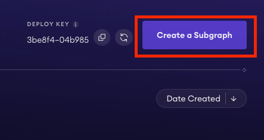
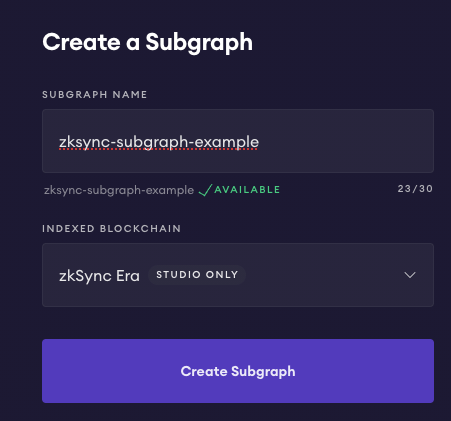
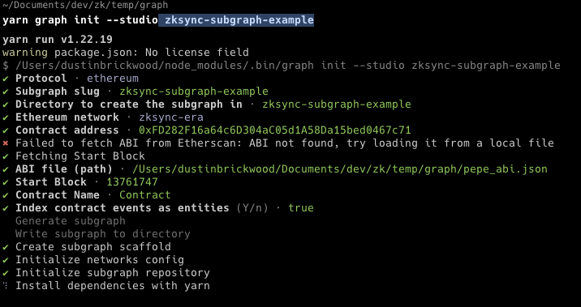
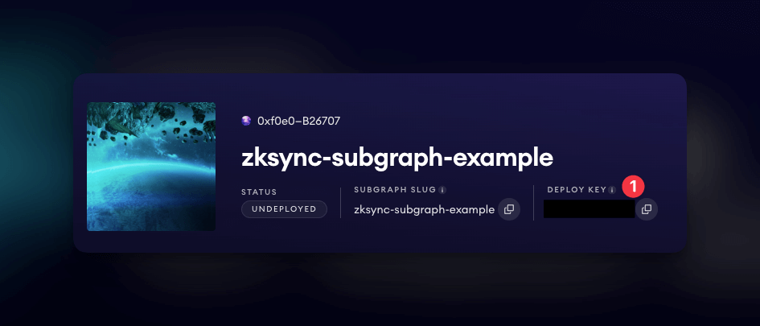
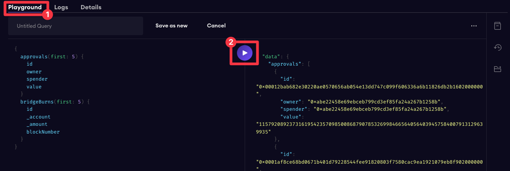

---
head:
  - - meta
    - name: "twitter:title"
      content: The Graph | zkSync Docs
---

# The Graph

### Introduction

In this guide, you will learn how to deploy a subgraph that tracks a specific address on zkSync Era mainnet. Deploying graphs is a great way to query data from network historically and in real-time.

[The Graph](https://thegraph.com/) is a decentralized protocol for indexing and querying data from blockchains. The Graph serves queries over data that is easily stored, decentralized, and secured by the blockchain. You will learn how to deploy a subgraph that tracks a specific address on zkSync Era mainnet.

### Prerequisites

- **Knowledge Base**: Familiarity with Typescript.
- **Wallet Setup**: Have MetaMask installed and Setup, ensuring there's a balance on the zkSync Testnet.
- **Tooling**: This guide utilizes `@graphprotocol/graph-cli`. Ensure you have it accessible or installed in your environment.

### Step 1 — Understanding subgraphs

A subgraph extracts data from a blockchain, processing it and storing it so that it can be easily queried via GraphQL. DApps often need to fetch data from chain. Instead of querying the chain directly, which can be slow and expensive, DApps can use subgraphs to quickly retrieve the data they need.

**Key components:**

- **subgraph.yaml**: a YAML file containing the subgraph manifest.
- **schema.graphql**: a GraphQL schema that defines what data is stored for your subgraph, and how to query it via GraphQL.
- **AssemblyScript Mappings**: [AssemblyScript](https://github.com/AssemblyScript/assemblyscript) code that translates from the event data to the entities defined in your schema.

### Step 2 — Environment setup

Visit [https://thegraph.com/studio/](https://thegraph.com/studio/), connect your wallet. Next, click the button to create a new subgraph:



- [Create subgraph](https://thegraph.com/studio)

Enter the name of the subgraph, and select the zkSync Era as the network:



Install the [@graphprotocol/graph-cli](https://www.npmjs.com/package/@graphprotocol/graph-cli):

::: code-tabs

@tab:active yarn

```bash
yarn add @graphprotocol/graph-cli
```

@tab npm

```bash
npm install @graphprotocol/graph-cli
```

:::

### Step 3 — Generate subgraph

To generate a subgraph using the `graph-cli` , we first need to be able to provide an ABI file for the CLI to reference. This will be addressed in future explorer updates. Create a `pepe_abi.json` file and insert the provided json:

```json
[
  {
    "inputs": [],
    "stateMutability": "nonpayable",
    "type": "constructor"
  },
  {
    "anonymous": false,
    "inputs": [
      {
        "indexed": true,
        "internalType": "address",
        "name": "owner",
        "type": "address"
      },
      {
        "indexed": true,
        "internalType": "address",
        "name": "spender",
        "type": "address"
      },
      {
        "indexed": false,
        "internalType": "uint256",
        "name": "value",
        "type": "uint256"
      }
    ],
    "name": "Approval",
    "type": "event"
  },
  {
    "anonymous": false,
    "inputs": [
      {
        "indexed": true,
        "internalType": "address",
        "name": "_account",
        "type": "address"
      },
      {
        "indexed": false,
        "internalType": "uint256",
        "name": "_amount",
        "type": "uint256"
      }
    ],
    "name": "BridgeBurn",
    "type": "event"
  },
  {
    "anonymous": false,
    "inputs": [
      {
        "indexed": true,
        "internalType": "address",
        "name": "l1Token",
        "type": "address"
      },
      {
        "indexed": false,
        "internalType": "string",
        "name": "name",
        "type": "string"
      },
      {
        "indexed": false,
        "internalType": "string",
        "name": "symbol",
        "type": "string"
      },
      {
        "indexed": false,
        "internalType": "uint8",
        "name": "decimals",
        "type": "uint8"
      }
    ],
    "name": "BridgeInitialization",
    "type": "event"
  },
  {
    "anonymous": false,
    "inputs": [
      {
        "indexed": true,
        "internalType": "address",
        "name": "_account",
        "type": "address"
      },
      {
        "indexed": false,
        "internalType": "uint256",
        "name": "_amount",
        "type": "uint256"
      }
    ],
    "name": "BridgeMint",
    "type": "event"
  },
  {
    "anonymous": false,
    "inputs": [
      {
        "indexed": false,
        "internalType": "uint8",
        "name": "version",
        "type": "uint8"
      }
    ],
    "name": "Initialized",
    "type": "event"
  },
  {
    "anonymous": false,
    "inputs": [
      {
        "indexed": true,
        "internalType": "address",
        "name": "from",
        "type": "address"
      },
      {
        "indexed": true,
        "internalType": "address",
        "name": "to",
        "type": "address"
      },
      {
        "indexed": false,
        "internalType": "uint256",
        "name": "value",
        "type": "uint256"
      }
    ],
    "name": "Transfer",
    "type": "event"
  },
  {
    "inputs": [
      {
        "internalType": "address",
        "name": "owner",
        "type": "address"
      },
      {
        "internalType": "address",
        "name": "spender",
        "type": "address"
      }
    ],
    "name": "allowance",
    "outputs": [
      {
        "internalType": "uint256",
        "name": "",
        "type": "uint256"
      }
    ],
    "stateMutability": "view",
    "type": "function"
  },
  {
    "inputs": [
      {
        "internalType": "address",
        "name": "spender",
        "type": "address"
      },
      {
        "internalType": "uint256",
        "name": "amount",
        "type": "uint256"
      }
    ],
    "name": "approve",
    "outputs": [
      {
        "internalType": "bool",
        "name": "",
        "type": "bool"
      }
    ],
    "stateMutability": "nonpayable",
    "type": "function"
  },
  {
    "inputs": [
      {
        "internalType": "address",
        "name": "account",
        "type": "address"
      }
    ],
    "name": "balanceOf",
    "outputs": [
      {
        "internalType": "uint256",
        "name": "",
        "type": "uint256"
      }
    ],
    "stateMutability": "view",
    "type": "function"
  },
  {
    "inputs": [
      {
        "internalType": "address",
        "name": "_from",
        "type": "address"
      },
      {
        "internalType": "uint256",
        "name": "_amount",
        "type": "uint256"
      }
    ],
    "name": "bridgeBurn",
    "outputs": [],
    "stateMutability": "nonpayable",
    "type": "function"
  },
  {
    "inputs": [
      {
        "internalType": "address",
        "name": "_l1Address",
        "type": "address"
      },
      {
        "internalType": "bytes",
        "name": "_data",
        "type": "bytes"
      }
    ],
    "name": "bridgeInitialize",
    "outputs": [],
    "stateMutability": "nonpayable",
    "type": "function"
  },
  {
    "inputs": [
      {
        "internalType": "address",
        "name": "_to",
        "type": "address"
      },
      {
        "internalType": "uint256",
        "name": "_amount",
        "type": "uint256"
      }
    ],
    "name": "bridgeMint",
    "outputs": [],
    "stateMutability": "nonpayable",
    "type": "function"
  },
  {
    "inputs": [],
    "name": "decimals",
    "outputs": [
      {
        "internalType": "uint8",
        "name": "",
        "type": "uint8"
      }
    ],
    "stateMutability": "view",
    "type": "function"
  },
  {
    "inputs": [
      {
        "internalType": "address",
        "name": "spender",
        "type": "address"
      },
      {
        "internalType": "uint256",
        "name": "subtractedValue",
        "type": "uint256"
      }
    ],
    "name": "decreaseAllowance",
    "outputs": [
      {
        "internalType": "bool",
        "name": "",
        "type": "bool"
      }
    ],
    "stateMutability": "nonpayable",
    "type": "function"
  },
  {
    "inputs": [
      {
        "internalType": "address",
        "name": "spender",
        "type": "address"
      },
      {
        "internalType": "uint256",
        "name": "addedValue",
        "type": "uint256"
      }
    ],
    "name": "increaseAllowance",
    "outputs": [
      {
        "internalType": "bool",
        "name": "",
        "type": "bool"
      }
    ],
    "stateMutability": "nonpayable",
    "type": "function"
  },
  {
    "inputs": [],
    "name": "l1Address",
    "outputs": [
      {
        "internalType": "address",
        "name": "",
        "type": "address"
      }
    ],
    "stateMutability": "view",
    "type": "function"
  },
  {
    "inputs": [],
    "name": "l2Bridge",
    "outputs": [
      {
        "internalType": "address",
        "name": "",
        "type": "address"
      }
    ],
    "stateMutability": "view",
    "type": "function"
  },
  {
    "inputs": [],
    "name": "name",
    "outputs": [
      {
        "internalType": "string",
        "name": "",
        "type": "string"
      }
    ],
    "stateMutability": "view",
    "type": "function"
  },
  {
    "inputs": [],
    "name": "symbol",
    "outputs": [
      {
        "internalType": "string",
        "name": "",
        "type": "string"
      }
    ],
    "stateMutability": "view",
    "type": "function"
  },
  {
    "inputs": [],
    "name": "totalSupply",
    "outputs": [
      {
        "internalType": "uint256",
        "name": "",
        "type": "uint256"
      }
    ],
    "stateMutability": "view",
    "type": "function"
  },
  {
    "inputs": [
      {
        "internalType": "address",
        "name": "to",
        "type": "address"
      },
      {
        "internalType": "uint256",
        "name": "amount",
        "type": "uint256"
      }
    ],
    "name": "transfer",
    "outputs": [
      {
        "internalType": "bool",
        "name": "",
        "type": "bool"
      }
    ],
    "stateMutability": "nonpayable",
    "type": "function"
  },
  {
    "inputs": [
      {
        "internalType": "address",
        "name": "from",
        "type": "address"
      },
      {
        "internalType": "address",
        "name": "to",
        "type": "address"
      },
      {
        "internalType": "uint256",
        "name": "amount",
        "type": "uint256"
      }
    ],
    "name": "transferFrom",
    "outputs": [
      {
        "internalType": "bool",
        "name": "",
        "type": "bool"
      }
    ],
    "stateMutability": "nonpayable",
    "type": "function"
  }
]
```

We will refer to this file path during setup. Execute the command:

::: code-tabs

@tab:active yarn

```bash
yarn graph init --studio  zksync-subgraph-example
```

@tab npm

```bash
npm graph init --studio  zksync-subgraph-example
```

:::

Begin initializing the project with the following item options:

- Select `Ethereum` as the protocol
- Select `zksync-era` as the Ethereum network
- Provide the contract address you wish to track, for this tutorial, the PEPE token: `0xFD282F16a64c6D304aC05d1A58Da15bed0467c71`
- Provide an ABI file path, in this case the `pepe_abi.json` file created previously.
- Provide a block number to start indexing from (e.g. 13761747)
- Provide a contract name (e.g. PEPE)
- Indicate `true` to indexing events as entities
- Approve the next steps and skip adding another contract



### Step 4 — Authenticate and Deploy the Subgraph

In order to authenticate and deploy the generated subgraph, copy the deploy key studio account:


Copy deploy key from The Graph studio

Run auth command:

::: code-tabs

@tab:active yarn

```bash
yarn graph auth --studio <DEPLOY-KEY>
```

@tab npm

```bash
npm graph auth --studio <DEPLOY-KEY>
```

:::

Change directory to the subgraph:

```bash
cd zksync-subgraph-example
```

Deploy the subgraph:

::: code-tabs

@tab:active yarn

```bash
yarn graph deploy zksync-subgraph-example
```

@tab npm

```bash
npm graph deploy --studio zksync-subgraph-example
```

:::

:::warning
Please, make sure that local folder name matches name of the subgraph studio
:::

### Step 5 — Query the Subgraph

Visit the [studio](https://thegraph.com/studio/), select the **Playground** tab, and run the pre-loaded query:

Running a query on our subgraph


To write a custom query, for example, to query the `approvals` table for a specific `owner` address:

```graphql
{
  approvals(where: { owner: "0x7c5a0ce9267ed19b22f8cae653f198e3e8daf098" }) {
    id
    owner
    spender
    value
  }
}
```

Query the `bridgeBurns` table for a specific `account` address:

```graphql
{
  bridgeBurns(where: { _account: "0x7c5a0ce9267ed19b22f8cae653f198e3e8daf098" }) {
    id
    _account
    _amount
    blockNumber
  }
}
```

Query the `bridgeMints` table for a specific `account` address:

```graphql
{
  bridgeMints(where: { _account: "0x7c5a0ce9267ed19b22f8cae653f198e3e8daf098" }) {
    id
    _account
    _amount
    blockNumber
  }
}
```

### Conclusion

In this tutorial, you learned how to deploy a subgraph that tracks a specific address on zkSync Era. Build a frontend application that interacts with the subgraph and is reliant on data from zkSync Era!
