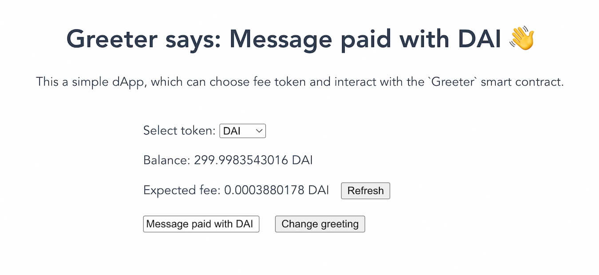

# Quickstart

This guide shows you how to deploy a smart contract to zkSync and build a dApp that interacts with it using the zkSync development toolbox.

This is what we're going to do:

- Build and deploy a smart contract on zkSync that stores a greeting message.
- Build a dApp that retrieves and updates the greeting message.
- Allow users to change the greeting message on the smart contract via the app.
- Show you how to [implement the testnet paymaster](#paying-fees-using-testnet-paymaster) that allows users to pay transaction fees with ERC20 tokens instead of ETH.

## Prerequisites

- Download and install [Node](https://nodejs.org/en/download).
- Download and install [`nvm`](https://github.com/nvm-sh/nvm#installing-and-updating) to change the running Node version to v16.16.0 with command `nvm use 16`.
- Use the `yarn` or `npm` package manager. We recommend using `yarn`. To install `yarn`, follow the [Yarn installation guide](https://yarnpkg.com/getting-started/install).
- A wallet with sufficient Göerli `ETH` on L1 to pay for bridging funds to zkSync and deploying smart contracts.
- ERC20 tokens on zkSync are required for the testnet paymaster. We recommend using [the faucet from the zkSync portal](https://goerli.portal.zksync.io/faucet).
- You know [how to get your private key from your MetaMask wallet](https://support.metamask.io/hc/en-us/articles/360015289632-How-to-export-an-account-s-private-key).

## Build and deploy the Greeter contract

### Initialize the project

1. Create a folder and `cd` into it.

```sh
mkdir greeter-example
cd greeter-example
```

2. Initialize the project and install the dependencies.

```sh
yarn init -y
yarn add -D typescript ts-node ethers@~5.7.2 zksync-web3 hardhat @matterlabs/hardhat-zksync-solc @matterlabs/hardhat-zksync-deploy
```

:::info
TypeScript is required by zkSync plugins.
:::

::: tip
The current version of `zksync-web3` uses `ethers v5.7.x` as a peer dependency. An update compatible with `ethers v6.x.x` will be released soon.
:::

3. Create the `hardhat.config.ts` file and copy/paste the following code, replacing `goerli` with your RPC URL:

```typescript
import "@matterlabs/hardhat-zksync-deploy";
import "@matterlabs/hardhat-zksync-solc";

module.exports = {
  zksolc: {
    version: "1.3.8",
    compilerSource: "binary",
    settings: {},
  },
  defaultNetwork: "zkSyncTestnet",

  networks: {
    zkSyncTestnet: {
      url: "https://testnet.era.zksync.dev",
      ethNetwork: "goerli", // RPC URL of the network (e.g. `https://goerli.infura.io/v3/<API_KEY>`)
      zksync: true,
    },
  },
  solidity: {
    version: "0.8.8",
  },
};
```

::: warning
If the contract was already compiled, it won't recompile until you delete the `artifacts-zk` and `cache-zk` folders, or change the compiler version.
:::

### Compile and deploy the Greeter contract

1. Create the following folders: 

```sh
mkdir contracts deploy
```

We store all the smart contracts' `*.sol` files in the `contracts` folder. The `deploy` folder will contain all scripts related to deployments.

2. Create the `contracts/Greeter.sol` contract and copy/paste the following code:

```solidity
//SPDX-License-Identifier: Unlicense
pragma solidity ^0.8.8;

contract Greeter {
    string private greeting;

    constructor(string memory _greeting) {
        greeting = _greeting;
    }

    function greet() public view returns (string memory) {
        return greeting;
    }

    function setGreeting(string memory _greeting) public {
        greeting = _greeting;
    }
}
```

3. Compile the contract with the following command:

```sh
yarn hardhat compile
```

4. Create the following deployment script in `deploy/deploy.ts`, replacing `<WALLET-PRIVATE-KEY>` with your own:

```typescript
import { Wallet, utils } from "zksync-web3";
import * as ethers from "ethers";
import { HardhatRuntimeEnvironment } from "hardhat/types";
import { Deployer } from "@matterlabs/hardhat-zksync-deploy";

// An example of a deploy script that will deploy and call a simple contract.
export default async function (hre: HardhatRuntimeEnvironment) {
  console.log(`Running deploy script for the Greeter contract`);

  // Initialize the wallet.
  const wallet = new Wallet("<WALLET-PRIVATE-KEY>");

  // Create deployer object and load the artifact of the contract you want to deploy.
  const deployer = new Deployer(hre, wallet);
  const artifact = await deployer.loadArtifact("Greeter");

  // Estimate contract deployment fee
  const greeting = "Hi there!";
  const deploymentFee = await deployer.estimateDeployFee(artifact, [greeting]);

  // OPTIONAL: Deposit funds to L2
  // Comment this block if you already have funds on zkSync.
  const depositHandle = await deployer.zkWallet.deposit({
    to: deployer.zkWallet.address,
    token: utils.ETH_ADDRESS,
    amount: deploymentFee.mul(2),
  });
  // Wait until the deposit is processed on zkSync
  await depositHandle.wait();

  // Deploy this contract. The returned object will be of a `Contract` type, similarly to ones in `ethers`.
  // `greeting` is an argument for contract constructor.
  const parsedFee = ethers.utils.formatEther(deploymentFee.toString());
  console.log(`The deployment is estimated to cost ${parsedFee} ETH`);

  const greeterContract = await deployer.deploy(artifact, [greeting]);

  //obtain the Constructor Arguments
  console.log("constructor args:" + greeterContract.interface.encodeDeploy([greeting]));

  // Show the contract info.
  const contractAddress = greeterContract.address;
  console.log(`${artifact.contractName} was deployed to ${contractAddress}`);
}
```

5. Deploy the contract.

```sh
yarn hardhat deploy-zksync
```

::: tip Request-Rate Exceeded message
- This message is caused by using the default RPC endpoints provided by ethers. 
- To avoid this, use your own Goerli RPC endpoint. 
- Find multiple [node providers here](https://github.com/arddluma/awesome-list-rpc-nodes-providers).
:::

You should see something like this:

```txt
Running deploy script for the Greeter contract
The deployment is estimated to cost 0.0265726735 ETH
constructor args:0x000000000000000000000000000000000000000000000000000000000000002000000000000000000000000000000000000000000000000000000000000000094869207468657265210000000000000000000000000000000000000000000000
Greeter was deployed to 0xE84774C41F096Ba5BafA1439cEE787D9dD1A6b72
```

**Congratulations! You have deployed a smart contract to zkSync Era Testnet** 🎉

Now visit the [zkSync block explorer](https://explorer.zksync.io/) and search with the contract address to confirm the deployment. Follow the [contract verification guide](../../api/tools/block-explorer/contract-verification.md) for instructions on how to verify your smart contract using the zkSync block explorer.

## Build the front-end dApp

### Set up the project

:::info
- We use the `Vue` web framework for the tutorial front end (the process is similar to other frameworks). 
- In order to focus on the `zksync-web3` SDK, we provide a prebuilt template. 
- Once set up, we add code that interacts with the smart contract we just deployed.
:::

1. Clone the template and `cd` into the folder.

```sh
git clone https://github.com/matter-labs/greeter-tutorial-starter
cd greeter-tutorial-starter
```

2. Spin up the project.

```bash
yarn
yarn serve
```

Navigate to `http://localhost:8081/` in a browser to see the running application.

### Connect accounts to the dApp

#### Smart accounts

Enabling smart accounts allows you to onboard Argent account abstraction wallet users that have been using the first version of zkSync.

- Use [this library](https://era.zksync.io/docs/dev/developer-guides/aa.html#aa-signature-checker) to verify your smart account compatibility.
- Follow [this guide](https://docs.argent.xyz/) to add Argent login to your dApp.

#### Externally owned accounts (EOAs)

In order to interact with dApps built on zkSync, connect the MetaMask wallet to the zkSync Era Testnet.

- Follow [this guide](../fundamentals/interacting.md#connecting-to-zksync-era-on-metamask) to connect Metamask to zkSync.

### Bridge funds to L2

- Use our [portal](https://goerli.portal.zksync.io) to bridge funds to zkSync.
- Use the [faucet](https://goerli.portal.zksync.io/faucet) to get some test ERC20 tokens in your account.

:::warning
When bridging from mainnet to a smart account (e.g. Argent) on zkSync Era, you must specify the address of your L2 wallet by clicking on **Deposit to another address on zkSync Era Mainnet**.
:::

### Project structure

In the `./src/App.vue` file, in the `functions:` section, you will see template code that stores the application. 

Most of the code is provided. You have to complete the TODO: sections.

```javascript
functions: {
  initializeProviderAndSigner() {
    // TODO: initialize provider and signer based on `window.ethereum`
  },

  async getGreeting() {
    // TODO: return the current greeting
    return "";
  },

  async getFee() {
    // TODO: return formatted fee
    return "";
  },

  async getBalance() {
    // Return formatted balance
    return "";
  },
  async getOverrides() {
    if (this.selectedToken.l1Address != ETH_L1_ADDRESS) {
      // TODO: Return data for the paymaster
    }

    return {};
  },
...
```

Beneath the `<script>` tag, there are placeholders for the address of your deployed `Greeter` contract: `GREETER_CONTRACT_ADDRESS`, and the path to its ABI: `GREETER_CONTRACT_ABI`.

```javascript
<script>
// eslint-disable-next-line
const GREETER_CONTRACT_ADDRESS = ""; // TODO: insert the Greeter contract address here
// eslint-disable-next-line
const GREETER_CONTRACT_ABI = []; // TODO: Complete and import the ABI
```

### Add the libraries

1. From the `greeter-tutorial-starter` root, install the dependencies.

```sh
yarn add ethers@^5.7.2 zksync-web3
```

2. Add the library imports under `<script>` in`App.vue`.

```js
<script>
import {} from "zksync-web3";
import {} from "ethers";

// eslint-disable-next-line
const GREETER_CONTRACT_ADDRESS = ""; // TODO: insert the Greeter contract address here
// eslint-disable-next-line
const GREETER_CONTRACT_ABI = []; // TODO: Complete and import the ABI
```

### Add the ABI and contract address

:::info
- To interact with a smart contract deployed to zkSync, we need its ABI. 
- ABI stands for Application Binary Interface and is json which describes the contract's variable and function, names and types.
:::

1. Create the `./src/abi.json` file. You may find one in the repo, but it's good practice to use the one you created instead.

2. Copy/paste the contract's ABI from the `./artifacts-zk/contracts/Greeter.sol/Greeter.json` file in the hardhat project folder from the previous section into `abi.json`. The file should look something like this:

```json
[
  {
    "inputs": [
      {
        "internalType": "string",
        "name": "_greeting",
        "type": "string"
      }
    ],
    "stateMutability": "nonpayable",
    "type": "constructor"
  },
  {
    "inputs": [],
    "name": "greet",
    "outputs": [
      {
        "internalType": "string",
        "name": "",
        "type": "string"
      }
    ],
    "stateMutability": "view",
    "type": "function"
  },
  {
    "inputs": [
      {
        "internalType": "string",
        "name": "_greeting",
        "type": "string"
      }
    ],
    "name": "setGreeting",
    "outputs": [],
    "stateMutability": "nonpayable",
    "type": "function"
  }
]
```

3. Set the `GREETER_CONTRACT_ABI` to require the ABI file, and add the Greeter contract address.

```js
// eslint-disable-next-line
const GREETER_CONTRACT_ADDRESS = "0x...";
// eslint-disable-next-line
const GREETER_CONTRACT_ABI = require("./abi.json");
```

### Working with a Web3 Provider

1. Go to the `initializeProviderAndSigner` function in `./src/App.vue`. This function is called after the connection to Metamask is successful.

In this function we should:

- Initialize a `Web3Provider` and a `Signer` to interact with zkSync.
- Initialize the `Contract` object to interact with the `Greeter` contract we just deployed.

2. Import the necessary dependencies under the imports from before:

```javascript
import { Contract, Web3Provider, Provider } from "zksync-web3";
```

3. Initialise the provider, signer, and contract instances like this:

```javascript
initializeProviderAndSigner() {
    this.provider = new Provider('https://testnet.era.zksync.dev');
    // Note that we still need to get the Metamask signer
    this.signer = (new Web3Provider(window.ethereum)).getSigner();
    this.contract = new Contract(
        GREETER_CONTRACT_ADDRESS,
        GREETER_CONTRACT_ABI,
        this.signer
    );
},
```

### Retrieving the greeting

Fill in the function to retrieve the greeting from the smart contract:

```javascript
async getGreeting() {
    // Smart contract calls work the same way as in `ethers`
    return await this.contract.greet();
},
```

The function looks like this:

```javascript
initializeProviderAndSigner() {
    this.provider = new Provider('https://testnet.era.zksync.dev');
    // Note that we still need to get the Metamask signer
    this.signer = (new Web3Provider(window.ethereum)).getSigner();
    this.contract = new Contract(
        GREETER_CONTRACT_ADDRESS,
        GREETER_CONTRACT_ABI,
        this.signer
    );
},
async getGreeting() {
    return await this.contract.greet();
},
```

After connecting the Metamask wallet to zkSync Era Testnet, you should see the following page:


The **Select token** dropdown menu allows you to choose which token to pay fees with. 

### Retrieving token balance and transaction fee

The easiest way to retrieve the user's balance is to use the `Signer.getBalance` function.

1. Add the necessary dependencies to the same place you added imports before:

```javascript
// `ethers` is only used in this tutorial for its utility functions
import { ethers } from "ethers";
```

2. Implement the function:

```javascript
async getBalance() {
    // Getting the balance for the signer in the selected token
    const balanceInUnits = await this.signer.getBalance(this.selectedToken.l2Address);
    // To display the number of tokens in the human-readable format, we need to format them,
    // e.g. if balanceInUnits returns 500000000000000000 wei of ETH, we want to display 0.5 ETH the user
    return ethers.utils.formatUnits(balanceInUnits, this.selectedToken.decimals);
},
```

3. Estimate the fee:

```javascript
async getFee() {
    // Getting the amount of gas (gas) needed for one transaction
    const feeInGas = await this.contract.estimateGas.setGreeting(this.newGreeting);
    // Getting the gas price per one erg. For now, it is the same for all tokens.
    const gasPriceInUnits = await this.provider.getGasPrice();

    // To display the number of tokens in the human-readable format, we need to format them,
    // e.g. if feeInGas*gasPriceInUnits returns 500000000000000000 wei of ETH, we want to display 0.5 ETH the user
    return ethers.utils.formatUnits(feeInGas.mul(gasPriceInUnits), this.selectedToken.decimals);
},
```

Now, when you select the token to pay the fee, the balance and the expected fee for the transaction are available.

Click **Refresh** to recalculate the fee. The fee depends on the length of the message we want to store as the greeting.

It is possible to also click on the **Change greeting** button, but nothing will happen yet as we haven't implemented the function.


### Updating the greeting

Update the function in `App.vue` with the following code:

```javascript
async changeGreeting() {
    this.txStatus = 1;
    try {
        const txHandle = await this.contract.setGreeting(this.newGreeting, await this.getOverrides());

        this.txStatus = 2;

        // Wait until the transaction is committed
        await txHandle.wait();
        this.txStatus = 3;

        // Update greeting
        this.greeting = await this.getGreeting();

        this.retreivingFee = true;
        this.retreivingBalance = true;
        // Update balance and fee
        this.currentBalance = await this.getBalance();
        this.currentFee = await this.getFee();
    } catch (e) {
        alert(JSON.stringify(e));
    }

    this.txStatus = 0;
    this.retreivingFee = false;
    this.retreivingBalance = false;
},
```

Now you can add a new greeting message and send it to the contract via a transaction with MetaMask. You will see the Greeter message change on the front end.

You now have a fully functional Greeter-dApp! However, it does not yet leverage any zkSync-specific features.

::: warning
Do you see a **wallet_requestPermissions** error?

Refresh your browser, or open the MetaMask extension on your browser and click _Next_ or _Cancel_ to resolve it.

Read more about `wallet_requestPermissions`, in the [MetaMask documentation](https://docs.metamask.io/guide/rpc-api.html#wallet-requestpermissions).
:::

### Paying fees using testnet paymaster

The zkSync Era account abstraction feature allows you to integrate [paymasters](../developer-guides/aa.md#paymasters) that can pay the fees entirely for you, or swap your tokens on the fly. 

We will use the [testnet paymaster](../developer-guides/aa.md#testnet-paymaster) that is provided on all zkSync Era testnets.

:::info
**The testnet paymaster allows users to pay fees in any ERC20 token** with the exchange rate of Token:ETH of 1:1, i.e. one unit of the token for one wei of ETH. 

This means that transaction fees in tokens with fewer decimals than ETH will be bigger; for example, USDC which has only 6 decimals. This is a known behaviour of the testnet paymaster, which was built for demonstration purposes only.
:::

::: warning Paymasters on mainnet
The testnet [paymaster](https://era.zksync.io/docs/dev/tutorials/custom-paymaster-tutorial.html#building-custom-paymaster) is purely for demonstrating this feature and won't be available on mainnet. 

When integrating your protocol on mainnet, you should follow the documentation of the paymaster you use, or create your own.
:::

The `getOverrides` function returns an empty object when users decide to pay with ether but, when users select the ERC20 option, it should return the paymaster address and all the information required by it. This is how to do it:

1. To retrieve the address of the testnet paymaster from the zkSync provider, add a new function `getOverrides`:

```javascript
async getOverrides() {
  if (this.selectedToken.l1Address != ETH_L1_ADDRESS) {
    const testnetPaymaster = await this.provider.getTestnetPaymasterAddress();

    // ..
  }

  return {};
}
```

:::info
It is recommended to retrieve the testnet paymaster's address before each interaction as it may change.
:::

2. Add `utils` to the same import from `zksync-web3` SDK as before:

```javascript
import { Contract, Web3Provider, Provider, utils } from "zksync-web3";
```

3. We need to calculate how many tokens are required to process the transaction. Since the testnet paymaster exchanges any ERC20 token to ETH at a 1:1 rate, the amount is the same as the ETH amount in wei:

```javascript
async getOverrides() {
  if (this.selectedToken.l1Address != ETH_L1_ADDRESS) {
    const testnetPaymaster = await this.provider.getTestnetPaymasterAddress();

    const gasPrice = await this.provider.getGasPrice();
    // estimate gasLimit via paymaster
    const paramsForFeeEstimation = utils.getPaymasterParams(
          testnetPaymaster,
          {
            type: "ApprovalBased",
            minimalAllowance: ethers.BigNumber.from("1"),
            token: this.selectedToken.l2Address,
            innerInput: new Uint8Array(),
          }
        );

        // estimate gasLimit via paymaster
        const gasLimit = await this.contract.estimateGas.setGreeting(
          this.newGreeting,
          {
            customData: {
              gasPerPubdata: utils.DEFAULT_GAS_PER_PUBDATA_LIMIT,
              paymasterParams: paramsForFeeEstimation,
            },
          }
        );
    const fee = gasPrice.mul(gasLimit);

    // ..
  }

  return {};
}
```

4. Now, what is left is to encode the paymasterInput following the [protocol requirements](../developer-guides/aa.md#testnet-paymaster) and return the needed overrides. 

Copy/paste the following complete function:

```javascript
async getOverrides() {
  if (this.selectedToken.l1Address != ETH_L1_ADDRESS) {
    const testnetPaymaster =
      await this.provider.getTestnetPaymasterAddress();

    const gasPrice = await this.provider.getGasPrice();

    // estimate gasLimit via paymaster
    const paramsForFeeEstimation = utils.getPaymasterParams(
      testnetPaymaster,
      {
        type: "ApprovalBased",
        minimalAllowance: ethers.BigNumber.from("1"),
        token: this.selectedToken.l2Address,
        innerInput: new Uint8Array(),
      }
    );

    // estimate gasLimit via paymaster
    const gasLimit = await this.contract.estimateGas.setGreeting(
      this.newGreeting,
      {
        customData: {
          gasPerPubdata: utils.DEFAULT_GAS_PER_PUBDATA_LIMIT,
          paymasterParams: paramsForFeeEstimation,
        },
      }
    );

    const fee = gasPrice.mul(gasLimit.toString());

    const paymasterParams = utils.getPaymasterParams(testnetPaymaster, {
      type: "ApprovalBased",
      token: this.selectedToken.l2Address,
      minimalAllowance: fee,
      // empty bytes as testnet paymaster does not use innerInput
      innerInput: new Uint8Array(),
    });

    return {
      maxFeePerGas: gasPrice,
      maxPriorityFeePerGas: ethers.BigNumber.from(0),
      gasLimit,
      customData: {
        gasPerPubdata: utils.DEFAULT_GAS_PER_PUBDATA_LIMIT,
        paymasterParams,
      },
    };
  }

  return {};
},
```

5. To use a list of ERC20 tokens, change the following line:

```javascript
const allowedTokens = require("./eth.json");
```

to the following one:

```javascript
const allowedTokens = require("./erc20.json");
```

The `erc20.json` file contains a few tokens like DAI, USDC and wBTC.

### Complete app

Now you should be able to update the greeting message with ETH or any of the available tokens.

1. Select one of the ERC20 tokens to see the estimated fee:



2. Click on the `Change greeting` button to update the message. Since the `paymasterParams` were supplied, the transaction will be an `EIP712` ([more on EIP712 here](https://eips.ethereum.org/EIPS/eip-712)):


3. Click "Sign" to send the transaction.

After the transaction is processed, the page updates the balances and the new greeting can be viewed.

**You've paid for this transaction with an ERC20 token using the testnet paymaster** 🎉

### Learn more

- To learn more about `zksync-web3` SDK, check out its [documentation](../../api/js).
- To learn more about the zkSync hardhat plugins, check out their [documentation](../../api/hardhat).
