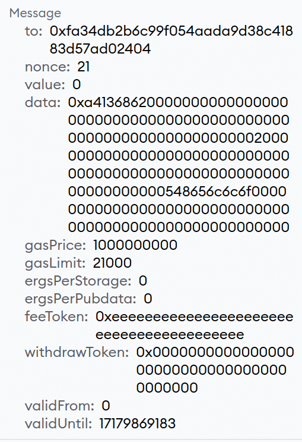

 # 快速入门

  在这个快速入门指南中，您将学习如何将智能合约部署到zkSync，并使用zkSync开发工具箱构建一个与之互动的dApp。

  这就是我们要建立的东西。

  - 一个存储问候信息的智能合约，并部署在zkSync上。
  - 一个dApp来检索和更新问候信息。
  - 用户将能够在智能合约上改变问候语。
  - 默认情况下，用户将以ETH支付交易费用。然而，我们也将解释如何[实现testnet paymaster]（#paying-fees-using-testnet-paymaster），让用户用ERC20代币支付交易费用。


::: warning

请注意，在`zksync-web3 ^0.13.0`中引入了突破性变化。API层现在使用 "gas "操作，"ergs "概念只在虚拟机内部使用。

:::

## 先决条件

- `yarn`或`NPM`软件包管理器。我们推荐`yarn`，它是我们在前端项目中使用的。[这里是Yarn的安装指南](https://yarnpkg.com/getting-started/install)，以防你没有它。
- 一个在L1上有足够的Göerli `ETH`的钱包，以支付桥接资金到zkSync以及部署智能合约。
- 如果你想实现testnet paymaster，则需要zkSync上的ERC20代币。我们建议使用[来自zkSync门户网站的龙头](https://portal.zksync.io/faucet)。

## 初始化项目和部署智能合约

1. 初始化项目并安装依赖性。在你的终端运行以下命令。

```sh
mkdir greeter-example
cd greeter-example

# For Yarn
yarn init -y
yarn add -D typescript ts-node ethers@^5.7.2 zksync-web3@^0.13.1 hardhat @matterlabs/hardhat-zksync-solc @matterlabs/hardhat-zksync-deploy

# For NPM
npm init -y
npm i -D typescript ts-node ethers@^5.7.2 zksync-web3@^0.13.1 hardhat @matterlabs/hardhat-zksync-solc @matterlabs/hardhat-zksync-deploy
```

请注意，ZkSync插件需要使用Typescript。

::: tip

当前版本的`zksync-web3`使用`ethers v5.7.x`作为同行依赖。与`ethers v6.x.x`兼容的更新将很快发布。

:::

1. 创建`hardhat.config.ts`文件并在那里粘贴以下代码。

```typescript
import "@matterlabs/hardhat-zksync-deploy";
import "@matterlabs/hardhat-zksync-solc";

module.exports = {
  zksolc: {
    version: "1.3.1",
    compilerSource: "binary",
    settings: {},
  },
  defaultNetwork: "zkSyncTestnet",

  networks: {
    zkSyncTestnet: {
      url: "https://zksync2-testnet.zksync.dev",
      ethNetwork: "goerli", // Can also be the RPC URL of the network (e.g. `https://goerli.infura.io/v3/<API_KEY>`)
      zksync: true,
    },
  },
  solidity: {
    version: "0.8.17",
  },
};
```

::: warning Tip

如果合同已经被编译，你应该删除artifacts-zk和cache-zk文件夹，否则，除非你改变编译器版本，否则它不会重新编译。

:::

3. 创建 "合同 "和 "部署 "文件夹。前者是我们将存储所有智能合约的`*.sol`文件的地方，后者是我们将放置所有与部署合约有关的脚本的地方。
4. 创建`contracts/Greeter.sol`合约并在其中粘贴以下代码。

```solidity
//SPDX-License-Identifier: Unlicense
pragma solidity ^0.8.0;

contract Greeter {
    string private greeting;

    constructor(string memory _greeting) {
        greeting = _greeting;
    }

    function greet() public view returns (string memory) {
        return greeting;
    }

    function setGreeting(string memory _greeting) public {
        greeting = _greeting;
    }
}
```

5. 用以下命令编译合同。

```sh
yarn hardhat compile
```

6. 在`deploy/deploy.ts`中创建以下部署脚本。

```typescript
import { Wallet, utils } from "zksync-web3";
import * as ethers from "ethers";
import { HardhatRuntimeEnvironment } from "hardhat/types";
import { Deployer } from "@matterlabs/hardhat-zksync-deploy";

// An example of a deploy script that will deploy and call a simple contract.
export default async function (hre: HardhatRuntimeEnvironment) {
  console.log(`Running deploy script for the Greeter contract`);

  // Initialize the wallet.
  const wallet = new Wallet("<WALLET-PRIVATE-KEY>");

  // Create deployer object and load the artifact of the contract you want to deploy.
  const deployer = new Deployer(hre, wallet);
  const artifact = await deployer.loadArtifact("Greeter");

  // Estimate contract deployment fee
  const greeting = "Hi there!";
  const deploymentFee = await deployer.estimateDeployFee(artifact, [greeting]);

  // OPTIONAL: Deposit funds to L2
  // Comment this block if you already have funds on zkSync.
  const depositHandle = await deployer.zkWallet.deposit({
    to: deployer.zkWallet.address,
    token: utils.ETH_ADDRESS,
    amount: deploymentFee.mul(2),
  });
  // Wait until the deposit is processed on zkSync
  await depositHandle.wait();

  // Deploy this contract. The returned object will be of a `Contract` type, similarly to ones in `ethers`.
  // `greeting` is an argument for contract constructor.
  const parsedFee = ethers.utils.formatEther(deploymentFee.toString());
  console.log(`The deployment is estimated to cost ${parsedFee} ETH`);

  const greeterContract = await deployer.deploy(artifact, [greeting]);

  //obtain the Constructor Arguments
  console.log("constructor args:" + greeterContract.interface.encodeDeploy([greeting]));

  // Show the contract info.
  const contractAddress = greeterContract.address;
  console.log(`${artifact.contractName} was deployed to ${contractAddress}`);
}
```

7. 将`WALLET-PRIVATE-KEY`替换为你用于开发的Ethereum钱包的私钥，并使用以下命令运行部署脚本。

```sh
yarn hardhat deploy-zksync
```

::: tip 请求-速率超标消息

这个消息是由使用ethers提供的默认RPC端点引起的。为了避免这种情况，请使用你自己的Goerli RPC端点。你可以[在这里找到多个节点提供者]（https://github.com/arddluma/awesome-list-rpc-nodes-providers）。

:::

在输出中，你应该看到合同被部署到的地址。

**恭喜你! 你已经部署了一个智能合约到zkSync Era Testnet** 🎉。

现在你可以访问[zkSync区块探索器](https://explorer.zksync.io/)，搜索你的合约地址，以确认它被成功部署。

[本指南](.../.../api/tools/block-explorer/contract-verification.md)解释了如何使用zkSync区块探索器验证你的智能合约。

## 前端集成

### 设置项目

在本教程中，`Vue'将被用作首选的网络框架，但无论使用哪种框架，其过程都很相似。为了专注于使用`zksync-web3`SDK的细节，我们将提供一个模板，所有的前端工作都已经完成。最后一步是添加代码，与我们刚刚部署的智能合约进行交互。

1. Clone it。

```sh
git clone https://github.com/matter-labs/greeter-tutorial-starter
```

2. Spin up the project:

```sh
cd greeter-tutorial-starter
# For Yarn
yarn
yarn serve

# For NPM
npm install
npm run serve
```

默认情况下，该页面应该在`http://localhost:8080`上运行。在浏览器中打开这个URL，可以看到该页面。

### 连接到Metamask和桥接token到zkSync

为了与建立在zkSync上的dApps互动，将Metamask钱包连接到zkSync alpha testnet网络并将一些资金桥接到L2。

- 按照[本指南](./fundamentals/interacting.md#connecting tozksync-era-onmetamask)将Metamask连接到zkSync。
- 使用我们的[portal](https://portal.zksync.io)来连接资金到zkSync。
- 使用[faucet](https://portal.zksync.io/faucet)来获得一些测试的ERC20代币到你的账户。

### 项目结构

我们将在`./src/App.vue`中编写所有代码。几乎所有的前端代码都是开箱即用的，剩下的唯一任务就是填写TODO-s，与我们刚刚在zkSync上部署的合约进行交互。

```javascript
initializeProviderAndSigner() {
  // TODO: initialize provider and signer based on `window.ethereum`
},

async getGreeting() {
  // TODO: return the current greeting
  return "";
},

async getFee() {
  // TODO: return formatted fee
  return "";
},

async getBalance() {
  // Return formatted balance
  return "";
},
async getOverrides() {
  if (this.selectedToken.l1Address != ETH_L1_ADDRESS) {
    // TODO: Return data for the paymaster
  }

  return {};
},
async changeGreeting() {
  this.txStatus = 1;
  try {
    // TODO: Submit the transaction
    this.txStatus = 2;
    // TODO: Wait for transaction compilation
    this.txStatus = 3;
    // Update greeting
    this.greeting = await this.getGreeting();
    this.retreivingFee = true;
    this.retreivingBalance = true;
    // Update balance and fee
    this.currentBalance = await this.getBalance();
    this.currentFee = await this.getFee();
  } catch (e) {
    alert(JSON.stringify(e));
  }
  this.txStatus = 0;
  this.retreivingFee = false;
  this.retreivingBalance = false;
},
```

在`<script>`标签的顶部，你可以看到应该填写部署的`Greeter`合同的地址和其ABI的路径的部分。我们将在下面的章节中填写这些字段。

```javascript
// eslint-disable-next-line
const GREETER_CONTRACT_ADDRESS = ""; // TODO: insert the Greeter contract address here
// eslint-disable-next-line
const GREETER_CONTRACT_ABI = []; // TODO: Complete and import the ABI
```

### 安装 `zksync-web3`.

在greeter-tutorial-starter根目录下运行以下命令来安装`zksync-web3`和`ethers`。

```
# For Yarn
yarn add ethers@^5.7.2 zksync-web3@^0.13.1

# For NPM
npm i ethers@^5.7.2 zksync-web3@^0.13.1
```

之后，在`App.vue`文件的`script`部分导入这两个库（就在合同常量之前）。它应该看起来像这样。


```javascript
import {} from "zksync-web3";
import {} from "ethers";

// eslint-disable-next-line
const GREETER_CONTRACT_ADDRESS = ""; // TODO: insert the Greeter contract address here
// eslint-disable-next-line
const GREETER_CONTRACT_ABI = []; // TODO: Complete and import the ABI
```

### 获取ABI和合同地址

打开`./src/App.vue`并设置`GREETER_CONTRACT_ADDRESS`常数等于部署greeter合约的地址。

为了与我们刚刚部署到zkSync的智能合约互动，我们还需要它的ABI。ABI代表应用二进制接口，简而言之，它是一个文件，描述了所有可用的智能合约方法的名称和类型，以便与之互动。

- 创建`./src/abi.json`文件。
- 你可以从上一节的hardhat项目文件夹中的`./artifacts-zk/contracts/Greeter.sol/Greeter.json`文件中得到合约的ABI。你应该复制`abi`数组并将其粘贴到上一步创建的`abi.json`文件中。该文件应该看起来大致如下。

```json
[
  {
    "inputs": [
      {
        "internalType": "string",
        "name": "_greeting",
        "type": "string"
      }
    ],
    "stateMutability": "nonpayable",
    "type": "constructor"
  },
  {
    "inputs": [],
    "name": "greet",
    "outputs": [
      {
        "internalType": "string",
        "name": "",
        "type": "string"
      }
    ],
    "stateMutability": "view",
    "type": "function"
  },
  {
    "inputs": [
      {
        "internalType": "string",
        "name": "_greeting",
        "type": "string"
      }
    ],
    "name": "setGreeting",
    "outputs": [],
    "stateMutability": "nonpayable",
    "type": "function"
  }
]
```

设置`GREETER_CONTRACT_ABI`以要求ABI文件并设置Greeter合同地址。

```js
// eslint-disable-next-line
const GREETER_CONTRACT_ADDRESS = "0x...";
// eslint-disable-next-line
const GREETER_CONTRACT_ABI = require("./abi.json");
```

### 与提供者合作

1. 转到`./src/App.vue`中的`initializeProviderAndSigner`方法。这个方法在与Metamask的连接成功后被调用。

在这个方法中，我们应该。

- 初始化一个`Web3Provider'和一个`Signer'以与zkSync交互。
- 初始化`Contract`对象，与我们刚刚部署的`Greeter`合同进行交互。

2. 导入必要的依赖性。

```javascript
import { Contract, Web3Provider, Provider } from "zksync-web3";
```

3. 像这样初始化提供者、签名者和合同实例。

```javascript
initializeProviderAndSigner() {
    this.provider = new Provider('https://zksync2-testnet.zksync.dev');
    // Note that we still need to get the Metamask signer
    this.signer = (new Web3Provider(window.ethereum)).getSigner();
    this.contract = new Contract(
        GREETER_CONTRACT_ADDRESS,
        GREETER_CONTRACT_ABI,
        this.signer
    );
},
```

### 检索问候语

填入方法，从智能合约中检索问候语。

```javascript
async getGreeting() {
    // Smart contract calls work the same way as in `ethers`
    return await this.contract.greet();
}
```

完整的方法现在看起来如下。


```javascript
initializeProviderAndSigner() {
    this.provider = new Provider('https://zksync2-testnet.zksync.dev');
    // Note that we still need to get the Metamask signer
    this.signer = (new Web3Provider(window.ethereum)).getSigner();
    this.contract = new Contract(
        GREETER_CONTRACT_ADDRESS,
        GREETER_CONTRACT_ABI,
        this.signer
    );
},
async getGreeting() {
    return await this.contract.greet();
},
```

连接Metamask钱包后，你应该看到以下页面。


现在可以选择所选择的代币来支付费用。但是，目前还没有更新余额，_yet_。

### 检索代币余额和交易费用

检索用户余额的最简单方法是使用`Signer.getBalance`方法。

1. 添加必要的依赖性。

```javascript
// `ethers` is only used in this tutorial for its utility functions
import { ethers } from "ethers";
```

2. 实现该方法本身。


```javascript
async getBalance() {
    // Getting the balance for the signer in the selected token
    const balanceInUnits = await this.signer.getBalance(this.selectedToken.l2Address);
    // To display the number of tokens in the human-readable format, we need to format them,
    // e.g. if balanceInUnits returns 500000000000000000 wei of ETH, we want to display 0.5 ETH the user
    return ethers.utils.formatUnits(balanceInUnits, this.selectedToken.decimals);
},
```

3. 估计费用。


```javascript
async getFee() {
    // Getting the amount of gas (gas) needed for one transaction
    const feeInGas = await this.contract.estimateGas.setGreeting(this.newGreeting);
    // Getting the gas price per one erg. For now, it is the same for all tokens.
    const gasPriceInUnits = await this.provider.getGasPrice();

    // To display the number of tokens in the human-readable format, we need to format them,
    // e.g. if feeInGas*gasPriceInUnits returns 500000000000000000 wei of ETH, we want to display 0.5 ETH the user
    return ethers.utils.formatUnits(feeInGas.mul(gasPriceInUnits), this.selectedToken.decimals);
},
```

当打开页面并选择支付费用的令牌时，交易的余额和预期费用将被提供。

应使用`刷新`按钮来重新计算费用，因为费用可能取决于我们想存储为问候语的信息的长度。

也可以点击`改变问候语`按钮，但由于合同还没有被调用，所以不会有任何改变。


### 更新问候语

1. 与智能合约的交互方式与 "ethers "绝对相同，但是，如果你想使用zkSync的特定功能，你可能需要在覆盖中提供一些额外的参数。

```javascript
// The example of paying fees using a paymaster will be shown in the
// section below.
const txHandle = await this.contract.setGreeting(this.newGreeting, await this.getOverrides());
```

2. 等待，直到事务被提交。


```javascript
await txHandle.wait();
```

完整的方法看起来如下。


```javascript
async changeGreeting() {
    this.txStatus = 1;
    try {
        const txHandle = await this.contract.setGreeting(this.newGreeting, await this.getOverrides());

        this.txStatus = 2;

        // Wait until the transaction is committed
        await txHandle.wait();
        this.txStatus = 3;

        // Update greeting
        this.greeting = await this.getGreeting();

        this.retreivingFee = true;
        this.retreivingBalance = true;
        // Update balance and fee
        this.currentBalance = await this.getBalance();
        this.currentFee = await this.getFee();
    } catch (e) {
        alert(JSON.stringify(e));
    }

    this.txStatus = 0;
    this.retreivingFee = false;
    this.retreivingBalance = false;
},
```

你现在有了一个功能齐全的Greeter-dApp! 然而，它并没有利用任何zkSync的特定功能。


::: warning

当你得到一个**钱包_请求权限**的错误时，会发生什么？

要解决这个错误，请刷新浏览器，或在浏览器上打开MetaMask扩展，点击_Next_或_Cancel_来解决。

阅读更多关于**wallet_requestPermissions**的信息，请访问[metamask文档](https://docs.metamask.io/guide/rpc-api.html#wallet-requestpermissions)。

:::

### 使用testnet paymaster支付费用

尽管以太坊是你唯一可以支付费用的代币，但账户抽象功能允许你整合[paymasters](.../developer-guides/aa.md#paymasters)，它可以完全为你支付费用，或者在飞行中交换你的代币。在本教程中，我们将使用[testnet paymaster](.../developer-guides/aa.md#testnet-paymaster)，它在所有zkSync Era testnets上提供。

**testnet paymaster允许用户以任何ERC20代币支付费用**，Token:ETH的汇率为1:1，即一个单位的代币兑换一Wei的ETH。这意味着小数点少于ETH的代币的交易费用会更大，例如只有6小数点的USDC。这是testnet支付系统的一个已知行为，它的建立只是为了演示目的。

::: warning 主网上的付款人

🚨 测试网的支付系统纯粹是为了演示这个功能，不会在主网上使用。当在主网上整合你的协议时，你应该遵循你将使用的支付系统的文档，或者创建你自己的支付系统。

:::

当用户决定用乙醚支付时，`getOverrides'方法返回一个空对象，但是，当用户选择ERC20选项时，它应该返回付款人地址和它所需要的所有信息。这就是如何做到这一点。

1. 从zkSync提供商那里检索testnet支付系统的地址。

```javascript
async getOverrides() {
  if (this.selectedToken.l1Address != ETH_L1_ADDRESS) {
    const testnetPaymaster = await this.provider.getTestnetPaymasterAddress();

    // ..
  }

  return {};
}
```

注意，建议每次在进行任何互动之前，都要检索测试网付款人的地址，因为它可能会改变。

2. 从`zksync-web3`SDK的导入中添加`utils`。

```javascript
import { Contract, Web3Provider, Provider, utils } from "zksync-web3";
```

3. 我们需要计算出处理该交易需要多少代币。由于testnet支付宝以1:1的比例将任何ERC20代币兑换成ETH，所以金额与ETH金额相同，以wei计算。

```javascript
async getOverrides() {
  if (this.selectedToken.l1Address != ETH_L1_ADDRESS) {
    const testnetPaymaster = await this.provider.getTestnetPaymasterAddress();

    const gasPrice = await this.provider.getGasPrice();
    // estimate gasLimit via paymaster
    const paramsForFeeEstimation = utils.getPaymasterParams(
          testnetPaymaster,
          {
            type: "ApprovalBased",
            minimalAllowance: ethers.BigNumber.from("1"),
            token: this.selectedToken.l2Address,
            innerInput: new Uint8Array(),
          }
        );

        // estimate gasLimit via paymaster
        const gasLimit = await this.contract.estimateGas.setGreeting(
          this.newGreeting,
          {
            customData: {
              gasPerPubdata: utils.DEFAULT_GAS_PER_PUBDATA_LIMIT,
              paymasterParams: paramsForFeeEstimation,
            },
          }
        );
    const fee = gasPrice.mul(gasLimit);

    // ..
  }

  return {};
}
```

4. 现在，剩下的就是按照[协议要求](.../developer-guides/aa.md#testnet-paymaster)对paymasterInput进行编码，并返回需要的重写。

```javascript
async getOverrides() {
  if (this.selectedToken.l1Address != ETH_L1_ADDRESS) {
    const testnetPaymaster =
      await this.provider.getTestnetPaymasterAddress();

    const gasPrice = await this.provider.getGasPrice();

    // estimate gasLimit via paymaster
    const paramsForFeeEstimation = utils.getPaymasterParams(
      testnetPaymaster,
      {
        type: "ApprovalBased",
        minimalAllowance: ethers.BigNumber.from("1"),
        token: this.selectedToken.l2Address,
        innerInput: new Uint8Array(),
      }
    );

    // estimate gasLimit via paymaster
    const gasLimit = await this.contract.estimateGas.setGreeting(
      this.newGreeting,
      {
        customData: {
          gasPerPubdata: utils.DEFAULT_GAS_PER_PUBDATA_LIMIT,
          paymasterParams: paramsForFeeEstimation,
        },
      }
    );

    const fee = gasPrice.mul(gasLimit.toString());

    const paymasterParams = utils.getPaymasterParams(testnetPaymaster, {
      type: "ApprovalBased",
      token: this.selectedToken.l2Address,
      minimalAllowance: fee,
      // empty bytes as testnet paymaster does not use innerInput
      innerInput: new Uint8Array(),
    });

    return {
      maxFeePerGas: gasPrice,
      maxPriorityFeePerGas: ethers.BigNumber.from(0),
      gasLimit,
      customData: {
        gasPerPubdata: utils.DEFAULT_GAS_PER_PUBDATA_LIMIT,
        paymasterParams,
      },
    };
  }

  return {};
},
```

5. 要使用ERC20代币的列表，请修改以下一行。


```javascript
const allowedTokens = require("./eth.json");
```

到下面一个。


```javascript
const allowedTokens = require("./erc20.json");
```

`erc20.json`文件包含一些代币，如DAI、USDC和wBTC。

### 完成应用程序

现在你应该可以用ETH或任何可用的代币来更新问候语了。

1. 选择其中一个ERC20代币来查看估计费用。


2. 点击`改变问候语`按钮来更新信息。由于提供了`paymasterParams`，该交易将是`EIP712`([更多关于EIP712的信息](https://eips.ethereum.org/EIPS/eip-712))。



3. 点击 "签名"，发送交易。

交易处理完毕后，页面会更新余额，可以查看新的问候语。

**你已经用ERC20代币使用testnet paymaster支付了这笔交易** 🎉。

### 了解更多

- 要了解更多关于`zksync-web3`SDK的信息，请查看其[文档](.../.../api/js)。
- 要了解更多关于zkSync hardhat插件的信息，请查看它们的[document](../../api/hardhat)。

