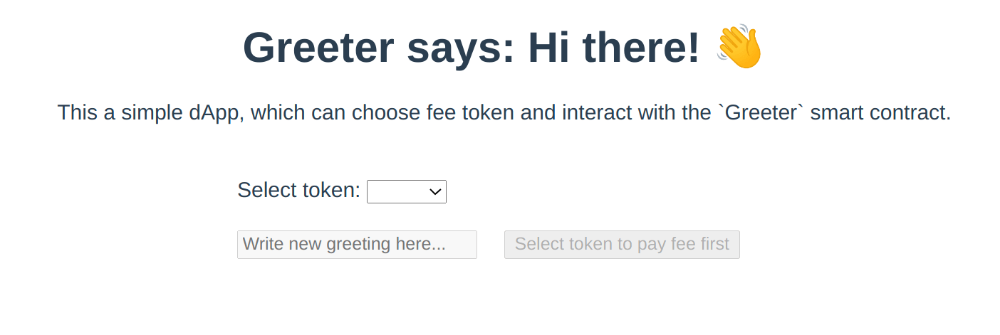
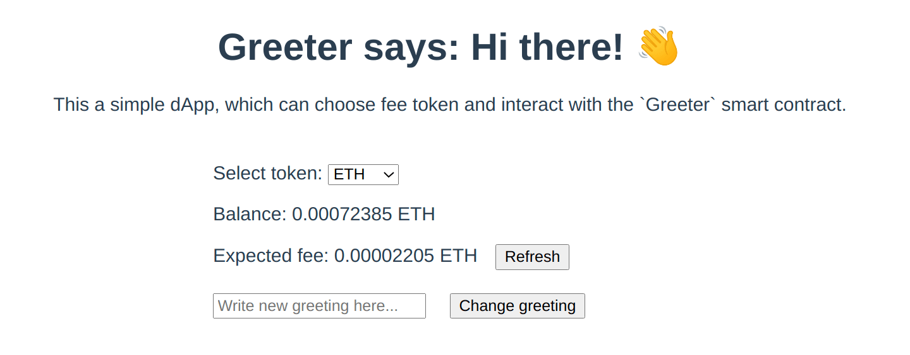
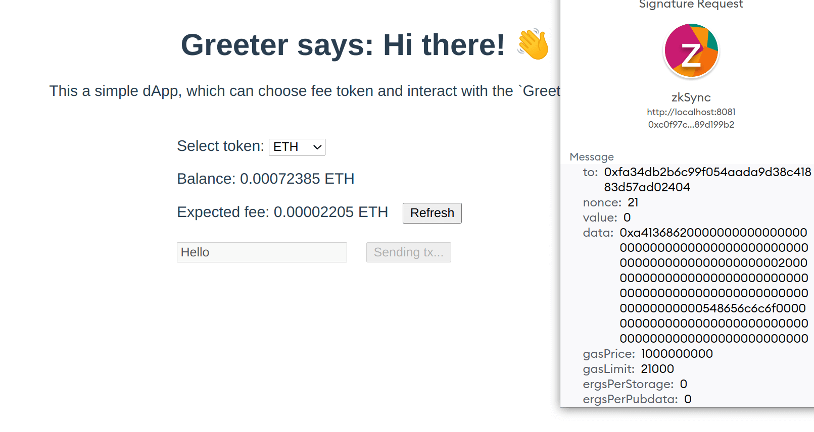
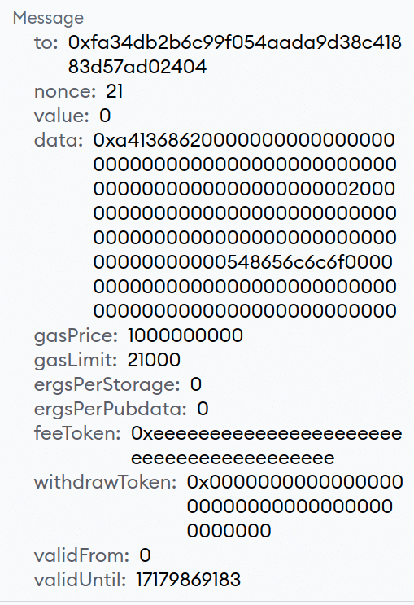
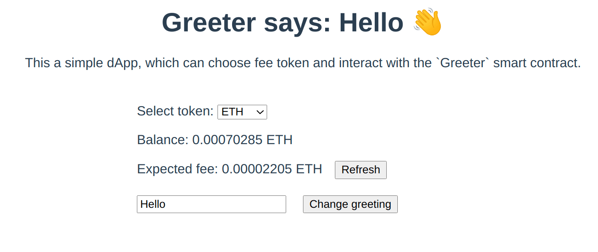

# Quickstart

In this quickstart guide, you will learn how to deploy a smart contract to zkSync and build a dApp to interact with it using the zkSync development toolbox.

This is what we're going to build:

- A smart contract that stores a greeting message and is deployed on zkSync.
- A dApp to retrieve the greeting.
- Users will be able to change the greeting on the smart contract.
- By default, users will have to pay transaction fees to change the greeting message in ether. However, we will also explain how to [implement the testnet paymaster](#paying-fees-using-testnet-paymaster) to allow users to pay fees with ERC20 tokens.

::: tip

The testnet paymaster is just for testing. If you decide to build a project on mainnet, you should read the documentation about [paymasters](./aa.md#paymasters).

:::

<TocHeader />
<TOC class="table-of-contents" :include-level="[2,3]" />

## Prerequisites

- `yarn` package manager. [Here is the installation guide](https://yarnpkg.com/getting-started/install)(`npm` examples will be added soon.)
- A wallet with sufficient Göerli `ETH` on L1 to pay for bridging funds to zkSync as well as deploying smart contracts. ERC20 tokens on zkSync are required if you want to implement the testnet paymaster. We recommend using [the faucet from the zkSync portal](https://portal.zksync.io/faucet).

## Initializing the project & deploying a smart contract

1. Initialize the project and install the dependencies. Run the following commands in your terminal:

```
mkdir greeter-example
cd greeter-example
yarn init -y
yarn add -D typescript ts-node ethers zksync-web3 hardhat @matterlabs/hardhat-zksync-solc @matterlabs/hardhat-zksync-deploy
```

Please note that Typescript is required by zkSync plugins.

2. Create the `hardhat.config.ts` file and paste the following code there:

```typescript
import "@matterlabs/hardhat-zksync-deploy";
import "@matterlabs/hardhat-zksync-solc";

module.exports = {
  zksolc: {
    version: "1.2.2",
    compilerSource: "binary",
    settings: {},
  },
  defaultNetwork: "zkSyncTestnet",

  networks: {
    zkSyncTestnet: {
      url: "https://zksync2-testnet.zksync.dev",
      ethNetwork: "goerli", // Can also be the RPC URL of the network (e.g. `https://goerli.infura.io/v3/<API_KEY>`)
      zksync: true,
    },
  },
  solidity: {
    version: "0.8.16",
  },
};
```

::: warning Tip

If the contract was already compiled, you should delete the `artifacts-zk` and `cache-zk` folders, otherwise, it won't recompile unless you change the compiler version.

:::

3. Create the `contracts` and `deploy` folders. The former is the place where we will store all the smart contracts' `*.sol` files, and the latter is the place where we will put all the scripts related to deploying the contracts.

4. Create the `contracts/Greeter.sol` contract and paste the following code in it:

```solidity
//SPDX-License-Identifier: Unlicense
pragma solidity ^0.8.0;

contract Greeter {
    string private greeting;

    constructor(string memory _greeting) {
        greeting = _greeting;
    }

    function greet() public view returns (string memory) {
        return greeting;
    }

    function setGreeting(string memory _greeting) public {
        greeting = _greeting;
    }
}
```

5. Compile the contract with the following command:

```
yarn hardhat compile
```

6. Create the following deployment script in `deploy/deploy.ts`:

```typescript
import { Wallet, utils } from "zksync-web3";
import * as ethers from "ethers";
import { HardhatRuntimeEnvironment } from "hardhat/types";
import { Deployer } from "@matterlabs/hardhat-zksync-deploy";

// An example of a deploy script that will deploy and call a simple contract.
export default async function (hre: HardhatRuntimeEnvironment) {
  console.log(`Running deploy script for the Greeter contract`);

  // Initialize the wallet.
  const wallet = new Wallet("<WALLET-PRIVATE-KEY>");

  // Create deployer object and load the artifact of the contract you want to deploy.
  const deployer = new Deployer(hre, wallet);
  const artifact = await deployer.loadArtifact("Greeter");

  // Estimate contract deployment fee
  const greeting = "Hi there!";
  const deploymentFee = await deployer.estimateDeployFee(artifact, [greeting]);

  // Deposit funds to L2
  const depositHandle = await deployer.zkWallet.deposit({
    to: deployer.zkWallet.address,
    token: utils.ETH_ADDRESS,
    amount: deploymentFee.mul(2),
  });
  // Wait until the deposit is processed on zkSync
  await depositHandle.wait();

  // Deploy this contract. The returned object will be of a `Contract` type, similarly to ones in `ethers`.
  // `greeting` is an argument for contract constructor.
  const parsedFee = ethers.utils.formatEther(deploymentFee.toString());
  console.log(`The deployment is estimated to cost ${parsedFee} ETH`);

  const greeterContract = await deployer.deploy(artifact, [greeting]);

  //obtain the Constructor Arguments
  console.log("constructor args:" + greeterContract.interface.encodeDeploy([greeting]));

  // Show the contract info.
  const contractAddress = greeterContract.address;
  console.log(`${artifact.contractName} was deployed to ${contractAddress}`);
}
```

7. Replacing the `WALLET-PRIVATE-KEY` with the private key of the Ethereum wallet you're using for development, and run the script using the following command to run the deployment script:

```
yarn hardhat deploy-zksync
```

In the output, you should see the address to which the contract was deployed.

Congratulations! You have deployed a smart contract to zkSync! Now you can visit the [zkSync block explorer](https://explorer.zksync.io/) and search your contract address to confirm it was successfully deployed.

[This guide](../../api/tools/block-explorer/contract-verification.md) explains how to verify your smart contract using the zkSync block explorer.

## Front-end integration

### Setting up the project

In this tutorial, `Vue` will be used as the web framework of choice, but the process will be quite similar regardless of the framework used. To focus on the specifics of using the `zksync-web3` SDK, we're providing a template with all the front-end work done. The final step is to interact with zkSync smart contract.

1. Clone it:

```
git clone https://github.com/matter-labs/greeter-tutorial-starter
```

2. Spin up the project:

```
cd greeter-tutorial-starter
yarn
yarn serve
```

By default, the page should be running at `http://localhost:8080`. Open this URL in the browser to see the page.

### Connecting to Metamask & bridging tokens to zkSync

In order to interact with dApps built on zkSync, connect the Metamask wallet to the zkSync alpha testnet network and bridge some funds to L2.

- Follow [this guide](../fundamentals/testnet.md#connecting-metamask) to connect Metamask to zkSync.

- Use our [portal](https://portal.zksync.io) to bridge funds to zkSync.

### Project structure

We will write all the code in the `./src/App.vue`. Almost all the front-end code is provided out of the box, the only task left is to fill out the TODO-s to interact with the contract we just deployed on zkSync:

```javascript
initializeProviderAndSigner() {
  // TODO: initialize provider and signer based on `window.ethereum`
},

async getGreeting() {
  // TODO: return the current greeting
  return "";
},

async getFee() {
  // TODO: return formatted fee
  return "";
},

async getBalance() {
  // Return formatted balance
  return "";
},
async getOverrides() {
  if (this.selectedToken.l1Address != ETH_L1_ADDRESS) {
    // TODO: Return data for the paymaster
  }

  return {};
},
async changeGreeting() {
  this.txStatus = 1;
  try {
    // TODO: Submit the transaction
    this.txStatus = 2;
    // TODO: Wait for transaction compilation
    this.txStatus = 3;
    // Update greeting
    this.greeting = await this.getGreeting();
    this.retreivingFee = true;
    this.retreivingBalance = true;
    // Update balance and fee
    this.currentBalance = await this.getBalance();
    this.currentFee = await this.getFee();
  } catch (e) {
    alert(JSON.stringify(e));
  }
  this.txStatus = 0;
  this.retreivingFee = false;
  this.retreivingBalance = false;
},
```

At the top of the `<script>` tag, you may see the parts that should be filled with the address of the deployed `Greeter` contract and the path to its ABI. We will fill these fields in the following sections.

```javascript
// eslint-disable-next-line
const GREETER_CONTRACT_ADDRESS = ""; // TODO: insert the Greeter contract address here
// eslint-disable-next-line
const GREETER_CONTRACT_ABI = []; // TODO: insert the path to the Greeter contract ABI here
```

### Installing `zksync-web3`

Run the following command on the greeter-tutorial-starter root folder to install `zksync-web3` and `ethers`:

```
yarn add ethers zksync-web3
```

After that, import both libraries in the `script` part of the `App.vue` file (right before the contract constant). It should look like this:

```javascript
import {} from "zksync-web3";
import {} from "ethers";

// eslint-disable-next-line
const GREETER_CONTRACT_ADDRESS = ""; // TODO: insert the Greeter contract address here
// eslint-disable-next-line
const GREETER_CONTRACT_ABI = []; // TODO: insert the path to the Greeter contract ABI here
```

### Getting the ABI and contract address

Open `./src/App.vue` and set the `GREETER_CONTRACT_ADDRESS` constant equal to the address where the greeter contract was deployed.

To interact with the smart contract we just deployed to zkSync, we also need its ABI. ABI stands for Application Binary Interface and, in short, it's a file that describes all available names and types of the smart contract methods to interact with it.

- Create the `./src/abi.json` file.
- You can get the contract's ABI in the hardhat project folder from the previous section in the `./artifacts-zk/contracts/Greeter.sol/Greeter.json` file. You should copy the `abi` array and paste it into the `abi.json` file created in the previous step. The file should look roughly the following way:

```json
[
  {
    "inputs": [
      {
        "internalType": "string",
        "name": "_greeting",
        "type": "string"
      }
    ],
    "stateMutability": "nonpayable",
    "type": "constructor"
  },
  {
    "inputs": [],
    "name": "greet",
    "outputs": [
      {
        "internalType": "string",
        "name": "",
        "type": "string"
      }
    ],
    "stateMutability": "view",
    "type": "function"
  },
  {
    "inputs": [
      {
        "internalType": "string",
        "name": "_greeting",
        "type": "string"
      }
    ],
    "name": "setGreeting",
    "outputs": [],
    "stateMutability": "nonpayable",
    "type": "function"
  }
]
```

Set the `GREETER_CONTRACT_ABI` to require the ABI file.

```js
// eslint-disable-next-line
const GREETER_CONTRACT_ADDRESS = "0x...";
// eslint-disable-next-line
const GREETER_CONTRACT_ABI = require("./abi.json");
```

### Working with provider

1. Go to the `initializeProviderAndSigner` method in `./src/App.vue`. This method is called after the connection to Metamask is successful.

In this method we should:

- Initialize a `Web3Provider` and a `Signer` to interact with zkSync.
- Initialize the `Contract` object to interact with the `Greeter` contract we just deployed.

2. Import the necessary dependencies:

```javascript
import { Contract, Web3Provider, Provider } from "zksync-web3";
```

3. Initialise the provider, signer, and contract instances like this:

```javascript
initializeProviderAndSigner() {
    this.provider = new Provider('https://zksync2-testnet.zksync.dev');
    // Note that we still need to get the Metamask signer
    this.signer = (new Web3Provider(window.ethereum)).getSigner();
    this.contract = new Contract(
        GREETER_CONTRACT_ADDRESS,
        GREETER_CONTRACT_ABI,
        this.signer
    );
},
```

### Retrieving the greeting

Fill in the method to retrieve the greeting from the smart contract:

```javascript
async getGreeting() {
    // Smart contract calls work the same way as in `ethers`
    return await this.contract.greet();
}
```

The full methods now look the following way:

```javascript
initializeProviderAndSigner() {
    this.provider = new Provider('https://zksync2-testnet.zksync.dev');
    // Note that we still need to get the Metamask signer
    this.signer = (new Web3Provider(window.ethereum)).getSigner();
    this.contract = new Contract(
        GREETER_CONTRACT_ADDRESS,
        GREETER_CONTRACT_ABI,
        this.signer
    );
},
async getGreeting() {
    return await this.contract.greet();
},
```

After connecting the Metamask wallet, you should see the following page:



The chosen token to pay the fee can now be selected. However, no balances are updated, _yet_.

### Retrieving token balance and transaction fee

The easiest way to retrieve the user's balance is to use the `Signer.getBalance` method.

1. Add the necessary dependencies:

```javascript
// `ethers` is only used in this tutorial for its utility functions
import { ethers } from "ethers";
```

2. Implement the method itself:

```javascript
async getBalance() {
    // Getting the balance for the signer in the selected token
    const balanceInUnits = await this.signer.getBalance(this.selectedToken.l2Address);
    // To display the number of tokens in the human-readable format, we need to format them,
    // e.g. if balanceInUnits returns 500000000000000000 wei of ETH, we want to display 0.5 ETH the user
    return ethers.utils.formatUnits(balanceInUnits, this.selectedToken.decimals);
},
```

3. Estimate the fee:

```javascript
async getFee() {
    // Getting the amount of gas (ergs) needed for one transaction
    const feeInGas = await this.contract.estimateGas.setGreeting(this.newGreeting);
    // Getting the gas price per one erg. For now, it is the same for all tokens.
    const gasPriceInUnits = await this.provider.getGasPrice();

    // To display the number of tokens in the human-readable format, we need to format them,
    // e.g. if feeInGas*gasPriceInUnits returns 500000000000000000 wei of ETH, we want to display 0.5 ETH the user
    return ethers.utils.formatUnits(feeInGas.mul(gasPriceInUnits), this.selectedToken.decimals);
},
```

::: tip Paying fees in ERC20

zkSync v2 does not natively support paying fees in ERC20 tokens, but the account abstraction feature facilitates that. We will show you how to implement the testnet paymaster below, however, when working on mainnet, you should either provide the paymaster services [yourself](../tutorials/custom-paymaster-tutorial.md) or use a
3rd party paymaster.

:::

When opening the page and selecting the token to pay the fee, the balance and the expected fee for the transaction will be available.

The `Refresh` button should be used to recalculate the fee, as the fee may depend on the length of the message we want to store as the greeting.

It is possible to also click on the `Change greeting` button, but nothing will be changed as the contract has not been called yet.



### Updating the greeting

1. Interacting with a smart contract works absolutely the same way as in `ethers`, however, if you want to use zkSync-specific features you may need to provide some additional parameters in the overrides:

```javascript
// The example of paying fees using a paymaster will be shown in the
// section below.
const txHandle = await this.contract.setGreeting(this.newGreeting, await this.getOverrides());
```

2. Wait until the transaction is committed:

```javascript
await txHandle.wait();
```

The full method looks the following way:

```javascript
async changeGreeting() {
    this.txStatus = 1;
    try {
        const txHandle = await this.contract.setGreeting(this.newGreeting, await this.getOverrides());

        this.txStatus = 2;

        // Wait until the transaction is committed
        await txHandle.wait();
        this.txStatus = 3;

        // Update greeting
        this.greeting = await this.getGreeting();

        this.retreivingFee = true;
        this.retreivingBalance = true;
        // Update balance and fee
        this.currentBalance = await this.getBalance();
        this.currentFee = await this.getFee();
    } catch (e) {
        alert(JSON.stringify(e));
    }

    this.txStatus = 0;
    this.retreivingFee = false;
    this.retreivingBalance = false;
},
```

You now have a fully functional Greeter-dApp! However, it does not leverage any zkSync-specific features.

::: warning

What happens when you get a **wallet_requestPermissions** error?

To fix this error, refresh your browser, or open the MetaMask extension on your browser and click _Next_ or _Cancel_ to resolve it.

Read more about **wallet_requestPermissions**, on the [metamask documentation](https://docs.metamask.io/guide/rpc-api.html#wallet-requestpermissions).

:::

### Paying fees using testnet paymaster

Even though ether is the only token you can pay fees with, the account abstraction feature allows you to integrate [paymasters](./aa.md#paymasters) that can either pay the fees entirely for you or swap your tokens on the fly. In this tutorial, we will use the [testnet paymaster](./aa.md#testnet-paymaster) that is provided on all zkSync testnets. It allows users to pay fees in an ERC20 token with the exchange rate of ETH of 1:1, i.e. one unit of the token for one wei of ETH.

::: tip Mainnet integration

Testnet paymaster is purely for demonstration of the feature and won't be available on mainnet. When integrating your protocol on mainnet, you should follow the documentation of the paymaster you will use.

:::

The `getOverrides` method returns an empty object when users decide to pay with ether but, when users select the ERC20 option, it should return the paymaster address and all the information required by it. This is how to do it:

1. Retrieve the address of the testnet paymaster from the zkSync provider:

```javascript
async getOverrides() {
  if (this.selectedToken.l1Address != ETH_L1_ADDRESS) {
    const testnetPaymaster = await this.provider.getTestnetPaymasterAddress();

    // ..
  }

  return {};
}
```

Note, that it is recommended to retrieve the testnet paymaster's address each time before any interactions as it may change.

2. Add `utils` to the imports from `zksync-web3` SDK:

```javascript
import { Contract, Web3Provider, Provider, utils } from "zksync-web3";
```

3. We need to calculate how many tokens are required to process the transaction. Since the testnet paymaster exchanges any ERC20 token to ETH at a 1:1 rate, the amount is the same as the ETH amount:

```javascript
async getOverrides() {
  if (this.selectedToken.l1Address != ETH_L1_ADDRESS) {
    const testnetPaymaster = await this.provider.getTestnetPaymasterAddress();

    const gasPrice = await this.provider.getGasPrice();
    const gasLimit = await this.contract.estimateGas.setGreeting(this.newGreeting);
    const fee = gasPrice.mul(gasLimit);

    // ..
  }

  return {};
}
```

4. Now, what is left is to encode the paymasterInput following the [protocol requirements](./aa.md#testnet-paymaster) and return the needed overrides:

```javascript
async getOverrides() {
  if (this.selectedToken.l1Address != ETH_L1_ADDRESS) {
    const testnetPaymaster = await this.provider.getTestnetPaymasterAddress();

    const gasPrice = await this.provider.getGasPrice();
    const gasLimit = await this.contract.estimateGas.setGreeting(this.newGreeting);
    const fee = gasPrice.mul(gasLimit);

    const paymasterParams = utils.getPaymasterParams(testnetPaymaster, {
        type: 'ApprovalBased',
        token: this.selectedToken.l2Address,
        minimalAllowance: fee,
        // empty bytes as testnet paymaster does not use innerInput
        innerInput: new Uint8Array()
    });

    return {
        maxFeePerGas: gasPrice,
        maxPriorityFeePerGas: ethers.BigNumber.from(0),
        gasLimit,
        customData: {
            ergsPerPubdata: utils.DEFAULT_ERGS_PER_PUBDATA_LIMIT,
            paymasterParams
        }
    };
  }

  return {};
}
```

5. To use a list of ERC20 tokens, change the following line:

```javascript
const allowedTokens = require("./eth.json");
```

to the following one:

```javascript
const allowedTokens = require("./erc20.json");
```

### Complete app

Now you should be able to update the greeting message.

1. Type the new greeting in the input box and click on the `Change greeting` button:



2. Since the `paymasterParams` were supplied, the transaction will be an `EIP712` ([more on EIP712 here](https://eips.ethereum.org/EIPS/eip-712)):



3. Click "Sign".

After the transaction is processed, the page updates the balances and the new greeting can be viewed:



### Learn more

- To learn more about `zksync-web3` SDK, check out its [documentation](../../api/js).
- To learn more about the zkSync hardhat plugins, check out their [documentation](../../api/hardhat).
