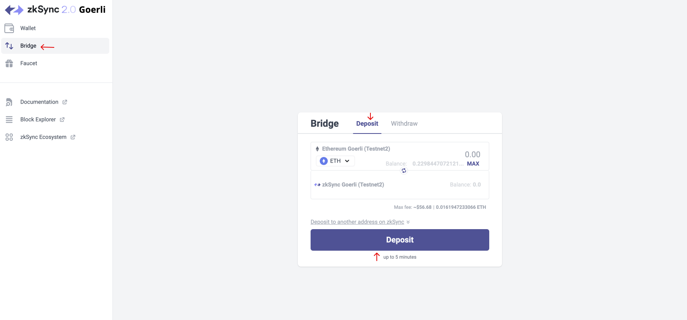
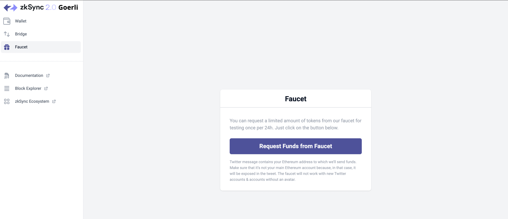
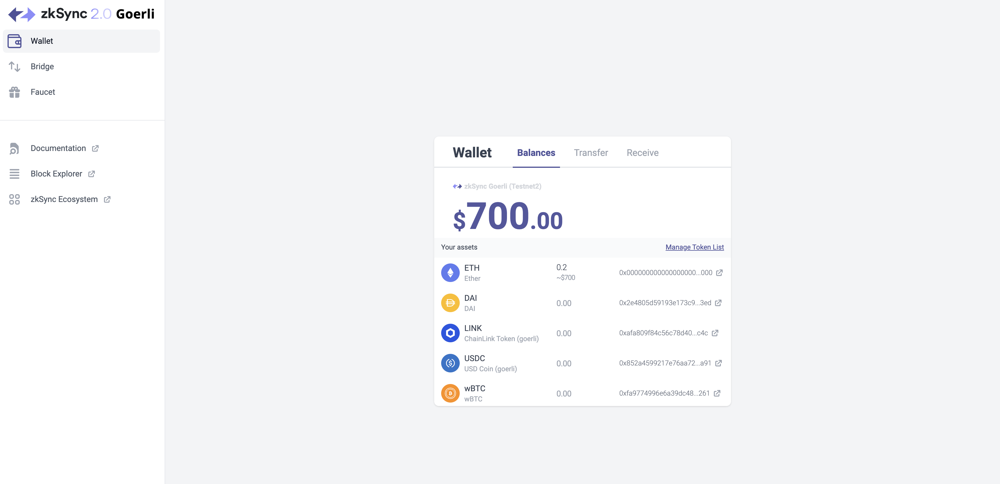
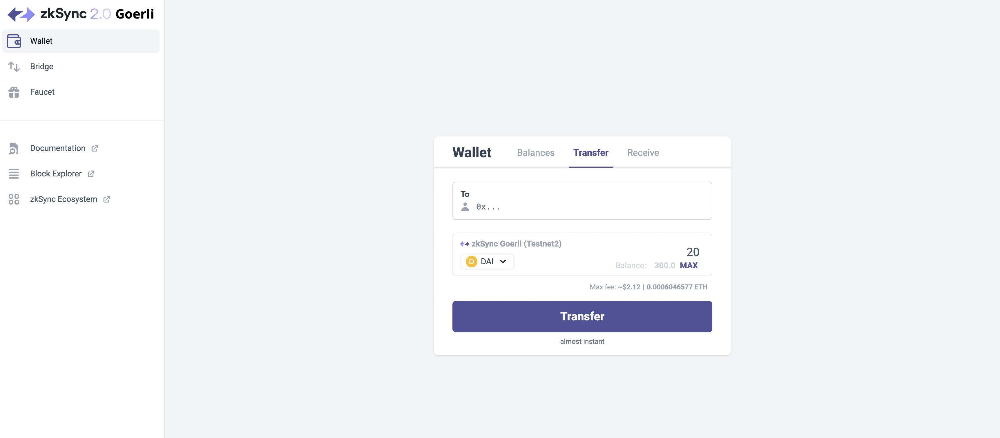
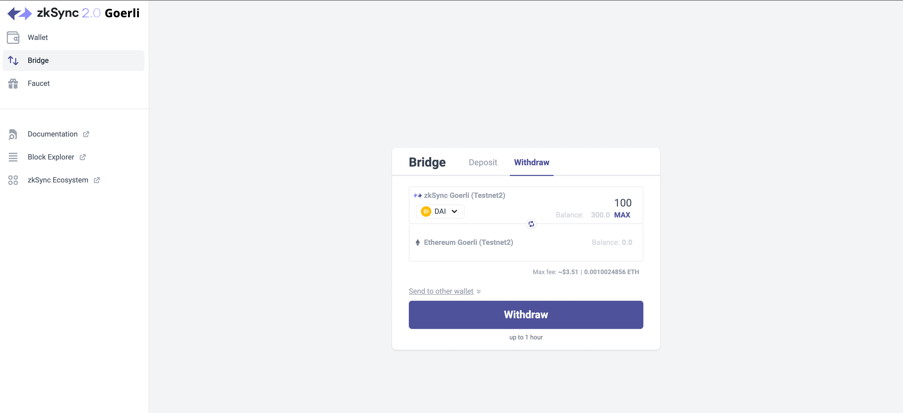

# FAQ

Here you will find some of the most common questions we receive about zkSync 2.0.

## What is zkSync 2.0?

zkSync 2.0 is a Zero Knowledge (ZK) rollup that supports generalized EVM compatibility for the Ethereum blockchain. The primary benefit of zkSync 2.0 is that developers who have created EVM dApps can port to zkSync 2.0 effortlessly and realize significantly lower gas fees and more transactions per second while inheriting Ethereum's security and decentralization.

## Why zkSync 2.0?

zkSync 2.0 is a gigantic leap forward in Layer 2 technologies. It is a long-awaited improvement that offers many never before enjoyed benefits for Ethereum developers.

- **EVM Compatible** - zkSync is an EVM-compatible zero knowledge rollup that supports generalized EVM smart contracts. This means if you have EVM smart contracts it’s super easy to port your dApp to zkSync 2.0.
- **Ethos Compatible** - we are very aligned with the ethos of decentralization and open source. All of our code will strive to be fully open-source and zkSync will be executing a roadmap that will fully decentralize the sequencer and proof generation, and we will be executing a roadmap of organizational subtractive management - that is, we will be decentralizing our organization as well.
- **Certainty** - Unlike previous methods attempting to scale Ethereum which have in some cases offered weaker security guarantees than for L1 (e.g. sidechains, plasma, and optimistic) zkSync uses zero-knowledge proofs which offer *certainty* of security.
- **Future Proof** - Ecosystem partners that adopt zkSync 2.0 now will enjoy all future improvements without the need to change their code, in particular coming from:
    1. The prover technology (hardware acceleration).
    2. The compiler (integration of LLVM-enabled modern programming languages).
    3. All innovations of zkSync 3.0 (Hyperchains and Hyperbridges).
## What is the zkEVM?

zkEVM is the name of the architecture that enables zero-knowledge proof generation for the execution trace of smart contracts originally written for EVM.

Its architecture is based on the following components:

- zkVM, a Turing-complete RISC-like virtual machine optimized for proving in a ZKP circuit. It has several different implementations:
    - Executor: fast native execution on CPU.
    - Witness generator: native executor to generate ZKP witness.
    - Prover: the actual ZKP circuit implementation.
- LLVM-based compiler with:
    - Solidity frontend (more precisely: Yul frontend).
    - Vyper frontend.
    - zkVM backend.
- Special-purpose circuits (heavily relying on PLONK’s custom gates and lookup tables) as “precompiles” for computationally intensive operations, such as:
    - Non-algebraic hashes (Keccak, SHA256, Blake2).
    - Storage access (Merkle paths).
    - Elliptic curve pairing.
- Recursive aggregation circuit (combines the proofs from the above-mentioned parts).

### zkEVM vs EVM

Apart from the opcodes and gas metering disparity, zkVM strictly inherits the EVM programming model and its invariants, including the ABI calling conventions. One important thing to emphasize is that the zkVM supports rollbacks and provably revertible transactions. It guarantees mutual protection: users can not stall the network with bombardment by revertible transactions, and the escape hatch (priority queue) protect the user’s ability to include any transactions into the blocks.

As a result, developers can fully rely on the censorship-resistance provided by L1 without having to introduce any changes related to the escape-hatch mechanism. This means that assets in a zkRollup account on zkSync will have exactly the same security guarantees as on L1.
### EVM Improvements

While maintaining maximum compatibility, the zkEVM has significant improvements over the EVM that increase adoption and benefit our ecosystem partners.

- **Our compiler is based on LLVM**. LLVM-based compilers (Low-Level Virtual Machine) have become the default compiler for Mac OS X, iOS, FreeBSD, and Android systems and are among the most widely used because they:
    - Enable us to improve the efficiency over the original EVM bytecode because with LLVM we can take advantage of the many optimizations and tools available in this mature ecosystem.
    - Pave the way for us to add support for integrating codebases written in other programming languages with LLVM frontend. By doing so, developers can build dApps and use blockchains in ways that are currently not possible.
- **Account Abstraction is included in our zkEVM**. This is a long-anticipated feature in the Ethereum dev community which improves developer adoption and user experience in a number of ways:
    - Native support for smart contracts wallets (like Argent), which is critical for onboarding mainstream users.
    - Much better UX for multisigs.
    - Transaction fees can be paid in any token using [paymasters](../developer-guides/aa.md#paymasters).
    - Protocols can now subsidize gas for users from their smart contracts or even enable gasless transactions.
    - Transaction batches (multicall) can be confirmed in one click (big UX problem on Ethereum today).
    - Learn more about [account abstraction support in zkSync 2.0](../developer-guides/aa.md).

## EVM Compatibility

There is a lot of confusion amongst the community with regard to the impacts of being EVM Compatible versus EVM Equivalent. First, let’s define what is meant by the two.

- **EVM Equivalent** means that a given protocol supports every opcode of Ethereum’s EVM down to the bytecode. Thus, any EVM smart contract works with 100% assurance out of the box.
- **EVM Compatible** means that a percentage of the opcodes of Ethereum’s EVM are supported; thus, a percentage of smart contracts work out of the box.

zkSync is optimized to be EVM *compatible* not EVM *equivalent* for three primary reasons:

1. Creating a generalized circuit for EVM equivalence down to the bytecode would be prohibitively expensive and time-consuming.
2. Building on what we learned with zkSync 1.0, we were able to design a system optimised for performance and provability in ZK.
3. The opcodes we’ve chosen NOT to support are deprecated by Ethereum itself, or rarely used. In the case a project needs then, modifications to work with zkSync are minimal and do not generate a need for a new security audit.

Almost every smart contract written for EVM will be supported by zkSync 2.0 and will hold all key security invariants so that no additional security re-auditing will be required in most cases. A notable exception is the contracts that use the following EVM opcodes:

- `SELFDESTRUCT` - (It’s considered harmful and there are calls to deactivate it on L1).
- `EXTCODECOPY` - (It can be implemented if needed, but we skip it for now because zkEVM opcodes are not identical to EVM ones anyway).
- `CALLCODE` - (deprecated on Ethereum in favor of `DELEGATECALL`).
- `CODECOPY` - (It does not return 0, but produces a compile error).

There are a few other distinctions, for example, gas metering will be different (as is the case for other L2s as well). Some EVM’s cryptographic precompiles (notably pairings and RSA) won’t be available in the very first release but will be implemented soon after the launch, with pairing being a priority to allow both Hyperchains and protocols like Aztec/Dark Forest to be deployed without modifications too.

### Security expectations

zkSync 2.0’s data availability layer is Ethereum. All ecosystem partners that build on zkSync 2.0 will inherit the full security benefits of Ethereum.

This is obviously a critically important topic for us, and we’re currently in the midst of a major review of zkSync 2.0’s security (including external audits, security contests, and overhauling and extending our bug bounty program). 

We’ll be expanding on the details here substantially very soon.
### Triggering Security audits

While there are a few, rarely used opcodes that we do not support, we have not found any instances with our ecosystem partners where a breaking change was anything other than a simple refactoring of a few lines of code. None of our ecosystem partners who have ported to zkSync have reported that any change has caused a need for a security audit.

## What is Account Abstraction?

At a very high level, Account Abstraction allows us to make authorizations *programmable*, enabling a greater diversity of wallet and protocol design with use cases including:

- The implementation of smart contract wallets that improve the user experience of private key storage and recovery (eg. [social recovery](https://vitalik.ca/general/2021/01/11/recovery.html), multisig).
- The ability to natively pay gas fees in tokens other than ETH.
- The ability for accounts to change public and private keys.
- The addition of non-cryptographic modifications, where users can require transactions to have expiry times, confirm slightly out-of-order, and more.
- Diversity in signature verification systems from the current ECDSA, including post-quantum safe signature algorithms (eg. Lamport, Winternitz).

In other words, Account Abstraction brings about major improvements to the overall user experience, and expands the application design space for developers. Learn more in [this blog post](https://www.argent.xyz/blog/wtf-is-account-abstraction/) by Argent.

In zkSync 2.0 Account Abstraction is natively implemented, meaning accounts can initiate transactions, like an EOA, but can also have arbitrary logic implemented in them, like a smart contract. 

If you want to better understand what Account Abstraction on zkSync looks like, you can read [this section of the docs](../developer-guides/aa.md), or try out our tutorial [here](../tutorials/custom-aa-tutorial.md).

## zkSync 2.0 vs Alternatives

### **zkSync 2.0 vs Optimistic Rollups**

Optimistic rollups like Arbitrum and Optimism utilize the optimistic approach to secure their network. At the time of their development, they represented an important incremental improvement over other available options. However, a widely held opinion ([including Vitalik Buterin's](https://coinculture.com/au/people/vitalik-buterin-zk-rollups-to-outperform-optimistic-rollups/)) is that optimistic methods represent yet another temporary solution and in the long run the only permanent and truly scalable solution will be blockchains based on Zero-Knowledge proofs.

Optimistic rollups suffer from the following key issues:

- **Optimistic rollups are secured via game theory.** This method assumes all transactions are valid and then utilizes an after-the-fact game theory mechanism to pay participants to discover fraudulent or otherwise invalid (e.g. because of bugs) transactions. Game theory is never perfect and as with the game theory that broke with stablecoins and other systems, we just don’t think it can be relied on in the long term and at true scale to offer the security the ecosystem needs. *zkSync 2.0, on the other hand, relies on math, not game theory, to provide the absolute certainty of proof that every single transaction is provably valid and not fraudulent.*
- **Optimistic methods take 7 days to settle**. Settlement time is becoming an increasingly important feature for ecosystem partners. As ecosystem partners’ needs mature, the need for as close to instant settlement will rise. With optimistic methods, this settlement problem will not go away. It's always going to be a 7-day settlement time because optimistic methods need 7 days for their after-the-fact game theory to conclude its challenge window. The only way around this is to bring in third parties that provide some liquidity - but then again this is a potential security risk in trusting the liquidity providers. *When zkSync 2.0 initially launches on Mainnet, it will provide settlement in hours but we are targeting  settlement within minutes after months of work - and as we improve settlement times to near zero - no partner needs to change any code*.
- **Optimistic rollups have no method of scaling beyond where they are now.** When optimistic methods first came out, they became popular because they scaled Ethereum - (e.g. they enabled the processing of 10x Ethereum transactions ****without degradation of security and decentralization). The problem is that while they can scale Ethereum by 10x now, they have no mechanism to go beyond 10x without degrading security and decentralization. *In contrast, zkSync 2.0 is based on zero-knowledge proofs which have important characteristics that optimistic methods do not - they can hyperscale.*

### zkSync 2.0 vs other zkRollups

While all zero knowledge rollup blockchains share the underlying technology of cryptographic proofs, there are many important differences.

**zkSync versus Starkware.** When you compare zkSync to Starkware, mostly what you see is two divergent strategies whereby zkSync optimizes for being compatible with the Ethereum ecosystem, technology, and ethos, whereby Starkware optimizes for theoretical performance benefits at the cost of compatibility.

- **EVM.** zkSync is EVM compatible VS Starknet is NOT EVM compatible.
- **Toolchain**. zkSync is toolchain compatible VS Starknet is NOT and requires people to learn a whole new toolchain centered around a custom language called Cairo.
- **Ecosystem**. zkSync’s ecosystem naturally works with all of the toolsets of the Ethereum ecosystem VS Starkware is attempting to bootstrap an entirely new ecosystem with all new tools.
- **Decentralization**. zkSync embraces decentralization, both at the technology level and the organizational level VS Starknet does NOT embrace decentralization.
- **Open-source.** zkSync is fully open-source VS Starkware is NOT open-source.

## Which Wallets are supported?

At the moment, we support any Ethereum-based wallet. By default, the provided option on zkSync 2.0 portal is Metamask - besides connecting automatically, you can add zkSync network to your Metamask manually:

**Testnet network info**

- Network Name: `zkSync alpha testnet`
- New RPC URL: `https://zksync2-testnet.zksync.dev`
- Chain ID: `280`
- Currency Symbol: `ETH`
- Block Explorer URL: `https://goerli.explorer.zksync.io/`
- WebSocket URL: `wss://zksync2-testnet.zksync.dev/ws`

**Mainnet network info**

- Network Name: `zkSync mainnet`
- New RPC URL: `https://zksync2-mainnet.zksync.io`
- Chain ID: `324`
- Currency Symbol: `ETH`
- Block Explorer URL: `https://explorer.zksync.io/`
- WebSocket URL: `wss://zksync2-mainnet.zksync.io/ws`

## How do I Request Funds for Testnet?

To access the testnet funds ([Faucet](https://portal.zksync.io/faucet)), you can tweet about us and get tokens. Make sure that Twitter message contains your Ethereum address to which we’ll send funds and that it’s not your main Ethereum account. The faucet will not work with new Twitter accounts & accounts without avatar.

Alternatively, you can use [our bridge](https://portal.zksync.io/bridge) to bridge ETH from Goerli to zkSync alpha testnet.
## How long does it take to complete a deposit transaction?

The transactions on zkSync 2.0 should not take more than 5 minutes.
## Where can I see the transactions I submitted?

Our [Block Explorer](https://explorer.zksync.io) will show everything you may need about a transaction. 

## What is the storage limit for smart contract on zkSync 2.0?

The current limit is 3600000000 ergs.

## Can I withdraw my funds back to Ethereum?

Yes, the bridge is two-way. You can withdraw your funds back to Ethereum. The withdrawal transaction will take up to 1 hour, depending on the usage of the zkSync network.
## Interacting - A step-by-step Guide

As the testnet is running on Goerli network, you will need to get some Goerli ETH first. Try any of the faucets below.

- [https://goerli-faucet.mudit.blog/](https://goerli-faucet.mudit.blog/)
- [https://faucets.chain.link/goerli](https://faucets.chain.link/goerli)
- [https://goerli-faucet.slock.it/](https://goerli-faucet.slock.it/)

**Step 1**

Head to [https://portal.zksync.io/](https://portal.zksync.io/) and connect your wallet. You will automatically be asked to add the “zkSync 2.0 testnet Goerli” network.

You may also add the network manually to your metamask.

- Network Name: `zkSync alpha testnet`
- RPC URL: `https://zksync2-testnet.zksync.dev`
- Chain ID: `280`

**Step 2 (Skip if you don’t have Goerli ETH)**

We first go to “Bridge” then “Deposit” to deposit some $ETH to zkSync 2.0.

**Step 3**

Next we go to “Faucet” to get some testnet $ETH, $LINK, $DAI, $WBTC and $USDC into our zkSync address.

Check your balance at “Balances” after claiming.

**Step 4**

Now go to “Transfer”. Input the address of another wallet and transfer some tokens to it. Pay the fees in DAI if you don’t have ETH.

**Step 5**

At last we go to “Withdraw” to withdraw some $DAI from zkSync back to Goerli. Pay the fees in DAI if you don’t have ETH.

## What is a testnet ReGenesis?

Sometimes, the team working on zkSync will initiate a regenesis on testnet - a restart of the blockchain which will introduce upgrades and return the state to the initial point. This won't happen on mainnet, and it is unlikely to happen on testnet after mainnet launch.
