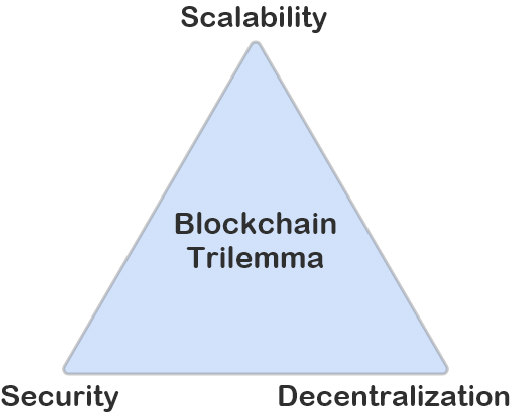
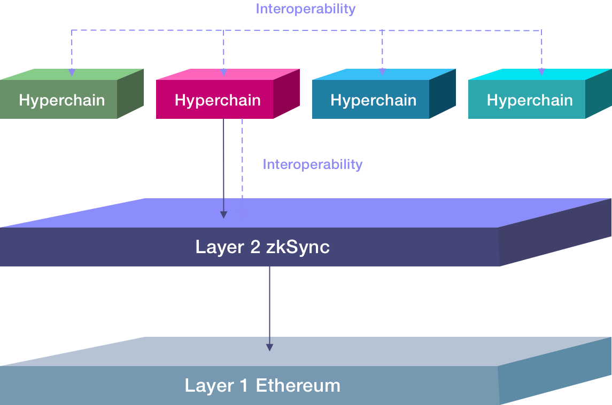
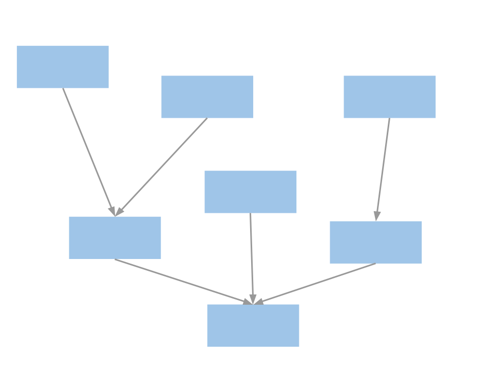
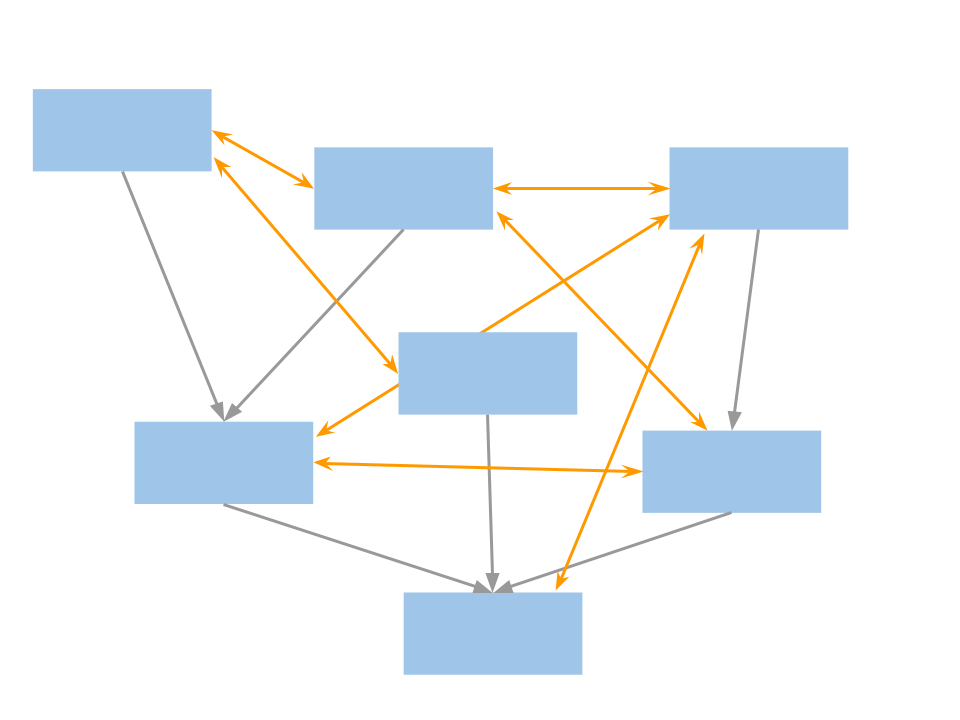

# Hyperscaling

Blockchain systems achieve incorruptible fairness by relying on the cornerstone principle “don’t trust, verify”. At the same time, for blockchains to remain decentralized, resource requirements for running the verifier nodes must be kept relatively low. Connecting these two ideas brings us to the widely accepted definition of scalability:

:::tip

Scaling = processing more transactions without degradation of security and decentralization.

:::

Scalability can be improved in a number of ways, from increasing the efficiency of the verifier to introducing probabilistic trust assumptions (what optimistic rollups do). Most of these approaches offer a linear scalability boost, but one method stands out: succinct zero-knowledge proofs (ZKPs). They always incur roughly O(1) verification costs regardless of the number of transactions processed. This means that ZKP-based scaling — i.e. [validiums and (under certain conditions) zkRollups](https://twitter.com/vitalikbuterin/status/1267455602764251138) — can be hyper-scalable:

:::tip

 Hyperscaling = processing infinitely many transactions without degradation of security and decentralization.

 :::

In other words, hyperscalability means breaking out of the blockchain trilemma:

Theoretically, given enough hardware, it is possible to aggregate arbitrarily large blocks of transactions and produce a single succinct ZKP (more precisely: proof of computational integrity) for each such block. In practice, however, no single monolithic blockchain system will be able to meet infinite market demand. Here are some reasons why:

- Sequential transaction processing will always be a bottleneck. At least some transactions will need to interact with the same storage slots of the shared state, and no amount of parallelism can help.
- Decentralized p2p networks and consensus mechanisms will have their own bottlenecks too.
- Data availability will have a bottleneck, at least until advanced sharding is implemented at L1 level.
- Users have different preferences on conflicting requirements: degree of decentralization vs. latency, privacy vs. transparency, generic composability vs. ultra-high security vs. ultra-low costs, and so on. No particular choice can be optimal for all use-cases.

Luckily, ZKPs offer a beautiful way to build a heterogeneous yet simultaneously a hyper-scalable blockchain system. This idea is known as [Fractal scaling](https://medium.com/starkware/fractal-scaling-from-l2-to-l3-7fe238ecfb4f). 
Many different ZKP chains (in the zkSync world we call them Hyperchains) are run in parallel and get their block proofs aggregated into a single final block that will be settled on L1. Each of the Hyperchains will resemble the entire system (i.e. it can have an infinite number of other Hyperchains on top of it: L3, L4, and so on).

Fractal scaling is necessary but not sufficient to achieve hyperscaling. You need one additional component:

:::tip

 Hyper-bridges = native bridges that enable transfers between any two Hyperchains without consuming resources on a third one.

 :::

Fractal scaling can always have native bridges connecting chains via underlying layers, but in this case eventually the Basechain will turn into a crossroad for most transfers and thus the central scalability bottleneck, defeating the very idea of parallel hyperscalability. As a result it won’t be possible to guarantee cheap direct transfers between users on any given two chains.

To achieve zero cost overhead on the underlying chains, each Hyperchain must:

- Implement native hyper-bridges that can actually burn and mint actual tokens and not their virtual representation (in contrast to the conventional bridges), storing mint claim commitments in the Hyperchain state.
- Trust the implementations of hyper-bridges on all other Hyperchains – because if a single hyper-bridge is compromised, the malicious chain could mess with the token supply (thus all of the Hyperchains must implement the exact same circuits).

**Fractal scaling**

**Hyperscaling**

With hyper-bridges you can transfer assets from one Hyperchain to another at the cost of a normal transfer, just like hyperlinks can take you from one web page to another at the cost of a single click (without the need to click separately through each layer of navigation).

Smart contracts can use hyper-chains too, to trustlessly send assets and arbitrary messages to any Hyperchain with a guarantee of eventual delivery (as long as the target Hyperchain is live).

Communication via hyper-bridges is always asynchronous: in order to process a message on the receiving Hyperchain B, the sending Hyperchain A must finalize its state all the way down to the earliest Hyperchain that is common base for both A and B. In practice, the communication latency of hyper-bridging will be a matter of seconds: Hyperchains can finalize blocks every second (which is cheap, in contrast to L1), and hardware acceleration makes block proof generation really fast.

For a technical deep dive, take a look at the excellent [Slush paper](https://hackmd.io/@kalmanlajko/rkgg9GLG5) which explores the nuances of hyper-bridge implementation in great detail.

## What are Hyperchains?

Hyperchains are fractal-like instances of zkEVM running in parallel and with the common settlement on the L1 mainnet.

Hyperchains can be developed and permissionlessly deployed by anyone. However, to remain trusted and fully interoperable, each Hyperchain must be powered by the exact same zkEVM engine as the main zkSync L2 instance. All the ZKP circuits will thus remain 100% identical, letting Hyperchains fully inherit their security from L1, no matter who deployed them. This ensures zero additional trust/security assumptions.

Hyperchains will be implemented following the modular approach – we will provide a Hyperchain SDK framework similar to those of Cosmos or Substrate, where developers can individually pick different components of their blockchains or implement their own ones (except the zkEVM core, for the reasons explained above). See the [question about Hyperchain parametrization](#how-can-hyperchains-be-parametrized) below for more details.

## What is the Basechain?

The Basechain is the main Hyperchain instance of zkSync Era (the L2 instance). It serves as the default computation layer for generic smart contracts and as a settlement layer for all other Hyperchains (L3 and above).

The Basechain is not special in any particular way except that it settles its blocks directly on the L1.

## How can Hyperchains be parametrized?

Main customization options to be provided by our Hyperchain SDK are explained below. Developers are free to implement their own components and customizations, of course.

### Sequencing transactions

- **Centralized sequencer** - In this mode, there will be a single centralized operator with a conventional REST API to accept transactions from users. The operator must be trusted to maintain liveness, not to abuse MEV, and not to allow reorgs of unfinalized transactions, so the operator’s reputation will play a big role. The biggest advantage of this option is that it can provide the lowest possible latency to confirm transactions (<100ms), which is critical for use-cases such as HFT. The Basechain will run in this mode until it is fully decentralized, so we will have battle-tested server code available for developers early on.

- **Decentralized sequencer** - In this mode, a Hyperchain will coordinate on what transactions are included in a block using a consensus algorithm. It can be any algorithm, so developers can reuse existing implementations (e.g. Tendermint or HotStuff with permissionless dPoS). But we can also take advantage of the fact that finality checkpoints are guaranteed by the underlying L1, and implement an algorithm that is simpler and boasts higher performance. The Basechain will switch to this option as soon as the consensus implementation is ready, and will make its code available to the Hyperchain developers.

- **Priority queue** - This simply means absence of any sequencer: all transactions can be submitted in batches via the priority queue from an underlying L2 or even L1 chain, taking advantage of their stronger censorship-resistance. It might be especially interesting for special-purpose governance protocols (e.g. on-chain voting). It’s worth noting that the priority queue will always be available as an escape-hatch mechanism (even if a centralized or decentralized sequencer is employed), to protect users against censorship by a malicious sequencer.

### Data availability

Each Hyperchain can manage its data availability (DA) policy using a smart contract interface. It can use one of the options described below or some more complex logic. For example, to combine zkPorter and validium, the DA will require both a quorum of the signatures from the guardians and a number of signatures from the data availability committee.

- **zkRollup** - This is our default recommendation policy: the values of every changed storage slot at the end of the block must be published as calldata on L1. Note that repeated changes (or back-and-forth changes that result in no net difference) are not posted. It means if a block contains 100 ETH/DAI swaps on the same DEX then pubdata costs will be partially amortized over all such swaps. A Hyperchain working in this mode strictly inherits full security and censorship-resistance properties from Ethereum. The implementation of zkRollup in output mode will be available from day 1. To propagate calldata to L1, it will be aggregated at the Basechain. Note that if Hyperchain’s ZK-proof is potentially large in size and/or computationally heavy to verify it only incurs L2 costs and not pubdata costs.

- **zkPorter** - it's explained in detail in [this post](https://blog.matter-labs.io/zkporter-a-breakthrough-in-l2-scaling-ed5e48842fbf). We already have a working zkPorter guardian testnet. We expect zkPorter to be popular with users willing to take higher security risks in exchange for really cheap transactions, until Danksharding is implemented. Hyperchain developers will be able to either tap into the DA from zkSync main zkPorter implementation or bootstrap their own guardian network (which could be interesting for large existing online communities such as Reddit or Twitter).

- **Validium** - Being true to our [values](https://www.notion.so/matterlabs/Freedom-d36a797ff1aa47d2859f9e0c5ffbd0ab), we generally [discourage](https://blog.matter-labs.io/zkrollup-vs-validium-starkex-5614e38bc263) mainstream users from trusting validium-based solutions. However, there are use-cases where using validium is fully justified, e.g. enterprise chains that require both auditability and privacy (since the data availability in such cases is controlled by a central party, it is trivial to keep such a Hyperchain private by simply withholding data). Since validium is essentially a simpler case of a zkPorter, developers can easily deploy Hyperchains based on this policy.

- **zkRollup (inputs only)** - This policy will require publishing full transaction inputs instead of final storage updates. Trustless state reconstruction and the DA costs in this case will be 100% identical to optimistic rollups (but with all the benefits of a zkRollup of course, including better security and faster exits). The implementation of this option is easily derived from the implementation of the normal zkRollup. It can be explored by application-specific chains where tx inputs are short but might lead to a lot of changes in data (for example, performing financial simulations).

- **zkRollup (self-hosted)** - An extremely interesting option! In this mode, users self-host the data for all the accounts they own. To enforce this, user confirmation signatures are required to make any changes – which means, you cannot send funds directly to another user. Instead, you will burn the funds and create a proof of this burn, which you can provide to your recipient via an off-chain channel. The recipient will then redeem them to their account. This might sound complicated, but it’s easy to construct a nice UI which will abstract away the UX, making it practically indistinguishable from sending and receiving funds on Ethereum (it will automatically redeem all received assets the moment the user intends to spend funds, requiring no extra clicks). But here comes a miracle: a self-hosted zkRollup can be happy with as little as 5 bytes per user interaction that includes a batch of arbitrary many transactions! This makes sharded Ethereum infinitely scalable for any practical purposes in the zkRollup mode (i.e. 100% secure and censorship-resistant). This is a way to onboard every single person on Earth to Ethereum with zero security compromise. A great thing about this approach is also that it’s fully compatible with our zkEVM implementation, but can nonetheless offer privacy to the users. The implementation is non-trivial, so we expect it to come last among all the other options. At the same time, it’s simpler and much more powerful than alternative approaches like Adamantium, which we will subsequently ignore.

### Logical state partitions

Each Hyperchain can have one or more logical partitions that are part of the same state but live in separate subtrees and enforce different data availability policies. From the user perspective, they would appear as separate Hyperchain instances (with their own chain ID, separate wallet connection, block explorer view, etc), which can however interoperate synchronously. 

Synchronicity is important as it enables atomic transactions between partitions, unlocking several unique use-cases:

- Transparently reading the state of another partition.
- Using flash loans between the partitions.

One prominent example of this is a combination of [zkRollup + zkPorter](https://blog.matter-labs.io/zkporter-a-breakthrough-in-l2-scaling-ed5e48842fbf) (which will be part of the zkSync Basechain):

<!-- ### MEV protection

We expect Hyperchain developers to experiment with different MEV-minimization approaches (see the [question about MEV in zkSync](https://docs.google.com/document/d/1Oq-grdnlY8RL8aoA1EAiRPlJSbH698BoTVK-5bX8nxc/edit#heading=h.5ygkd14evhl0)). -->

### Privacy

Hyperchains can add privacy in a number of ways:

1. Validium. For a Hyperchain running in the validium mode, privacy to the outer world is achieved out of the box as long as the operator keeps the block data secret. This might be an interesting option for enterprise users.
2. Privacy protocols. To implement user-level privacy, a specialized L3 protocol is required. Projects such as Aztec or Tornado can be implemented either directly on the Basechain (taking advantage of account abstraction and cheap recursive ZKP verification on zkSync), or they can opt into standalone special-purpose Hyperchains for more flexibility.

## What does hyperscalability UX feel like?

Hyperchains will have unique hierarchical identifiers similar to the Internet domains:

`zksync`  

`reddit.zksync`  

`ethereum.reddit.zksync`

Accounts will have standard EVM addresses, augmented by the Hyperchain id:

`0x60250Fff03f8E8aed6a5B36Fa4F5a5F75fD5d25d @ zksync`  

`0x31a7ca77c0bc7a26a5ee69ea3e65363ead6aa322 @ reddit.zksync`

Of course, services like ENS / Unstoppable domains can always be used for shortcuts:

`gluk64 @ reddit.zksync`  

`gluk64.eth`

Thus, sending digital assets to another user will feel just like sending an email (which arrives asynchronously in a few seconds), but now you can attach money to it.

Similarly, interacting with contracts on different Hyperchains from the developer’s point of view will resemble calling REST API methods on the web. If a call is initiated by a smart contract, the result will be received via an asynchronous callback.
