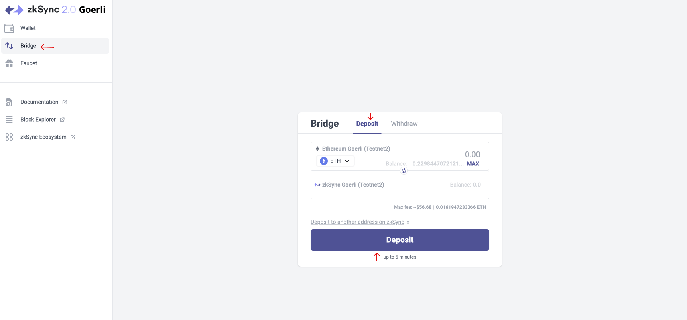
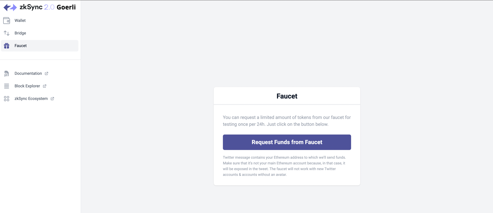
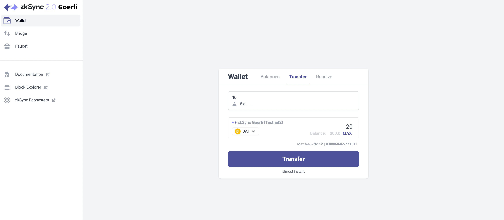

# Interact with zkSync Era

zkSync Era is currently is on the fair alpha onboarding stage, which involves opening our mainnet to certain teams to build and and make transactions on mainnet.

## Do I need experience with zkSync Lite?

Some experience with zkSync Lite would be helpful to understand some core concepts, e.g. how finality works. From all other aspects, zkSync Era and zkSync Lite are very different systems, and experience with the latter is not needed to build on zkSync Era.

## What do I need to start building?

All the existing SDKs for Ethereum will work out of the box and your users will have the same experience as on Ethereum. If you want to enable advanced zkSync features, like account abstraction, the zkSync SDK should be used.

The only other place where using zkSync SDK is required is during contract deployment. This can be easily done through our hardhat plugin.

### Quickstart on zkSync

Check out our step-by-step [quickstart guide](../building-on-zksync/hello-world.md), where you will learn:

- How to install zkSync hardhat plugin and deploy smart contracts with it.
- How to build the front-end for your dApp using the `zksync-web3` library.

### Connecting to zkSync Era on Metamask

In order to add the zkSync Era alpha mainnet network to your wallet, you will need to enter the following details:

1. Open the Metamask wallet and click on the network in the top center:

2. Click on "Add network manually".

3. Fill in the details about zkSync Era alpha mainnet or testnet network and click "Save":

**Mainnet network info**

- Network Name: `zkSync Era Mainnet`
- New RPC URL: `https://zksync2-mainnet.zksync.io`
- Chain ID: `324`
- Currency Symbol: `ETH`
- Block Explorer URL: `https://explorer.zksync.io/`
- WebSocket URL: `wss://zksync2-mainnet.zksync.io/ws`

**Testnet network info**

- Network Name: `zkSync Era Testnet`
- New RPC URL: `https://zksync2-testnet.zksync.dev`
- Chain ID: `280`
- Currency Symbol: `ETH`
- Block Explorer URL: `https://goerli.explorer.zksync.io/`
- WebSocket URL: `wss://zksync2-testnet.zksync.dev/ws`

## zkSync Era Support

You can open a support ticket in `💻🧪│dev-support-beta` or ask any questions in `🖥│dev-general`

If you need help with anything related to the zkSync Era, you can raise a support ticket on the zkSync Era discord, or check out the [FAQs](../troubleshooting/faq.md) page to view the most common queries about the zkSync Era. Additionally, you can reach out to the support team available on the `#dev-support-beta`, or ask any questions in `#dev-general` channel on the zkSync Era Discord server. 
Instructions for raising a support ticket are as follows:

- Join the zkSync Era [our Discord](https://join.zksync.dev/) server.
- Accept the invite sent.
- Navigate to the `#dev-support-beta` channel.

Alternatively, you can now contact our support engineers with your questions and concerns via [email](mailto:support@zksync.io). 
We will actively monitor for issues and work to resolve them as soon as possible.

<!-- **Testnet network info**

- Network Name: `zkSync alpha testnet`
- New RPC URL: `https://zksync2-testnet.zksync.dev`
- Chain ID: `280`
- Currency Symbol: `ETH`
- Block Explorer URL: `https://goerli.explorer.zksync.io/`
- WebSocket URL: `wss://zksync2-testnet.zksync.dev/ws` -->

<!-- ## Deposit and withdraw funds using zkSync Portal

As the testnet is running on Goerli network, you will need to get some Goerli ETH first. Try any of the faucets below.

- [https://goerli-faucet.mudit.blog/](https://goerli-faucet.mudit.blog/)
- [https://faucets.chain.link/goerli](https://faucets.chain.link/goerli)
- [https://goerli-faucet.slock.it/](https://goerli-faucet.slock.it/)
- [https://goerlifaucet.com/](https://goerlifaucet.com/)

**Step 1**

Head to [https://portal.zksync.io/](https://portal.zksync.io/) and connect your wallet. You will automatically be asked to add the “zkSync Era testnet Goerli” network.

You may also add the network manually to your metamask.

- Network Name: `zkSync mainnet`
- New RPC URL: `https://zksync2-mainnet.zksync.io`
- Chain ID: `324` -->
<!-- 
**Step 2 (Skip if you don’t have Goerli ETH)**

We first go to “Bridge” and then “Deposit” to deposit some \$ETH to zkSync Era.

**Step 3**

Next, we go to “Faucet” to get some testnet $ETH, $LINK, $DAI, $WBTC and \$USDC into our zkSync address.

Check your balance at “Balances” after claiming.

**Step 4**

Now go to “Transfer”. Input the address of another wallet and transfer some tokens to it. Pay the fees in DAI if you don’t have ETH.

**Step 5**

At last we go to “Withdraw” to withdraw some \$DAI from zkSync back to Goerli. Pay the fees in ETH.

 -->
