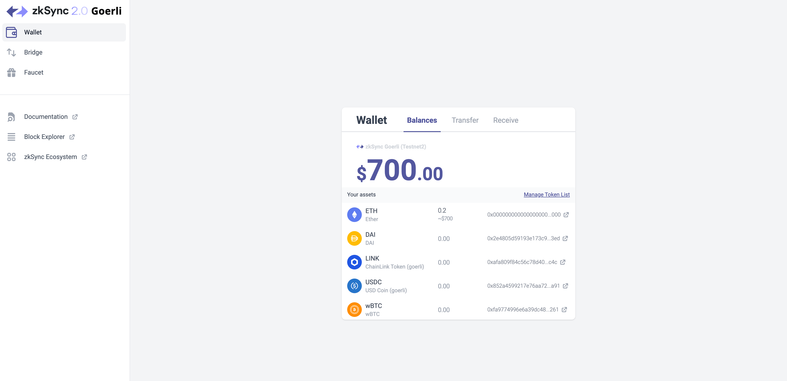

# zkSync testnet

Welcome to zkSync 2.0 testnet! Our team would be very happy to see what you can build on zkSync. We are glad for any feedback you could provide!

::: warning Alpha testnet

Note, that the system is still in active development, so:

- **Breaking changes are possible in the future.**
- **Some of the updates may require regenesis**, i.e. erasing all the balances, and smart contracts, and restarting the blockchain. We will make sure to communicate all regenesis beforehand! Make sure to follow our [Discord](https://join.zksync.dev/).

:::

To get a first-hand impression of the zkSync 2.0 user experience:

- Go to the [zkSync 2.0 Portal](https://portal.zksync.io).
- Get some test tokens from the faucet, or deposit some from Ethereum's Görli testnet.
- Make some transfers.

The Portal is the central entry point into the zkSync 2.0 ecosystem for users and developers alike. It contains links to all relevant resources, such as [block explorer](https://explorer.zksync.io) or the catalog of featured dApps.

<TocHeader />
<TOC class="table-of-contents" :include-level="[2,4]" />

## Do I need experience with zkSync 1.x?

Some experience with zkSync 1. x would be helpful to understand some core concepts, e.g. how finality works. From all other aspects, zkSync 2.0 and zkSync 1.x are very different systems, and experience with the latter is not needed to build on zkSync 2.0.

## What do I need to start building?

All the existing SDKs for Ethereum will work out of the box and your users will have the same experience as on Ethereum. If you want to enable advanced zkSync features, like account abstraction, the zkSync SDK should be used.

The only other place where using zkSync SDK is required is during contract deployment. This can be easily done through our hardhat plugin.

## Quickstart on zkSync

Check out our step-by-step [quickstart guide](../developer-guides/hello-world.md), where you will learn:

- How to install zkSync hardhat plugin and deploy smart contracts with it.
- How to build the front-end for your dApp using the `zksync-web3` library.

## Connecting Metamask

To connect Metamask to zkSync, add the zkSync alpha testnet network to the wallet.

1. Open the Metamask wallet and click on the network in the top center:

2. Click on "Add network manually".

3. Fill in the details about zkSync alpha testnet network and click "Save":

**Testnet network info**

- Network Name: `zkSync alpha testnet`
- New RPC URL: `https://zksync2-testnet.zksync.dev`
- Chain ID: `280`
- Currency Symbol: `ETH`
- Block Explorer URL: `https://goerli.explorer.zksync.io/`
- WebSocket URL: `wss://zksync2-testnet.zksync.dev/ws`

**Mainnet network info**

- Network Name: `zkSync mainnet`
- New RPC URL: `https://zksync2-mainnet.zksync.io`
- Chain ID: `324`
- Currency Symbol: `ETH`
- Block Explorer URL: `https://explorer.zksync.io/`
- WebSocket URL: `wss://zksync2-mainnet.zksync.io/ws`

## Deposit and withdraw funds using zkSync Portal

As the testnet is running on Goerli network, you will need to get some Goerli ETH first. Try any of the faucets below.

- [https://goerli-faucet.mudit.blog/](https://goerli-faucet.mudit.blog/)
- [https://faucets.chain.link/goerli](https://faucets.chain.link/goerli)
- [https://goerli-faucet.slock.it/](https://goerli-faucet.slock.it/)
- [https://goerlifaucet.com/](https://goerlifaucet.com/)

**Step 1**

Head to [https://portal.zksync.io/](https://portal.zksync.io/) and connect your wallet. You will automatically be asked to add the “zkSync 2.0 testnet Goerli” network.

You may also add the network manually to your metamask.

- Network Name: `zkSync alpha testnet`
- RPC URL: `https://zksync2-testnet.zksync.dev`
- Chain ID: `280`

**Step 2 (Skip if you don’t have Goerli ETH)**

We first go to “Bridge” and then “Deposit” to deposit some \$ETH to zkSync 2.0.

**Step 3**

Next, we go to “Faucet” to get some testnet $ETH, $LINK, $DAI, $WBTC and \$USDC into our zkSync address.

Check your balance at “Balances” after claiming.

**Step 4**

Now go to “Transfer”. Input the address of another wallet and transfer some tokens to it. Pay the fees in DAI if you don’t have ETH.

**Step 5**

At last we go to “Withdraw” to withdraw some \$DAI from zkSync back to Goerli. Pay the fees in ETH.

