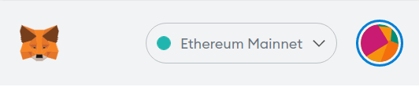

# zkSync Testnet

Welcome to zkSync 2.0 alpha testnet! Our team would be very happy to see what you can build on zkSync. We are glad for any feedback you could provide!

::: warning Alpha testnet

Note, that the system is still in active development, so:

- **Breaking changes are possible in the future.**
- **Some of the updates may require regenesis**, i.e. erasing all the balances, smart contracts, and restarting the blockchain. We will make sure to communicate all regenesis beforehand! Make sure to follow our [Discord](https://discord.gg/px2aR7w).

:::

To get a first-hand impression of the zkSync 2.0 user experience:

- Go to the [zkSync 2.0 Portal](https://portal.zksync.io).
- Get some test tokens from the faucet, or deposit some from Ethereum's Görli testnet.
- Make some transfers.

The Portal is the central entry point into the zkSync 2.0 ecosystem for users and developers alike. It contains links to all relevant resources, such as block explorer or the catalog of featured dapps.

## Connecting Metamask

To connect Metamask to zkSync, add the zkSync alpha testnet network to the wallet.

1. Open the Metamask wallet and click on the network in the top center:

2. Click on "Add network".

3. Fill in the details about zkSync alpha testnet network and click "Save":

- Network Name: `zkSync alpha testnet`
- New RPC URL: `https://zksync2-testnet.zksync.dev`
- Chain ID: `280`
- Currency Symbol(Optional): `ETH`
- Block Explorer URL(Optional): `https://zksync2-testnet.zkscan.io/`
