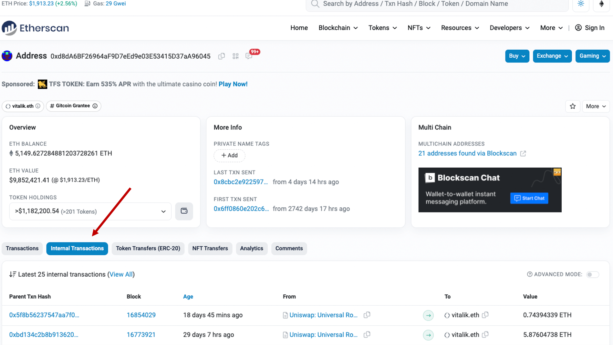

# Withdrawal delay

In order to prevent a quick drain of the protocol in case a critical bug has been discovered and exploited, we are introducing a block execution delay. Each L2 block committed to L1 will have a time lock before it is executed and finalized. This means that there is enough time to verify the effects of the transactions included in a block before the block becomes final. The zkSync team will be monitoring each block and be able to investigate any anomaly (e.g. rapid outflow, unusually large withdrawals, etc).

To introduce this time lock no changes were made to the audited smart contracts. Instead, we have used an existing Validator role that we control and additionally restricted ourselves by pointing it at an intermediate smart contract with a time lock. It will be initially configured for a **24-hour** delay, which will be gradually decreased as the system matures. Changing the delay requires multiple signatures collected from several cold wallets owned by zkSync leadership.

This design has the following advantages:

- Even if an attacker finds a critical bug in ZK circuits and also successfully compromises the servers running our sequencer, there is plenty of time to detect an exploit, investigate, and freeze the protocol via governance.
- No changes were introduced to the zkSync Era contracts, so even if the intermediate contract is compromised we revert back to the original state.
- Delayed execution affects not only the standard zkSync ETH and ERC20 bridges but also any custom bridge built by a different team.
- Implementing the logic in an external governor-controlled contract makes it easy to remove this limitation later.

## Types of transactions in etherscan

### External transactions

The transfer of ETH or ERC-20 tokens from one address to another is referred to as an external transaction, which is the prevailing transaction type. Such transactions are classified as external when a user initiates a transfer from their wallet to another wallet, and they are subsequently documented in the **"Transactions"** section of Etherscan.

### Internal transactions

Conversely, internal transactions are initiated by a smart contract or other internal code execution within the Ethereum network. Although these transactions can be prompted by a user action, they are not sent directly from one address to another but are instead part of the internal workings of a smart contract. Internal transactions may involve the transfer of ETH or ERC-20 tokens between different addresses within the contract. Withdrawals from the zkSync Era network are typically internal transactions managed by the [zkSync Era Diamond Proxy](https://etherscan.io/address/0x32400084c286cf3e17e7b677ea9583e60a000324) ) contract. These transactions are documented in the **"Internal Transactions"** section of Etherscan due to their internal nature.

### How to check your internal transactions

To check the internal transactions of an Ethereum wallet, follow these steps:

1. Launch your web browser and visit [Etherscan.io](https://etherscan.io/).

2. In the search bar located at the top of the page, enter the Ethereum wallet address you want to review internal transactions for.

3. After accessing the wallet page, navigate to the **"Internal Transactions"** section by scrolling down and clicking on it. This section lists all the internal transactions associated with the wallet. Refer to the image below for more clarity.

4. Any withdrawal transactions from zkSync Era will appear as transactions from **"zkSync Era: Diamond Proxy"** to your wallet address.

5. To obtain more information about a specific transaction, including the block it was mined in, gas usage, and sender and recipient addresses, click on the **"Parent Tx Hash"** of the relevant transaction.