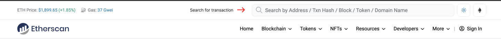
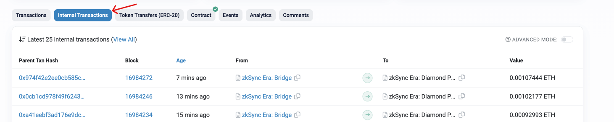
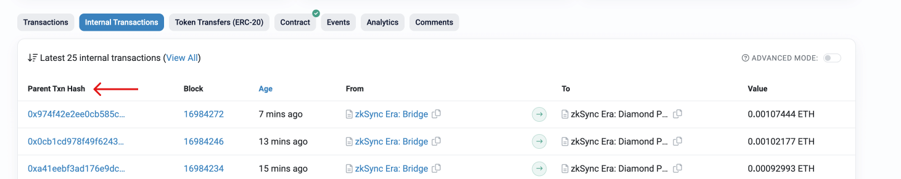

# Withdrawal delay

In order to prevent a quick drain of the protocol in case a critical bug has been discovered and exploited, we are introducing a block execution delay. Each L2 block committed to L1 will have a time lock before it is executed and finalized. This means that there is enough time to verify the effects of the transactions included in a block before the block becomes final. The zkSync team will be monitoring each block and be able to investigate any anomaly (e.g. rapid outflow, unusually large withdrawals, etc).

To introduce this time lock no changes were made to the audited smart contracts. Instead, we have used an existing Validator role that we control and additionally restricted ourselves by pointing it at an intermediate smart contract with a time lock. It will be initially configured for a **24-hour** delay, which will be gradually decreased as the system matures. Changing the delay requires multiple signatures collected from several cold wallets owned by zkSync leadership.

This design has the following advantages:

- Even if an attacker finds a critical bug in ZK circuits and also successfully compromises the servers running our sequencer, there is plenty of time to detect an exploit, investigate, and freeze the protocol via governance.
- No changes were introduced to the zkSync Era contracts, so even if the intermediate contract is compromised we revert back to the original state.
- Delayed execution affects not only the standard zkSync ETH and ERC20 bridges but also any custom bridge built by a different team.
- Implementing the logic in an external governor-controlled contract makes it easy to remove this limitation later.

## Why can't i find my transaction in the block explorer?

There could be several reasons why your withdrawal was completed, but you cannot see your tokens or the transaction on the block explorer in Etherscan. Some of these reasons include:

1. Delay in Block Confirmation: It could be that the withdrawal transaction was successfully executed, but the confirmation process is still ongoing. It takes some time for a block to be confirmed, and until then, the transaction will not be visible on the block explorer.

2. Transaction Reverted: Another reason why a withdrawal may not appear on the block explorer could be that the transaction was reverted. A transaction can be reverted when there is a conflict or a problem with the smart contract that executes the transaction. When this happens, the transaction is canceled, and users will not be able to see it on the block explorer.

3. Wrong Address: Finally, the user may have sent their tokens to the wrong address. If this is the case, the tokens will not show up in their wallet, and they will not be able to see the transaction on the block explorer.

### Internal transactions

Internal transactions are initiated by a smart contract or other internal code execution within the Ethereum network. Although these transactions can be prompted by a user action, they are not sent directly from one address to another but are instead part of the internal workings of a smart contract. Internal transactions may involve the transfer of ETH or ERC-20 tokens between different addresses within the contract. Withdrawals from the zkSync Era network are typically internal transactions managed by the [zkSync Era Diamond Proxy](https://etherscan.io/address/0x32400084c286cf3e17e7b677ea9583e60a000324) contract. These transactions are recorded in the **"Internal Transactions"** section of Etherscan due to their internal nature.

### How to check your internal transactions

To check the internal transactions of an Ethereum wallet, follow these steps:

1. Launch your web browser and visit [Etherscan.io](https://etherscan.io/).

2. In the search bar at the top of the page, enter the Ethereum wallet address you used to withdraw the funds. This should be the address where you withdrew the funds, not the destination address.

3. Once you've entered your wallet address, press the "Enter" key to search for your wallet on Etherscan.

4. On the resulting page, scroll down to the **Internal Transactions** section. This section will display all of the internal transactions that have occurred within your wallet.

Refer to the image below for more clarity.

5. Look for the internal transaction that corresponds to your withdrawal. You should see a transaction that shows the withdrawal amount being sent from the bridge.

::: tip

Any withdrawal transactions from zkSync Era will appear as transactions from **zkSync Era: Diamond Proxy** to your wallet address.

:::

6. Once you've located the transaction, you can click on the **Parent Tx Hash** to view more details about the transaction, including the block it was mined in, gas usage, and sender and recipient addresses.

That's it! You should now be able to find your withdrawal transaction in the **Internal Transactions** section on Etherscan. If for any reason you're still unable to see your transaction after withdrawal please contact [support](../fundamentals/interacting.md#zksync-era-support) and we will look into it.
