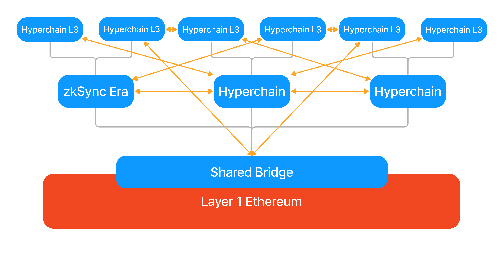

# Hyperscaling

## Scaling Blockchains

Ethereum, currently processing around 12 transactions per second, must scale to handle millions of transactions for a future of global on-chain financial activities. Achieving this in a decentralized structure poses significant challenges. Various solutions, including Polkadot, Cosmos, Near, and Eth 2.0, have been explored with multi-chain or shard architectures, but full trust remains an issue. The widely accepted solution for these challenges lies in zero-knowledge proofs, offering cryptographic security. Combined with the DA layer and ZK Rollups, these can create a secure, scalable ecosystem, making Ethereum accessible to all.

## What are Hyperchains?

Hyperchains are fractal-like instances of zkEVM running in parallel and with the common settlement on the L1 mainnet. The name Hyperbridge comes from the traditional web, where users can navigate websites using hyperlinks. Similarly, our rollups will be connected with Hyperbridges.

Gray lines show proofs, orange lines the hyperbridges, which automatically connect all blue chains.

Using Hyperchains with a shared bridge contract on L1, and native Hyperbridges between the rollups solves a lot of problems in other architectures.

1. Rollups have validating bridges that are trustless.
2. Hyperbridges can easily burn and mint the native tokens for transfers between members of the ecosystem. 
3. The L1 serves as a single source of truth, so the rollups cannot hard fork.
4. The ecosystem can coordinate a hard fork together in case a vulnerability is found using a governance framework on L1, similar to how the L1 would react to a vulnerability.

Hyperchains can be developed and permissionlessly deployed by anyone. However, to remain trusted and fully interoperable, each Hyperchain must be powered by the exact same zkEVM engine as the main zkSync Era instance. All the ZKP circuits will thus remain 100% identical, letting Hyperchains fully inherit their security from L1, no matter who deployed them. This ensures zero additional trust/security assumptions.

Hyperchains will be implemented following the modular approach – using the ZK Stack developers can individually pick different components of their blockchains or implement their own ones (except the zkEVM core, for the reasons explained above). See [Modularity: Hyperchain Customisation](#modularity-hyperchain-customization) below for more details.

### How Hyperbridges work

The Hyperbridge itself will be a system of smart contracts, verifying Merkle proofs of the transactions happening on other chains. The original asset is locked in the shared bridge contract on L1. This means liquidity is unified across the ecosystem.

Hyperbridging will consist of 7 steps. 
1. First the cross-rollup transaction has to be initiated on the sending rollup. 
2. The sending rollup settles its proof onto L1.
3. As the proof is settled, it updates the Transaction Root. This Root is a commitment to all the Hyperbridge transactions happening inside the ecosystem. 
4. The receiving Hyperchain imports this Transaction Root. 
5. A relayer sends the transaction and a Merkle Proof connecting it to the Transaction Root to the receiving Hyperchain. 
6. The transaction is verifies the Merkle proof connects the imported Transaction Root and the transaction. If the proof is correct, the transaction is executed and the relayer is rewarded. 
7. The receiving Hyperchain settles its proof, where the imported transaction root is also verified.  

Smart contracts will be written in many different programming languages in the ecosystem, due to our VM’s native LLVM support. Developers will have the option to use the native bridges, there will be no need for external third parties. Assets, function calls, general messages, and historical data can all be trustlessly transferred cross-chain.

There are three types of bridges in this ecosystem. The enshrined L1-L2 bridge, the [zkPorter](https://blog.matter-labs.io/zkporter-a-breakthrough-in-l2-scaling-ed5e48842fbf) shard bridges, and the hyperbridges will operate with a similar set of interfaces. 

Hyperbridges technically will be similar to L2→ L1 bridges, they will be asynchronous and not atomic. However, with the help of Account Abstraction, external relayers, and lower fees on rollups, the users will not have to initiate the call on the destination chain. This means the user experience will feel like an L1 → L2 bridge. You can try learn more about L1<>L2 bridging [here](https://era.zksync.io/docs/dev/how-to/send-message-l2-l1.html).

Besides cross-chain calls, it will be also possible to execute cross-chain views inside transactions, accessing arbitrary data from other chains in the ecosystem. 

### Hyperchain User Experience

As we aim to onboard billions of users to Web3, user experience has to be a priority. Users will have wallets on different chains, unified by cross-chain wallet management. This is still a hot research topic, as seen in Vitalik's [recent post](https://vitalik.ca/general/2023/06/20/deeperdive.html). These solutions will be integrated into [Account Abstractions](https://era.zksync.io/docs/reference/concepts/aa.html), which are natively supported on our chains.

The users' wallets will show all of their assets, and relayers will handle bridging, burning, and minting assets to be used on destination. Hyperchains will have unique identifiers that, when paired with ENS/Unstoppable domains, will make recipient addresses look like email addresses. Of course, the default will be the use of traditional Ethereum addresses together with the Hyperchain identifiers.

Bridging will be part of the protocol, so it will be built into the wallet alongside transfers. Bridging time will be the proof settlement time, which will be 1-15 minutes, depending on the Hyperchain. Due to fact that the only relayers will be required as external infrastructure, the cost of the bridging will be minimal, comparable to the gas fees. 

**Imagine a cross-chain Uniswap transaction.** You want to swap Ethereum for DAI. You start the transaction with your wallet. Then the relayer delivers 1 ETH to a Uniswap chain, and the ETH is swapped for DAI. Finally a relayer transfers the DAI back to your original chain. All three steps are part of the same transaction. All of this in a matter of minutes and feels as if you have not left your original chain (except for somewhat longer confirmation time).

When setting up wallets on cheaper chains ([validiums](https://ethereum.org/en/developers/docs/scaling/validium/)), they will have to trust the hosting organization to not lose their funds. Unlike centralized exchanges, these funds cannot be stolen, only frozen, which hurts the hosting organization as well! The risks will be made clear in the wallet.

## Proof Aggregation

Validity proofs provide the basic scalability to the ecosystem. Having a single blockchain is like running a single CPU. Having multiple Hyperchains run simultaneously provides parallelisation. The proof aggregator is the mechanism that gives the ecosystem its hyperscalability. If every Hyperchain wanted to settle their proofs to L1 independently, the total load on the L1 would still be proportional to the total number of Hyperchains. So the proofs of the Hyperchains are aggregated, settling all of them together on L1 in a single proof. There are multiple options for this. 

### Simple Proof Aggregation

Simple proof aggregation treats the proofs of different Hyperchains as independent statements that can be verified together on L1. Unfortunately the simple aggregation mechanism does not allow fast messaging as proofs are settled infrequently on L1 to save gas fees.

### L3s

Another alternative for aggregation is layering. Hyperchains can settle their proof on an L2 Hyperchain, becoming L3s. L3s settling on the same L2 will have faster messaging between each other and will have cheap atomicity via transactions forced through the L2, and interoperability will be preserved with the wider ecosystem. This is a particularly good solution for Validiums, as they don’t send data to the L1. The only downside is that there is a higher chance of reversion if the L2 reverts. 

Here proof aggreagation happens via the L2, as the proofs of different L2 blocks are aggregated when settling on L1. This method is ultimately not scalable, as the L2's VM will be a bottleneck for proof verification. The L2's VM will also require a full consensus mechanism, meaning long term storage, transaction verification etc.

### Layered Aggregation 

Layered Aggregation combines the benefits of L3s with the benefits of aggregation. The L2's VM is replaced by a specialised proof that still permits messaging and aggregation. This proof tracks the State Root of the participating rollups, as well as the Transaction Root. The Transaction Root will be imported from and settled inside this specialised proof. Compared to the L2's VM this solution is more scalable, and will only need a lightweight consensus mechanism. 

### Economic Guarantees

The time it takes to hyperbridge is the settlement time of the proof, which can only happen after the proof is generated. This will be on the order of minutes, but for some chains faster interoperability will be needed. This is impossible to achieve trustlessly, but it is easy to achieve if have economic guarantees. The transaction root can be calculated outside the proof and then imported. This is not as secure as importing the transaction root from a proof, even a single invalid transaction means that all of the participating rollups will have to revert, as valid proofs cannot be generated. So we are building this solution as an optional add-on, and not part of the core protocol. 

For these rollups proof generation and settlement still happens as usual. This means the transaction root will have to be calculated inside the L2 or specialised proof. This means this add-on can only work for L3s or for the Layered Aggregator.  

### Atomicity

Another property that we would like to enable long-term is atomicity for the transactions. This can be achieved using the DA layer. Instead of a relayer sending the transaction to the destination rollup, it can be posted to the DA layer, and the receiving rollup can read it from there. To guarantee atomicity, the received transactions need to be compared to the sent transactions. If rollups generated blocks at the same frequency then this could be done from block to block inside the proof aggregator. Unfortunately this is not the case, rollups will choose to generate blocks and setle proofs at their own rate. This makes the mechanism more complicated, a detailed description is available [here](https://hackmd.io/@kalmanlajko/BkmTTADai), and is still under review. This will only be possible for the Layered Aggregator. 

This image is an intuition pump, the real mechanism is more complicated and works differently. 

### Sovereignty

All Hyperchains will be sovereign in the ecosystem. This means two things.

Proof aggregation will be optional, Hyperchains can choose to not participate. In this case, they can settle their proofs directly to Ethereum for a much larger fee. Aggregation will also be decentralized and widely accessible, meaning the hardware requirements to run a prover will be as low as possible.

Second, Hyperchains will be able to permissionlessly join and exit the ecosystem, adding or removing all their assets to the common pool in the Shared Bridge. Joining is self-explanatory, everyone will have the right to boot up new Hyperchains and join the ecosystem in a Chain Factory contract.

Exiting will usually not be a similarly wise decision, as interoperability will be lost with other Hyperchains. However, the ecosystem could sometimes upgrade due to governance, and in this case, it is imperative that each Hyperchain have the right to rage quit. In this case, there will be a mandatory upgrade period during which the Hyperchains that disagrees with the upgrade can exit in a coordinated fashion.

### Feature comparison 

We look at the comparisons that different aggregator mechanisms enable. 

|   | Aggregation | L3s | Layered Aggregation  |
|---|---|---|---|
|Fast Messaging|  No | Yes  |  Yes |
| Scales   | Yes  |  No | Yes  |
| Consensus Mechanism | None  | L2 Full Consensus  | Lightweight Consensus  |
| Instant Messaging Add-on  | No  | Yes | Yes |
| Hyperbridges atomic | No | No | Yes via DA, under review|
| Sovereign | Yes  | Yes  | Yes |

## Modularity: Hyperchain Customization

The main customization options to be provided by [ZK Stack (Post)](https://blog.matter-labs.io/introducing-the-zk-stack-c24240c2532a) is explained below. Developers are of course free to implement their own components and customizations.

### Sequencing transactions

- **Centralized sequencer** - In this mode, there will be a single centralized operator with a conventional REST API to accept transactions from users. The operator must be trusted to maintain liveness, not to abuse MEV, and not to allow reorgs of unfinalized transactions, so the operator’s reputation will play a big role. The biggest advantage of this option is that it can provide the lowest possible latency to confirm transactions (<100ms), which is critical for use-cases such as HFT. The Basechain will run in this mode until it is fully decentralized, so we will have battle-tested server code available for developers early on.
- **Decentralized sequencer** - In this mode, a Hyperchain will coordinate on what transactions are included in a block using a consensus algorithm. It can be any algorithm, so developers can reuse existing implementations (e.g. Tendermint or HotStuff with permissionless dPoS). But we can also take advantage of the fact that finality checkpoints are guaranteed by the underlying L1, and implement an algorithm that is simpler and boasts higher performance. The Basechain will switch to this option as soon as the consensus implementation is ready, and will make its code available to the Hyperchain developers.
- **Priority queue** - This simply means absence of any sequencer: all transactions can be submitted in batches via the priority queue from an underlying L2 or even L1 chain, taking advantage of their stronger censorship-resistance. It might be especially interesting for special-purpose governance protocols (e.g. on-chain voting). It’s worth noting that the priority queue will always be available as an escape-hatch mechanism (even if a centralized or decentralized sequencer is employed), to protect users against censorship by a malicious sequencer.

### Data availability

Each Hyperchain can manage its data availability (DA) policy using a smart contract interface. It can use one of the options described below or some more complex logic. For example, to combine zkPorter and validium, the DA will require both a quorum of the signatures from the guardians and a number of signatures from the data availability committee.

- **zkRollup** - This is our default recommendation policy: the values of every changed storage slot at the end of the block must be published as calldata on L1. Note that repeated changes (or back-and-forth changes that result in no net difference) are not posted. It means if a block contains 100 ETH/DAI swaps on the same DEX then pubdata costs will be partially amortized over all such swaps. A Hyperchain working in this mode strictly inherits full security and censorship-resistance properties from Ethereum. The implementation of zkRollup in output mode will be available from day 1. To propagate calldata to L1, it will be aggregated at the Basechain. Note that if Hyperchain’s ZK-proof is potentially large in size and/or computationally heavy to verify it only incurs L2 costs and not pubdata costs.
- **zkPorter** - it's explained in detail in **[this post](https://blog.matter-labs.io/zkporter-a-breakthrough-in-l2-scaling-ed5e48842fbf)**. We already have a working zkPorter guardian testnet, which we are preparing to open source. We expect zkPorter to be popular with users willing to take higher security risks in exchange for really cheap transactions, which will be extremely useful until Danksharding is implemented, and even afterward for specialized use cases. Hyperchain developers will be able to either tap into the DA from zkSync main zkPorter implementation or bootstrap their own guardian network (which could be interesting for large existing online communities such as Reddit or Twitter), or use external DA solutions (e.g. EigenDA) .
- **Validium** - Being true to our **[values](https://www.notion.so/d36a797ff1aa47d2859f9e0c5ffbd0ab?pvs=21)**, we generally **[discourage](https://blog.matter-labs.io/zkrollup-vs-validium-starkex-5614e38bc263)** mainstream users from trusting validium-based solutions. However, there are use-cases where using validium is fully justified, e.g. enterprise chains that require both auditability and privacy (since the data availability in such cases is controlled by a central party, it is trivial to keep such a Hyperchain private by simply withholding data). Since validium is essentially a simpler case of a zkPorter, developers can easily deploy Hyperchains based on this policy.
- **zkRollup (inputs only)** - This policy will require publishing full transaction inputs instead of final storage updates. Trustless state reconstruction and the DA costs in this case will be 100% identical to optimistic rollups (but with all the benefits of a zkRollup of course, including better security and faster exits). The implementation of this option is easily derived from the implementation of the normal zkRollup. It can be explored by application-specific chains where tx inputs are short but might lead to a lot of changes in data (for example, performing financial simulations).
- **zkRollup (self-hosted)** - An extremely interesting option! In this mode, users self-host the data for all the accounts they own. To enforce this, user confirmation signatures are required to make any changes – which means, you cannot send funds directly to another user. Instead, you will burn the funds and create proof of this burn, which you can provide to your recipient via an off-chain channel. The recipient will then redeem them to their account. This might sound complicated, but it’s easy to construct a nice UI that will abstract away the UX, making it practically indistinguishable from sending and receiving funds on Ethereum (it will automatically redeem all received assets the moment the user intends to spend funds, requiring no extra clicks). But here comes a miracle: a self-hosted zkRollup can be happy with as little as 5 bytes per user interaction that includes a batch of arbitrary many transactions! This makes sharded Ethereum infinitely scalable for any practical purposes in the zkRollup mode (i.e. 100% secure and censorship-resistant). This is a way to onboard every single person on Earth to Ethereum with zero security compromise. A great thing about this approach is also that it’s fully compatible with our zkEVM implementation, but can nonetheless offer privacy to the users. The implementation is non-trivial, so we expect it to come last among all the other options. At the same time, it’s simpler and much more powerful than alternative approaches like Adamantium.

### Logical state partitions in ZK Porters

Each Hyperchain can have one or more logical partitions that are part of the same state but live in separate subtrees and enforce different data availability policies. From the user perspective, they would appear as separate Hyperchain instances (with their own chain ID, separate wallet connection, block explorer view, etc), which can however interoperate synchronously.

Synchronicity is important as it enables atomic transactions between partitions, unlocking several unique use cases:

- Transparently reading the state of another partition.
- Using flash loans between the partitions.

One prominent example of this is a combination of **[zkRollup + zkPorter](https://blog.matter-labs.io/zkporter-a-breakthrough-in-l2-scaling-ed5e48842fbf)** (which will be part of the zkSync Basechain):

### Privacy

Hyperchains can add privacy in a number of ways:

1. **Validium**. For a Hyperchain running in the validium mode, privacy to the outer world is achieved out of the box as long as the operator keeps the block data secret. This might be an interesting option for enterprise users.
2. **Privacy protocols**. To implement user-level privacy, a specialized L3 protocol is required. Projects such as Aztec or Tornado can be implemented either directly on the Basechain (taking advantage of account abstraction and cheap recursive ZKP verification on zkSync), or they can opt into standalone special-purpose Hyperchains for more flexibility.
3. **[Self-hosted Rollups](https://ethresear.ch/t/account-based-anonymous-rollup/6657),** based on user-maintained data availability and self-proved off-chain state transitions, will offer ultimate privacy and unlimited scalability in the long term.
