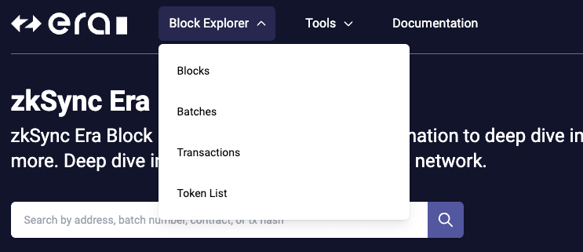

---
head:
  - - meta
    - name: "twitter:title"
      content: Block Explorer | zkSync Docs
---

# Block Explorer

The [zkSync Era Block Explorer user interface](https://explorer.zksync.io/) details comprehensive data about transactions, blocks, batches, wallets, tokens, and smart contracts on the zkSync Era network.

Toggle between testnet and mainnet data with the top-right dropdown menu.

## Block Explorer API

We’ve developed the [zkSync Era Block Explorer API](https://block-explorer-api.mainnet.zksync.io/docs) for developers to access [zkSync Era Block Explorer](https://explorer.zksync.io/) data directly via HTTP requests.

The [API](https://block-explorer-api.mainnet.zksync.io/docs) provides various endpoints for many use cases you might want in your app. It is compatible with [Etherscan API](https://docs.etherscan.io/), which makes it easy to transition your existing apps to zkSync Era network.

The following modules are supported:

- [Contract](https://block-explorer-api.mainnet.zksync.io/docs#/Contract%20API)
- [Account](https://block-explorer-api.mainnet.zksync.io/docs#/Account%20API)
- [Transaction](https://block-explorer-api.mainnet.zksync.io/docs#/Transaction%20API)
- [Logs](https://block-explorer-api.mainnet.zksync.io/docs#/Logs%20API)
- [Block](https://block-explorer-api.mainnet.zksync.io/docs#/Block%20API)

Check out the API documentation [API docs on Mainnet](https://block-explorer-api.mainnet.zksync.io/docs) | [API docs on Testnet](https://block-explorer-api.testnets.zksync.dev/docs)

:::note Note

The [API](https://block-explorer-api.mainnet.zksync.io/docs) does not fully cover all the functionality yet.
:::

We are working on additional endpoints to cover more use cases and to make developers’ experience better. Stay tuned for further updates.

Feel free to contribute and create issues and feature requests in [zkSync Era Block Explorer GitHub repo](https://github.com/matter-labs/block-explorer).

## Block explorer menu

The [block explorer menu](./block-explorer-menu.md) has options for viewing data on blocks, batches, transactions, and supported tokens.

## Smart contract verification

The tools menu has options for [verifying your smart contract deployments](./contract-verification.md).

:::warning Warning

- Currently there are some issues with the UI contract verification tool.
  :::

## Search bar

Use the search bar on all pages to access data by:

- **Address**: The address of an EOA (externally owned account).
- **Batch index**: The index of a batch submitted to L1.
- **Contract address**: The callable address of a smart contract deployed on zkSync Era.
- **Transaction hash**: The unique 66 character identifier of an executed transaction.

## Block Explorer API

The [zkSync Era Block Explorer API](https://block-explorer-api.mainnet.zksync.io/docs) is available for developers to access data directly via HTTP requests. Learn more [here](./block-explorer-api.md).
