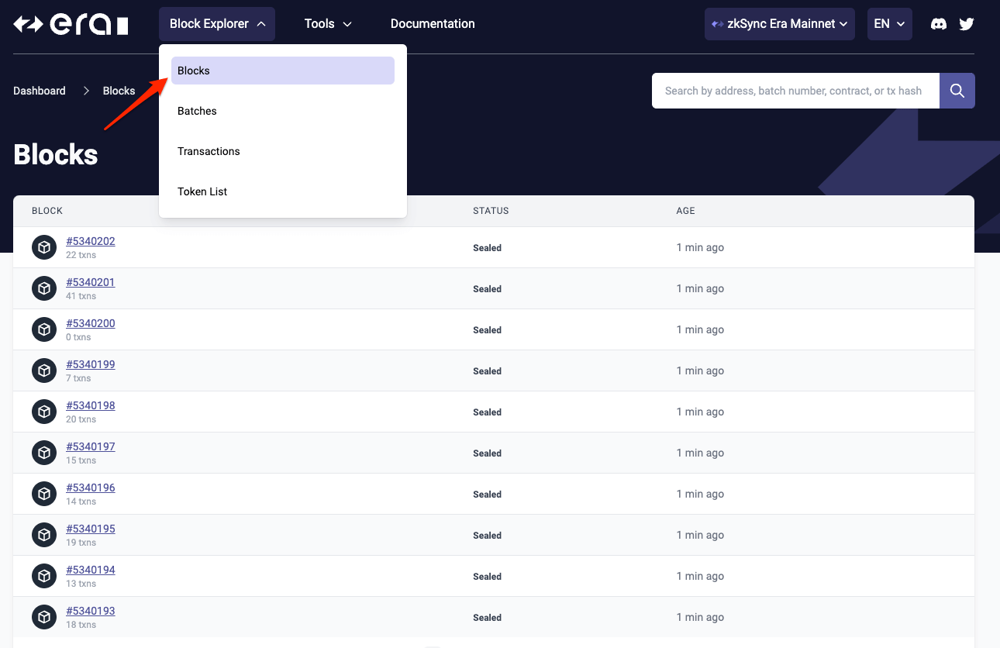

# Block explorer menu

# Use the block explorer

## Overview

The [zkSync Era block explorer](https://explorer.zksync.io/) displays real-time and historical blockchain data. It can be used by users and developers to utilize both high-level data (such as contracts, transaction rates, and so on) and more detailed insights (e.g. block contents, transaction hashes, sending accounts, etc.).
Consider it a window into the zkSync blockchain, letting you see what's going on there.

Our block explorer graphically displays block activity, allowing users to engage with the data more effectively. They may seek a specific block number and investigate it further by reading the address and transaction details that comprise a block.

## Who Should Make Use of a Block Explorer?

Users and developers can use block explorer to track the progress of their transactions. When a transaction is submitted, it automatically creates a transaction hash, which can be used to check the transaction details and whether it was successful or not.
We have prepared this document to aid users and developers in utilizing the block explorer and optimizing the ideal learning experience.

We have prepared this tutorial to aid users and traders in utilizing the block explorer and optimizing the ideal learning experience. We will highlight specific touch points in the block explorer:

1. [Search bar](./search.md) - Search by wallet address, transaction hash, block number or contract address.
2. [Browse blocks](./block-view.md): details about blocks included in zkSync Era.
4. [Transaction view](./block-view.md#transactions): fetch and analyze on-chain transactions.
5. [Smart contract verification](./contract-verification.md): verify smart contracts with zkSync Era block explorer.

To start, you can open up [block explorer](https://explorer.zksync.io/) in your web browser and follow along using the guide.
Let’s take a look at the block explorer!

The block explorer home screen shows the 10 most recent blocks by default. To see a more complete overview of recent blocks, you can view all blocks. You can also click on a specific block number to see details about that particular block.
You can access the blocks page from the top menu as well.

## Block details

For specific block details, click on the block number. Go to the [Blocks](https://explorer.zksync.io/blocks/) section and use the pagination at the bottom of the page to see older blocks.

Search for a specific block by typing in its block number.

For specific block details, click on the block number.

Block information has the transactions section that contains all the transactions included in the block.

### Transactions

In this section, you can find a list of all the transactions included in the block. Transactions are processed in the order they are received.

| Value             | Description                                                                                                                                              |
| ----------------- | ------------------------------------------------------------------------------------------------------------------------------------------------------------------------------ |
| Transaction hash  | The hash of the transaction serving as the transaction’s ID.                                                                                             |
| From              | The account or smart contract, sending the transaction.                                                                                                  |
| To                | The account or smart contract, receiving the transaction.                                                                                                |
| Nonce             | A unique identifier assigned to each transaction that is used to order transactions.                                                                     |
| Fee               | The rate of fees associated with this transaction processing.                                                                                            |
| Amount            | The number of ether (ETH) that were transferred in a particular transaction.                                                                             |
| Age               | The number of block confirmations that have occurred since the transaction was first included in the block.                                              |
