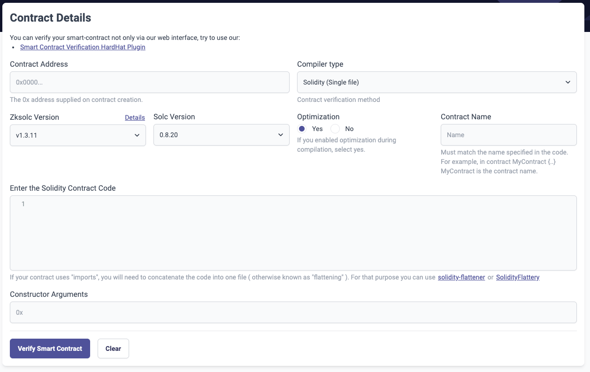

---
head:
  - - meta
    - name: "twitter:title"
      content: Block Explorer Contract Verification | zkSync Era Docs
---

# Contract verification

## User interface

1. Click [**Smart Contract Verification**](https://sepolia.explorer.zksync.io/contracts/verify) in the block explorer menu to go to the Smart Contract Verification page.


2. Supply the contract details.



- **Contract Address**: Enter the `0x` address generated at deployment time.
- **Compiler type**: Select Solidity or Vyper single or multi-part file from the dropdown menu.
- **Zksolc Version (in case Solidity is selected as Compiler type)**: Select the zkSync Era compiler version for Solidity used in your code from the dropdown menu.
- **Solc Version (in case Solidity is selected as Compiler type)**: Specify the Solidity compiler version used in your code from the dropdown menu.
- **Zkvyper Version (in case Vyper is selected as Compiler type)**: Select the zkSync Era compiler version for Vyper used in your code from the dropdown menu.
- **Vyper Version (in case Vyper is selected as Compiler type)**: Specify the Vyper compiler version used in your code from the dropdown menu.
- **Optimization**: Select **Yes** if you enabled optimization during contract compilation, otherwise **No**.
- **Contract Name**: Enter the exact name of your contract without the `.sol` postfix.
- **Contract Path (in case Solidity (Single file) is selected as Compiler type)**: Enter the path to the `.sol` contract file in the required format.
- **Enter the Solidity Contract Code (in case Solidity (Single file) is selected as Compiler type)**: Copy/paste your Solidity contract code into this text box.
- **Enter the Vyper Contract Code (in case Vyper (Single file) is selected as Compiler type)**: Copy/paste your Vyper contract code into this text box.

  :::tip Contract code flattening
  If your Solidity code uses a library or inherits dependencies from another contract, you may need to flatten it. Use a tool such as:

  - [Hardhat flatten](https://medium.com/coinmonks/flattening-smart-contracts-using-hardhat-dffe7dbc7b3f)
  - [Truffle flattener](https://github.com/NomicFoundation/truffle-flattener)
  - [POA Solidity flattener](https://github.com/poanetwork/solidity-flattener)
    :::

- **Constructor Arguments**: Enter the `0x` constructor argument returned at deployment time, or whatever was hardcoded in the deployment script.

3. Click **Verify Smart Contract** to run the verification process.

During verification, the smart contract's bytecode and Solidity source code are compared. The algorithm compiles the source code and checks if the generated bytecode matches the deployed bytecode.

4. Success

If the bytecode and source code match, the smart contract is verified.


If any input information is incorrect, the verification process fails.

## Hardhat plugin

You can also verify your smart contract using the [Hardhat plugin](../hardhat/hardhat-zksync-verify.md).

## Constructor arguments

You can output the constructor argument data at deploy time by adding the following code to your deployment script.

```js
const your_constructor_argument = "Hi there!";
const myContract = await deployer.deploy(artifact, [your_constructor_argument]);

//obtain the Constructor Arguments
console.log("constructor args:" + myContract.interface.encodeDeploy([your_constructor_argument]));
```
