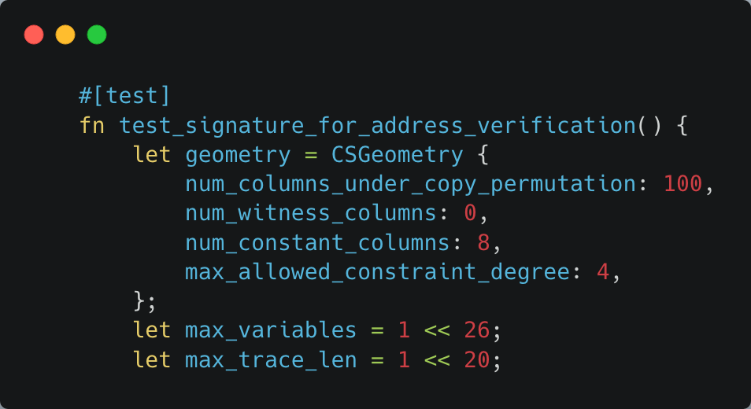
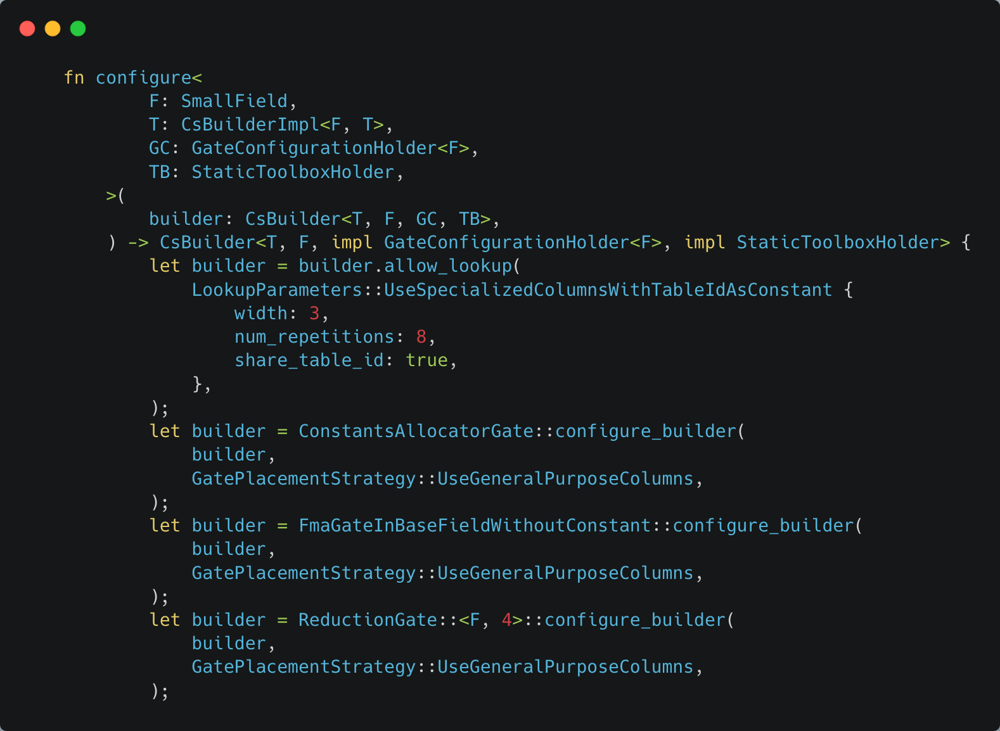
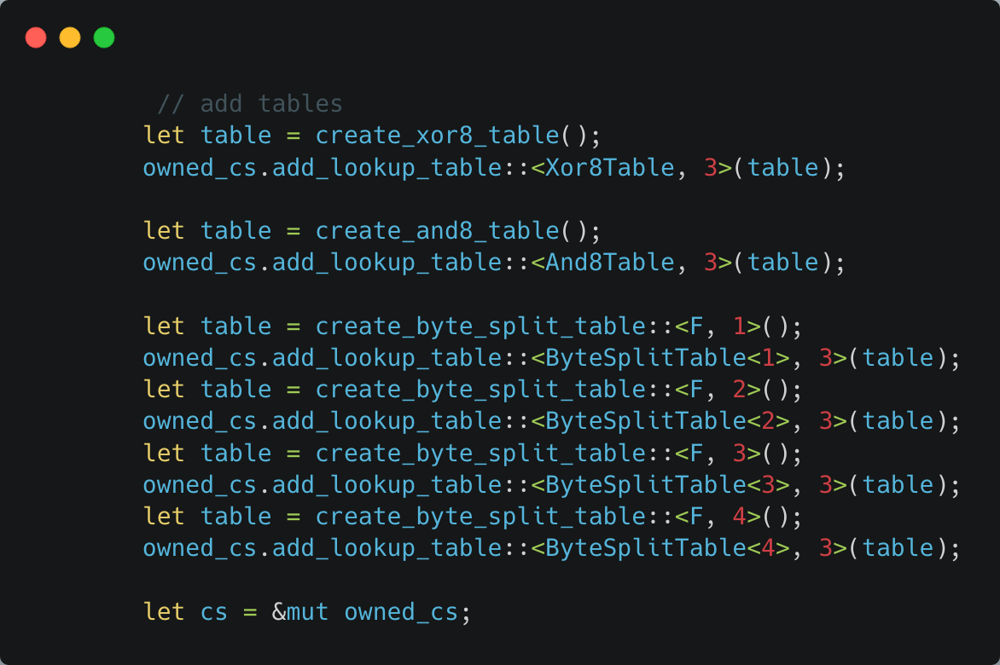
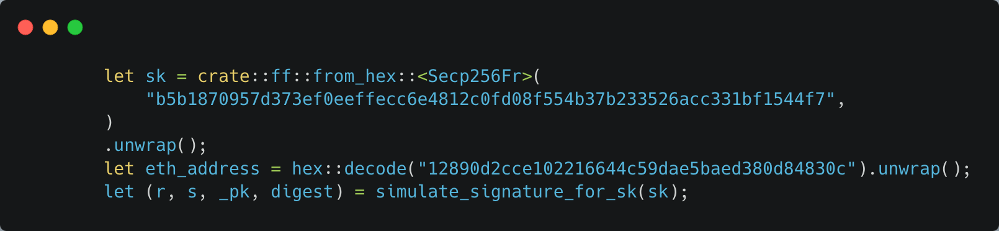
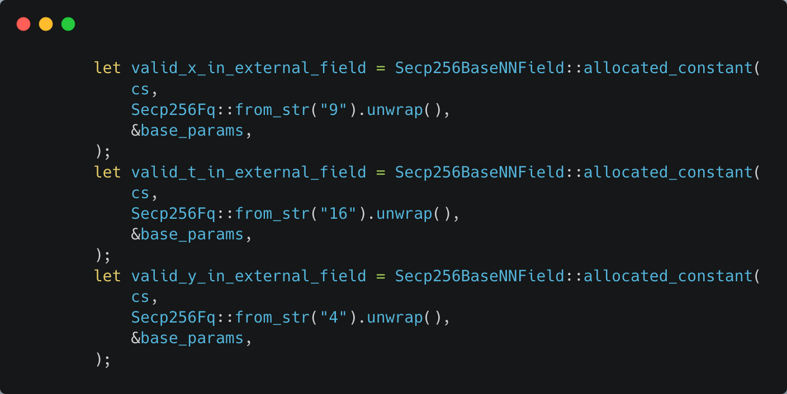
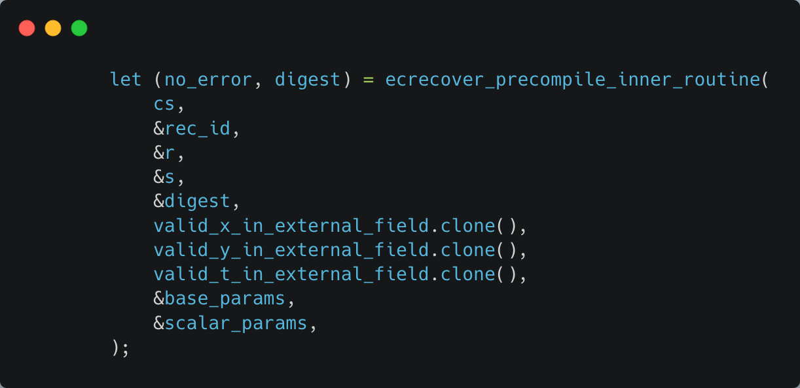
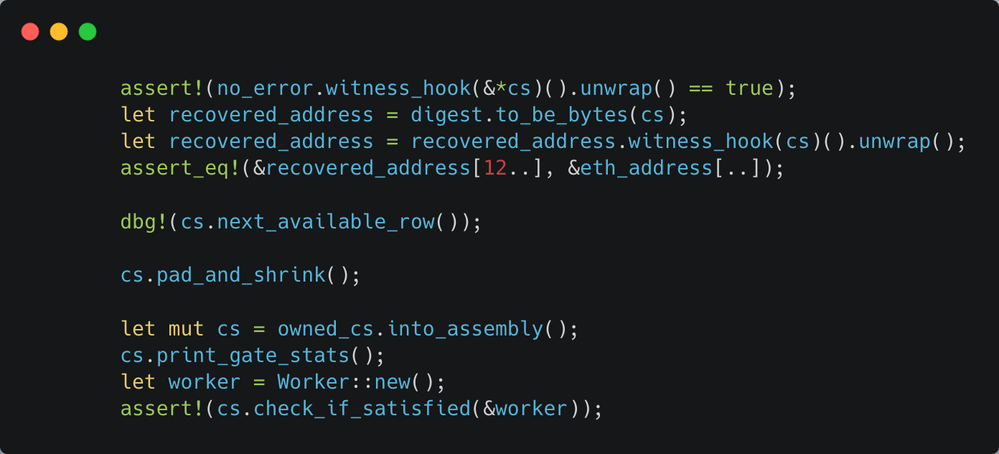

---
head:
  - - meta
    - name: "twitter:title"
      content: Circuit Testing | zkSync Docs
---

# Circuit testing

This page explains unit tests for circuits. Specifically, it goes through a unit test of
[ecrecover](https://github.com/matter-labs/era-zkevm_circuits/blob/main/src/ecrecover/mod.rs#L796). The tests for other
circuits are very similar.

Many of the tests for different circuits are nearly identical, for example:

- test_signature_for_address_verification (ecrecover)
- test_code_unpacker_inner
- test_demultiplex_storage_logs_inner
- and several others.

If you understand one, you will quickly be able to understand them all.

Let’s focus on ecrecover. Ecrecover is a precompile that, given your signature, can compute your address. If our circuit
works correctly, we should be able to recover the proper address, and be able to prove the computation was done
correctly.

The test begins by defining `geometry`, `max_variables`, and `max_trace_len`. This data will be used to create the
constraint system. Next, we define a helper function:

To help run the test, we have a helper function called `configure` that returns a builder. The builder knows all of the
gates and gate placement strategy, which will be useful for setting up the constraint system.

The constraint system is almost ready! We still need to add the lookup tables for common boolean functions:

Now the constraint system is ready! We can start the main part of the test!

Here we have hard coded a secret key with its associated public key, and generate a signature. We will test our circuit
on these inputs! Next we “allocate” these inputs as witnesses:

We have to use special integer types because we are working in a finite field.

The constants here are specific to the curve used, and are described in detail by code comments in the
ecrecover_precompile_inner_routine.

Finally we can call the ecrecover_precompile_inner_routine:

Lastly, we need to check to make sure that 1) we recovered the correct address, and 2) the constraint system can be
satisfied, meaning the proof works.

