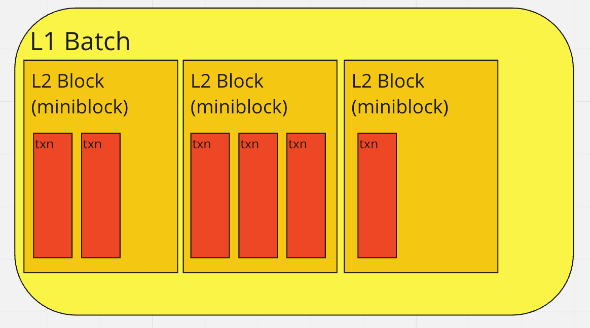
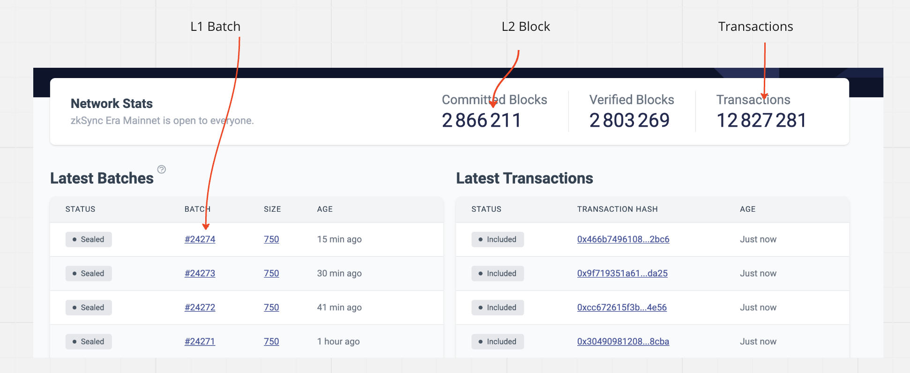

---
head:
  - - meta
    - name: "twitter:title"
      content: Blocks | zkSync Docs
---

# Blocks

Here, we will explore the processing of transactions, how we group them into blocks, what it means to "seal"
a block, and why it is important to have rollbacks in our virtual machine (VM).

At the basic level, we have [individual transactions](./transaction-lifecycle.md). However, to execute them more efficiently, we group them together
into blocks & batches.

**L2 blocks**, or just "blocks", are the blocks created on the L2, that is on the zkSync Era network, and they are not included on the Ethereum chain.

On the other hand, L1 rollup blocks are **batches** of consecutive L2 blocks that contain all the transactions in the same order, from the first block to the last block in the batch.

L1 batches, as the name suggests, are submitted to Ethereum. The main reason to have these different notions is that a block can
contain a minimal number of transactions (see fictive blocks below), and thus be processed quickly, while in a batch we would like to include many transactions to spread the cost of interacting with L1 across all transactions.

## Batch vs Block vs Transaction

To help visualize the concept, here are two images:

You can refer to the Block layout image to see how the blocks are organized. It provides a graphical representation of
how transactions are arranged within the blocks and the arrangement of L2 blocks within L1 batches.

## L2 Blocks (aka Miniblocks)

Currently, the L2 blocks do not have a major role in the system, until we transition to a decentralized sequencer. We
introduced them mainly as a "compatibility feature" to accommodate various tools, such as Metamask, which expect a block
that changes frequently. This allows these tools to provide feedback to users, confirming that their transaction has
been added.

As of now, an L2 block is created every 1 seconds (controlled by StateKeeper's config `miniblock_commit_deadline_ms`)
(You can check difference between `RemainingBlock` and `EstimateTimeInSec` from [block countdown api endpoint](https://block-explorer-api.mainnet.zksync.io/docs#/Block%20API/ApiController_getBlockCountdown)), and it includes all the transactions received during that time period. This periodic creation of L2 blocks ensures that
transactions are processed and included in the blocks regularly.

### Block Properties

The following are the block properties returned when you use the `getBlock` method from the API using any of our SDKs.

| Parameter     | Description                                                                                                                                       |
| ------------- | ------------------------------------------------------------------------------------------------------------------------------------------------- |
| hash          | The hash of the L2 block. null if pending                                                                                                         |
| parentHash    | It refers to the hash of the parent block in L2.                                                                                                  |
| number        | The number of the current L2 block. null if pending.                                                                                              |
| timestamp     | The UNIX timestamp for when the L2 block was collated.                                                                                            |
| nonce         | It's the most recent transaction based on the account's counter, which maintains track of how many transactions it does. null if pending.         |
| difficulty    | The current block difficulty returns 2500000000000000 (zkSync does not have proof of work consensus).                                             |
| gasLimit      | The maximum gas allowed in this block encoded as a hexadecimal, always returns `2^32-1`.                                                          |
| gasUsed       | The actual amount of gas used in this block.                                                                                                      |
| transactions  | An array of transaction objects - please see [interface TransactionResponse](../../build/sdks/js/providers.md#gettransaction) for exact more info |
| baseFeePerGas | The EIP1559-like baseFee for this block.                                                                                                          |

::: info Block number and timestamp considerations

An update in the protocol introduced changes on how certain block properties were implemented on zkSync Era. For details on the changes performed visit the [announcement on GitHub](https://github.com/zkSync-Community-Hub/zkync-developers/discussions/87).

:::

## L1 batches

L1 batches play a crucial role because they serve as the fundamental unit for generating proofs. From the perspective of
the virtual machine (VM), each L1 batch represents the execution of a single program, specifically the Bootloader. The
Bootloader internally processes all the transactions belonging to that particular batch. Therefore, the L1 batch serves
as the container for executing the program and handling the transactions within it.

### L1 Batch size and processing times

Most blockchains use factors like time and gas usage to determine when a block should be closed or sealed. However, our
case is a bit more complex because we also need to consider prover capacity and limits related to publishing to L1.

The decision of when to seal the batch is handled by the code in the [conditional_sealer](https://github.com/matter-labs/zksync-era/blob/main/core/lib/zksync_core/src/state_keeper/seal_criteria/conditional_sealer.rs) module. It
maintains a list of `SealCriterion` which include:

- Transaction count limit (that is, how many transactions would fit within a batch).
- Transaction size limit (that is, the total data/information within the transactions).
- L2 Gas limit.
- Published data limit (as each L1 batch must publish information about the changed slots to L1, so all the changes must
  fit within the L1 transaction limit).
- L1 Gas limit (Similar to the above, but ensuring the commit, prove and execute transactions on L1 wouldn't consume more gas than available).
- Circuits Geometry limits - For certain operations like merkle transformation, there is a maximum number of circuits that can be
  included in a single L1 batch. If this limit is exceeded, we wouldn't be able to generate the proof.
- Timeout (unlikely to ever be used, but ensures if there are not enough transactions to seal based on the other criteria, the batch is still sealed so information is sent to L1).

However, these sealing criteria pose a significant challenge because it is difficult to predict in advance whether
adding a given transaction to the current batch will exceed the limits or not. This unpredictability adds complexity to
the process of determining when to seal the block.

### `ExcludeAndSeal`

To handle situations where a transaction exceeds the limits of the currently active L1 batch, we employ a "try and
rollback" approach. This means that we attempt to add the transaction to the active L1 batch, and if we receive a
`ExcludeAndSeal` response indicating that it doesn't fit, we roll back the virtual machine (VM) to the state before the
transaction was attempted.

Implementing this approach introduces a significant amount of complexity in the `oracles` (also known as interfaces) of
the VM. These oracles need to support snapshotting and rolling back operations to ensure consistency when handling
transactions that don't fit.

## Retrieving block and batch numbers

Accessing block numbers within zkSync API is similar to how you would do it on Ethereum. For example, `eth_blockNumber` returns the number of the latest L2 block, and `eth_getBlockByNumber`, given a block number, returns the information about the requested block.

For L1 batches, to retrieve the latest batch number, use zkSync API method `zks_L1BatchNumber`.
Additionally, by querying on a block, you can see the batch number for the batch that includes the block.
Within transaction receipts, the field `l1BatchNumber` is the batch number that includes the transaction.
The field `l1BatchTxIndex` returns the transaction position among all of the transactions included in a batch.

## Deeper dive

### Initializing L1 batch

At the start of the batch, the operator
[provides](https://github.com/code-423n4/2023-10-zksync/blob/ef99273a8fdb19f5912ca38ba46d6bd02071363d/code/system-contracts/bootloader/bootloader.yul#L3636)
the timestamp of the batch, its number and the hash of the previous batch.. The root hash of the Merkle tree serves as
the root hash of the batch.

The SystemContext can immediately check whether the provided number is the correct batch number. It also immediately
sends the previous batch hash to L1, where it will be checked during the commit operation. Also, some general
consistency checks are performed. This logic can be found
[here](https://github.com/code-423n4/2023-10-zksync/blob/ef99273a8fdb19f5912ca38ba46d6bd02071363d/code/system-contracts/contracts/SystemContext.sol#L416).

### L2 blocks processing and consistency checks

#### `setL2Block`

Before each transaction, we call `setL2Block`
[method](https://github.com/code-423n4/2023-10-zksync/blob/ef99273a8fdb19f5912ca38ba46d6bd02071363d/code/system-contracts/bootloader/bootloader.yul#L2605).
There we will provide some data about the L2 block that the transaction belongs to:

- `_l2BlockNumber` The number of the new L2 block.
- `_l2BlockTimestamp` The timestamp of the new L2 block.
- `_expectedPrevL2BlockHash` The expected hash of the previous L2 block.
- `_isFirstInBatch` Whether this method is called for the first time in the batch.
- `_maxVirtualBlocksToCreate` The maximum number of virtual block to create with this L2 block.

If two transactions belong to the same L2 block, only the first one may have non-zero `_maxVirtualBlocksToCreate`. The
rest of the data must be same.

The `setL2Block`
[performs](https://github.com/code-423n4/2023-10-zksync/blob/ef99273a8fdb19f5912ca38ba46d6bd02071363d/code/system-contracts/contracts/SystemContext.sol#L312)
a lot of similar consistency checks to the ones for the L1 batch.

### L2 blockhash calculation and storage

Unlike L1 batch’s hash, the L2 blocks’ hashes can be checked on L2.

The hash of an L2 block is
`keccak256(abi.encode(_blockNumber, _blockTimestamp, _prevL2BlockHash, _blockTxsRollingHash))`. Where
`_blockTxsRollingHash` is defined in the following way:

`_blockTxsRollingHash = 0` for an empty block.

`_blockTxsRollingHash = keccak(0, tx1_hash)` for a block with one tx.

`_blockTxsRollingHash = keccak(keccak(0, tx1_hash), tx2_hash)` for a block with two txs, etc.

To add a transaction hash to the current miniblock we use the `appendTransactionToCurrentL2Block`
[function](https://github.com/code-423n4/2023-10-zksync/blob/ef99273a8fdb19f5912ca38ba46d6bd02071363d/code/system-contracts/contracts/SystemContext.sol#L373).

Since zkSync is a state-diff based rollup, there is no way to deduce the hashes of the L2 blocks based on the
transactions’ in the batch (because there is no access to the transaction’s hashes). At the same time, in order to
server `blockhash` method, the VM requires the knowledge of some of the previous L2 block hashes. In order to save up on
pubdata (by making sure that the same storage slots are reused, i.e. we only have repeated writes) we
[store](https://github.com/code-423n4/2023-10-zksync/blob/ef99273a8fdb19f5912ca38ba46d6bd02071363d/code/system-contracts/contracts/SystemContext.sol#L70)
only the last 257 block hashes. You can read more on what are the repeated writes and how the pubdata is processed
[here](https://github.com/code-423n4/2023-10-zksync/blob/main/docs/Smart%20contract%20Section/Handling%20L1%E2%86%92L2%20ops%20on%20zkSync.md).

We store only the last 257 blocks, since the EVM requires only 256 previous ones and we use 257 as a safe margin.

### Legacy blockhash

When initializing L2 blocks that do not have their hashes stored on L2 (basically these are blocks before the migration
upgrade), we use the following formula for their hash:

`keccak256(abi.encodePacked(uint32(_blockNumber)))`

### Timing invariants

While the timestamp of each L2 block is provided by the operator, there are some timing invariants that the system
preserves:

- For each L2 block its timestamp should be > the timestamp of the previous L2 block
- For each L2 block its timestamp should be ≥ timestamp of the batch it belongs to
- Each batch must start with a new L2 block (i.e. an L2 block can not span across batches).
- The timestamp of a batch must be ≥ the timestamp of the latest L2 block which belonged to the previous batch.
- The timestamp of the last miniblock in batch can not go too far into the future. This is enforced by publishing an
  L2→L1 log, with the timestamp which is then checked on L1.

### Fictive L2 block & finalizing the batch

At the end of the batch, [the bootloader](https://github.com/code-423n4/2023-10-zksync/blob/ef99273a8fdb19f5912ca38ba46d6bd02071363d/code/system-contracts/bootloader/bootloader.yul#L3812) calls the `setL2Block`
one more time to allow the operator to create a new empty block. This is done purely for technical reasons inside the
node, where each batch ends with an empty L2 block. This empty block contains a Transfer event log, representing the bootloader transferring the collected fees to the operator.

We do not enforce that the last block is empty explicitly as it complicates the development process and testing, but in
practice, it is, and either way, it should be secure.

Also, at the end of the batch we send the timestamps of the batch as well as the timestamp of the last miniblock in
order to check on L1 that both of these are realistic. Checking any other L2 block’s timestamp is not required since all
of them are enforced to be between those two.
