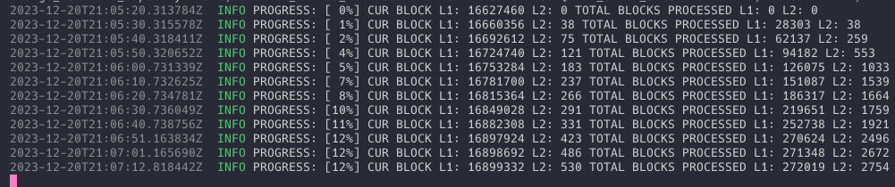

---
head:
  - - meta
    - name: "twitter:title"
      content: Recreating L2 state from L1 Pubdata | zkSync Docs
---

# Recreating L2 State from L1 Pubdata

## Prerequisites

> :warning: Note: Running the L1 pubdata tool will require approximately 500GB of memory and will take a few days to complete.

This tool is written in nightly Rust; you can install Rust by following the official instructions [here,](https://www.rust-lang.org/learn/get-started) and then running the following command to switch to the nightly toolchain:

```bash
rustup toolchain install nightly
```

1. Clone the [zksync-state-reconstruct](https://github.com/eqlabs/zksync-state-reconstruct) tool:

```bash
git clone https://github.com/eqlabs/zksync-state-reconstruct
cd zksync-state-reconstruct
```

## Usage

To start reconstructing the state, run the following command with any valid HTTP/HTTPS Ethereum JSON-RPC endpoint, for example using <https://eth.llamarpc.com>.

You can also use an Ethereum endpoint from [Alchemy,](https://www.alchemy.com/) [Infura](https://www.infura.io/) or any other endpoint provider:

```bash
cargo +nightly run -- reconstruct l1 --http-url https://eth.llamarpc.com
```

Here's what a successful start of the tool will look like in your terminal:


Here's what the tool will look like as it's running:



Once the tool has finished syncing, you will only be warned if the published L2 state is not the same as the reconstructed L2 state. If the tool has finished syncing and you have not received any warnings, then the L2 state has been successfully reconstructed.
