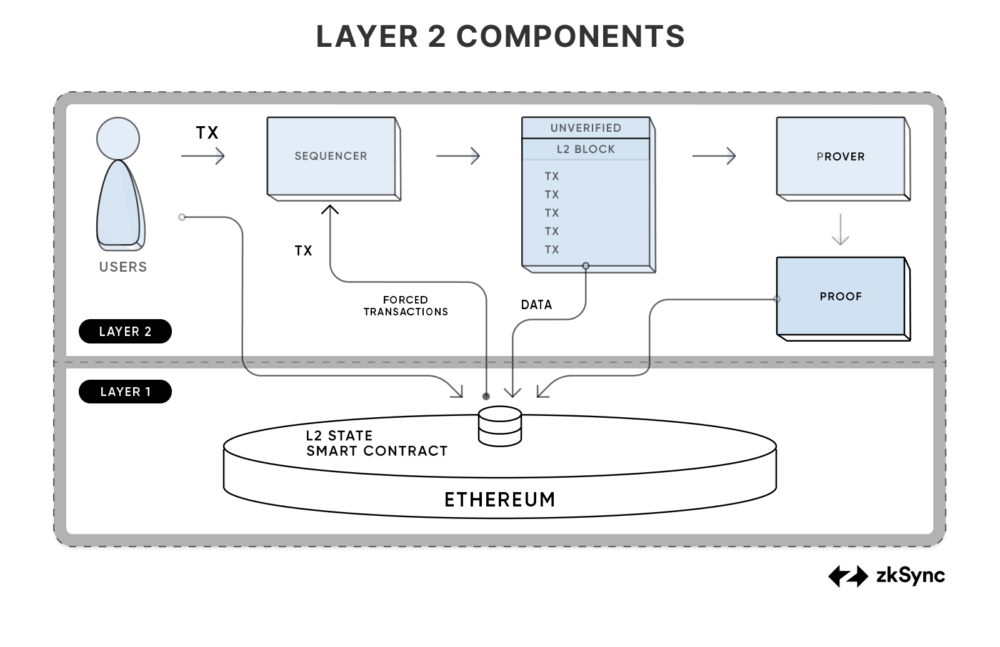

---
head:
  - - meta
    - name: "twitter:title"
      content: Transaction Lifecycle | zkSync Docs
---

# Transaction Lifecycle

## Overview

As stated in the introduction, the ZK Stack can be used to launch rollups. These rollups have some operators that are
needed to run it, these are the sequencer and the prover, they create blocks and proofs, and submit them to the L1
contract.

> Transactions are cryptographically signed instructions from accounts. An account will initiate a transaction to update the state of the Ethereum network. The simplest transaction is transferring ETH from one account to another. [Ethereum.org](https://ethereum.org/en/developers/docs/transactions/)

A user submits their transaction to the sequencer. The job of the sequencer is to collect transactions and execute them
using the zkEVM, and to provide a soft confirmation to the user that their transaction was executed. If the user chooses
they can force the sequencer to include their transaction by submitting it via L1. After the sequencer executes the
block, it sends it over to the prover, who creates a cryptographic proof of the block's execution. This proof is then
sent to the L1 contract alongside the necessary data. On the L1 a
smart contract verifies that the proof is valid and all the data has been
submitted, and the rollup's state is also updated in the contract.



The core of this mechanism was the execution of transactions. The ZK Stack uses the zkEVM for
this, which is similar to the EVM, but its role is different than the EVM's role in Ethereum.

Transactions can also be submitted via L1. This happens via the same process that allows
L1<>L2 communication. This method provides the rollup with censorship resistance, and
allows trustless bridges to the L1.

The sequencer collects transactions into blocks, similarly to Ethereum. To provide the
best UX the protocol has small blocks with quick soft confirmations for the users. Unlike Ethereum, [the zkEVM does not just have blocks, but also batches](./blocks.md#l1-batch-vs-l2-block-aka-miniblock-vs-transaction), which are just a collection of blocks. A batch is the unit that the prover
processes.

Before we submit a proof we send the data to L1. Instead of submitting the data of each
transaction, we submit how the state of the blockchain changes, this change is called the state diff. This approach
allows the transactions that change the same storage slots to be very cheap, since these transactions don't incur
additional data costs.

Finally at the end of the process, we create the proofs and send them to L1. Our Boojum
proof system provides excellent performance, and can be run on just 16Gb of GPU RAM. This will enable the proof
generation to be truly decentralized.

Up to this point we have only talked about a single chain. We will connect these chains into a single ecosystem, called the hyperchain.

## Transaction data

Transactions on zkSync Era are [similar to Ethereum transactions](https://ethereum.org/en/developers/docs/transactions/) so you can use the same wallet as you use on Ethereum. There are some minor differences, mostly with regards to setting the fees.

For more information on fees in zkSync Era, read the [fee model documentation](./fee-mechanism).

The following values are returned by any RPC call which outputs transaction details:

- `is_l1_originated`: `bool`
- `status`: `TransactionStatus`, one of `Pending`, `Included`, `Verified`, or `Failed`. See [Transaction statuses section](#transaction-statuses) below.
- `fee`: `U256`. See the [fee mechanism documentation](./fee-model.md) for more information.
- `initiator_address`: `Address`
- `received_at`: `DateTime<Utc>`
- `eth_commit_tx_hash`: `Option<H256>`
- `eth_prove_tx_hash`: `Option<H256>`
- `eth_execute_tx_hash`: `Option<H256>`

::: info Contract deployment transactions

Contract deployment transactions are different on zkSync as they involve interacting with the `ContractDeployer` system contract. Learn more about [contract deployment transactions here](../../build/technical-reference/architecture/contract-deployment.md).

:::

## Transaction statuses

Transactions are always in one of the following statuses:

- `Pending`: In the mempool but not yet included in a block.
- `Included`: Included in a block but the batch containing the block has not yet been committed.
- `Verified`: Included in a block and verified. Verified means the transaction has been committed, proven, and executed on the Ethereum L1 network.
- `Failed`: Unverified/failed transaction.

:::info
For more information on when a transaction is considered complete and unalterable, read the documentation on [finality](./finality.md).
:::

## Transaction types

For compatibility, the majority of zkSync Era transactions types are similar to those on Ethereum.

:::tip
The transaction type hex value is output by any RPC method call which returns a transaction type, such as [`eth_getTransactionByHash`](https://ethereum.github.io/execution-apis/api-documentation/) for example.
:::

### Legacy: `0x0`

The Ethereum transaction format used before the introduction of typed-transactions.

### EIP-2930: `0x1`

The Ethereum Improvement Proposal [EIP-2930: Optional access lists](https://eips.ethereum.org/EIPS/eip-2930) addressed contract breakage risks introduced by EIP-2929.

EIP-2930 transaction types contain everything from legacy transactions plus an `accessList` parameter containing an array of addresses and storage keys.

### EIP-1559: `0x2`

The Ethereum Improvement Proposal [EIP-1559: Fee market change for ETH 1.0 chain](https://eips.ethereum.org/EIPS/eip-1559) is an updated transaction type introduced in Ethereum's London fork. It addressed network congestion and excessive fees coming from bids. EIP-1559 transactions don't specify `gasPrice` and instead use a base fee which is adjusted by each block.

EIP-1559 transaction types contain everything from EIP-2930 and legacy transactions (apart from removing the `gasPrice`).

Additional parameters added are the `maxPriorityFeePerGas` and `maxFeePerGas` where users can specify maximum fees they're willing to pay to prioritize their transactions.

- `maxPriorityFeePerGas`: Is the maximum fee users are willing to give to miners as an incentive.
- `maxFeePerGas`: Is the maximum fee users are willing to pay in total. This includes the `maxPriorityFeePerGas` and network-determined base fee per gas.

:::warning Important
zkSync Era supports the EIP-1559 transaction-type format but does nothing with the max fee parameters.
:::

### EIP-712: `0x71`

The Ethereum Improvement Proposal [EIP-712: Typed structured data hashing and signing](https://eips.ethereum.org/EIPS/eip-712) introduced hashing and signing of typed-structured data as well as bytestrings.

EIP-712 transactions access zkSync-specific features such as [account abstraction](../../tutorials/smart-contract-development/account-abstraction/account-abstraction.md) and [paymasters](../../tutorials/smart-contract-development/paymasters/custom-paymaster-tutorial.md). Furthermore, smart contracts must be deployed with the EIP-712 transaction type.

You can specify the additional fields, such as the custom signature for custom accounts or to choose the paymaster with EIP-712 transactions. These transactions have the same fields as standard Ethereum transactions, plus fields containing additional L2-specific data (`paymaster`, etc).

```json
"gasPerPubdata": "1212",
"customSignature": "0x...",
"paymasterParams": {
  "paymaster": "0x...",
  "paymasterInput": "0x..."
},
"factoryDeps": ["0x..."]
```

- `gasPerPubdata`: A field denoting the maximum amount of gas the user is willing to pay for a single byte of pubdata.
- `customSignature`: A field with a custom signature for the cases in which the signer's account is not an EOA.
- `paymasterParams`: A field with parameters for configuring the custom paymaster for the transaction. Parameters include the address of the paymaster and the encoded input.
- `factory_deps`: A non-empty array of `bytes`. For deployment transactions, it should contain the bytecode of the contract being deployed. If the contract is a factory contract, i.e. it can deploy other contracts, the array should also contain the bytecodes of the contracts which it can deploy.

To ensure the server recognizes EIP-712 transactions, the `transaction_type` field is equal to `113`. The number `712` cannot be used as it has to be one byte long.

Instead of signing the RLP-encoded transaction, the user signs the following typed EIP-712 structure:

| Field name             | Type        |
| ---------------------- | ----------- |
| txType                 | `uint256`   |
| from                   | `uint256`   |
| to                     | `uint256`   |
| gasLimit               | `uint256`   |
| gasPerPubdataByteLimit | `uint256`   |
| maxFeePerGas           | `uint256 `  |
| maxPriorityFeePerGas   | `uint256`   |
| paymaster              | `uint256`   |
| nonce                  | `uint256`   |
| value                  | `uint256`   |
| data                   | `bytes`     |
| factoryDeps            | `bytes32[]` |
| paymasterInput         | `bytes`     |

These fields are handled by our [SDK](../../sdks/js/features.md).

### Priority: `0xff`

Since Ethereum L1 has no concept of interacting with other layers, this is a zkSync Era specific transaction type related to [L1 -> L2 transactions](../../tutorials/how-to/send-transaction-l1-l2.md).
