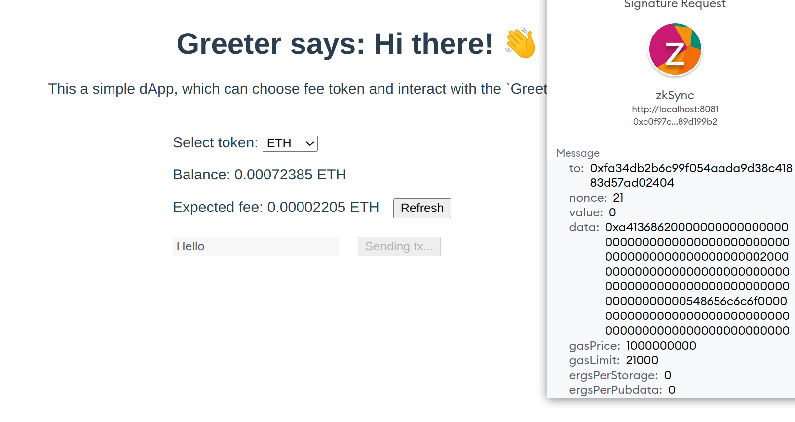

# Руководство Hello World!

Это руководство объясняет, как построить полноценный dApp, используя инструментарий zkSync.

Будет реализован следующий функционал:

* В смарт-контракте на zkSync будет содержаться приветствие.
* Пользователь сможет увидеть приветствие после загрузки страницы dApp.
* Пользователь сможет изменить текст приветствия в смарт-контракте.
* Пользователь сможет выбрать токен, который он желает использовать для комиссий. По умолчания руководство поддерживает только один токен: эфир. Пример оплаты комиссий с помощью токенов ERC20 будет продемонстрирован в этой [статье](rukovodstvo-hello-world.md#paying-fees-using-testnet-paymaster). Если вы решили строить проект в mainnet, вам стоит прочесть документацию к [paymaster](../ponimanie-zksync-2.0/vazhno-podderzhka-abstrakcii-akkaunta.md#paymasters), которого вы собираетесь использовать.\\

### Подготовка

Для целей этого руководства необходимо установить следующие программы:

* Менеджер пакетов `yarn` package manager. Примеры с `npm` будут добавлены позже.
* `Docker` для компиляции.
* Кошелек с достаточным количеством Görli `ETH` на L1 для платы за перенос средств на zkSync, а так же для развертывания контрактов. Нужно немного ERC20 токенов на zkSync для руководства testnet paymaster.

### Создание проекта и развертывание смарт-контракта <a href="#initializing-the-project-deploying-smart-contract" id="initializing-the-project-deploying-smart-contract"></a>

1. Создайте проект и установите все зависимости. Запустите следующие команды в терминале:

```
mkdir greeter-example
cd greeter-example
yarn init -y
yarn add -D typescript ts-node ethers zksync-web3 hardhat @matterlabs/hardhat-zksync-solc @matterlabs/hardhat-zksync-deploy
```

Пожалуйста, помните, на данный момент для плагинов zkSync необходим typescript.

1. Создайте файл `hardhat.config.ts` и вставьте в него следующий код:

```typescript
require("@matterlabs/hardhat-zksync-deploy");
require("@matterlabs/hardhat-zksync-solc");

module.exports = {
  zksolc: {
    version: "1.1.5",
    compilerSource: "docker",
    settings: {
      optimizer: {
        enabled: true,
      },
      experimental: {
        dockerImage: "matterlabs/zksolc",
        tag: "v1.1.5"
      },
    },
  },
  zkSyncDeploy: {
    zkSyncNetwork: "https://zksync2-testnet.zksync.dev",
    ethNetwork: "goerli", // Can also be the RPC URL of the network (e.g. `https://goerli.infura.io/v3/<API_KEY>`)
  },
  networks: {
    hardhat: {
      zksync: true,
    },
  },
  solidity: {
    version: "0.8.16",
  },
};
```


<mark style="color:orange;">**Подсказка**</mark>

<mark style="color:orange;">Если этот контракт уже был скомпилирован, вам нужно удалить артефакт и кэшированные папки, иначе контракт не скомпилируется в текущей версии компилятора</mark>


Чтобы узнать, как верифицировать ваш смарт-контракт, используя обозреватель блоков zkSync, нажмите [сюда](verifikaciya-kontrakta.md).

3\. Создайте папки `contracts` и `deploy`. Первая - это место, где должны храниться все контракты формата `*.sol`, а во вторую будут помещаться все скрипты, связанные с развертыванием контракта в сети.

4\. Создайте контракт `contracts/Greeter.sol` вставьте в него следующий код:

```solidity
//SPDX-License-Identifier: Unlicense
pragma solidity ^0.8.0;

contract Greeter {
    string private greeting;

    constructor(string memory _greeting) {
        greeting = _greeting;
    }

    function greet() public view returns (string memory) {
        return greeting;
    }

    function setGreeting(string memory _greeting) public {
        greeting = _greeting;
    }
}
```

5\. Скомпилируйте контракты с помощью следующей команды

```
yarn hardhat compile
```

6\. Создайте скрипт для развертывания в `deploy/deploy.ts`

```typescript
import { Wallet, Provider, utils } from "zksync-web3";
import * as ethers from "ethers";
import { HardhatRuntimeEnvironment } from "hardhat/types";
import { Deployer } from "@matterlabs/hardhat-zksync-deploy";

// An example of a deploy script that will deploy and call a simple contract.
export default async function (hre: HardhatRuntimeEnvironment) {
  console.log(`Running deploy script for the Greeter contract`);

  // Initialize the wallet.
  const provider = new Provider(hre.userConfig.zkSyncDeploy?.zkSyncNetwork);
  const wallet = new Wallet("<WALLET-PRIVATE-KEY>");
  
  // Create deployer object and load the artifact of the contract you want to deploy.
  const deployer = new Deployer(hre, wallet);
  const artifact = await deployer.loadArtifact("Greeter");

  // Estimate contract deployment fee
  const greeting = "Hi there!";
  const deploymentFee = await deployer.estimateDeployFee(artifact, [greeting]);

  // Deposit funds to L2
  const depositHandle = await deployer.zkWallet.deposit({
    to: deployer.zkWallet.address,
    token: utils.ETH_ADDRESS,
    amount: deploymentFee.mul(2),
  });
  // Wait until the deposit is processed on zkSync
  await depositHandle.wait();

  // Deploy this contract. The returned object will be of a `Contract` type, similarly to ones in `ethers`.
  // `greeting` is an argument for contract constructor.
  const parsedFee = ethers.utils.formatEther(deploymentFee.toString());
  console.log(`The deployment is estimated to cost ${parsedFee} ETH`);

  const greeterContract = await deployer.deploy(artifact, [greeting]);

  //obtain the Constructor Arguments
console.log("constructor args:" + greeterContract.interface.encodeDeploy([greeting]));

  // Show the contract info.
  const contractAddress = greeterContract.address;
  console.log(`${artifact.contractName} was deployed to ${contractAddress}`);
}
```

7\. После замены текста `WALLET-PRIVATE-KEY` приватным ключом кошелька Эфириума с добавлением префикса `0x`, запустите скрипт следующей командой:

```
yarn hardhat deploy-zksync
```

В качестве вывода вы должны увидеть адрес, где был развернут смарт-контракт.

### Интеграция фронтенда <a href="#front-end-integration" id="front-end-integration"></a>

#### Установка проекта <a href="#setting-up-the-project" id="setting-up-the-project"></a>

В этом руководстве будет использован `Vue` в качестве веб-фреймворка, однако процесс будет примерно одинаковым вне зависимости от выбранного фреймворка. Для фокусировки на особенностях использования `zksync-web3` SDK, примеры приводятся с уже выполненной работой по фронденду. Финальным шагом будет взаимодействие с контрактом zkSync.

1. Клонируйте это:

```
git clone https://github.com/matter-labs/greeter-tutorial-starter
```

2\. Активируйте проект:

```
cd greeter-tutorial-starter
yarn
yarn serve
```

По умолчанию, страница должна работать на `http://localhost:8080`. Открой этот адрес в браузере, чтобы увидеть эту страницу.

#### Подключение к Metamask и перенос токенов на zkSync. <a href="#connecting-to-metamask-bridging-tokens-to-zksync" id="connecting-to-metamask-bridging-tokens-to-zksync"></a>

Чтобы взаимодействовать с приложениями, построенными на zkSync, подключите Metamask к сети zkSync alpha testnet и перенесите немного средств на L2.

* [Руководство ](../testnet/podklyuchenie-metamask.md)по подключению Metamask.
* Используйте наш [портал ](https://portal.zksync.io/)для переноса средств на zkSync.

#### Структура проекта <a href="#project-structure" id="project-structure"></a>

Весь код будет записан в `./src/App.vue`. Весь фронтент код уже завершен; единственное, что осталось сделать, это заполнить пробелы вместо "TODO" касательно взаимодействия с zkSync:

```javascript
initializeProviderAndSigner() {
  // TODO: initialize provider and signer based on `window.ethereum`
},

async getGreeting() {
  // TODO: return the current greeting
  return "";
},

async getFee() {
  // TOOD: return formatted fee
  return "";
},

async getBalance() {
  // Return formatted balance
  return "";
},
async getOverrides() {
  if (this.selectedToken.l1Address != ETH_L1_ADDRESS) {
    // TODO: Return data for the paymaster
  }

  return {};
},
async changeGreeting() {
  this.txStatus = 1;
  try {
    // TODO: Submit the transaction
    this.txStatus = 2;
    // TODO: Wait for transaction compilation
    this.txStatus = 3;
    // Update greeting
    this.greeting = await this.getGreeting();
    this.retreivingFee = true;
    this.retreivingBalance = true;
    // Update balance and fee
    this.currentBalance = await this.getBalance();
    this.currentFee = await this.getFee();
  } catch (e) {
    alert(JSON.stringify(e));
  }
  this.txStatus = 0;
  this.retreivingFee = false;
  this.retreivingBalance = false;
},
```

На верху тега `<script>` вы можете увидеть элементы, которые нужно заполнить адресом развернутого контракта `Greeter` и путь к его ABI. Давайте заполним эти поля в следующих секциях.

```javascript
// eslint-disable-next-line
const GREETER_CONTRACT_ADDRESS = ""; // TODO: insert the Greeter contract address here
// eslint-disable-next-line
const GREETER_CONTRACT_ABI = []; // TODO: insert the path to the Greeter contract ABI here
```

Добавьте импорты над этими константами. Заголовок тега `<script>` будет выглядеть следующим образом:

```javascript
import {} from "zksync-web3";
import {} from "ethers";

// eslint-disable-next-line
const GREETER_CONTRACT_ADDRESS = ""; // TODO: insert the Greeter contract address here
// eslint-disable-next-line
const GREETER_CONTRACT_ABI = []; // TODO: insert the path to the Greeter contract ABI here
```

#### Установка `zksync-web3` <a href="#installing-zksync-web3" id="installing-zksync-web3"></a>

Запустите следующие команды для установки`zksync-web3` и `ethers`:

```
yarn add ethers zksync-web3
```

#### Получение ABI и адреса контракта <a href="#getting-the-abi-and-contract-address" id="getting-the-abi-and-contract-address"></a>

Откройте `./src/App.vue` и установите константу `GREETER_CONTRACT_ADDRESS` равной адресу, где контракт greeter был развернут.

Для взаимодействия с контрактом zkSync так же нужен его ABI.

* Создайте файл `./src/abi.json` .
* Вы можете достать ABI контракта в папке проекта hardhat из предыдущей секции руководства в файле `./artifacts-zk/contracts/Greeter.sol/Greeter.json`. Вам нужно скопировать массив `abi` и вставить его в файл `abi.json`, созданный шагом ранее. Файл должен выглядеть примерно так:

```json
[
  {
    "inputs": [
      {
        "internalType": "string",
        "name": "_greeting",
        "type": "string"
      }
    ],
    "stateMutability": "nonpayable",
    "type": "constructor"
  },
  {
    "inputs": [],
    "name": "greet",
    "outputs": [
      {
        "internalType": "string",
        "name": "",
        "type": "string"
      }
    ],
    "stateMutability": "view",
    "type": "function"
  },
  {
    "inputs": [
      {
        "internalType": "string",
        "name": "_greeting",
        "type": "string"
      }
    ],
    "name": "setGreeting",
    "outputs": [],
    "stateMutability": "nonpayable",
    "type": "function"
  }
]
```

Установите `GREETER_CONTRACT_ABI` на запрос файла ABI:

```javascript
// eslint-disable-next-line
const GREETER_CONTRACT_ADDRESS = "0x...";
// eslint-disable-next-line
const GREETER_CONTRACT_ABI = require("./abi.json");
```

#### Работа с провайдером <a href="#working-with-provider" id="working-with-provider"></a>

1. Перейдите к методу `initializeProviderAndSigner` в `./src/App.vue`. Этот метод вызывается после успешного подключения к Metamask.

В этом методе нам нужно:

* Инициализировать объекты `Web3Provider` и `Signer` для взаимодействия с zkSync.
* Инициализировать объект `Contract` для взаимодействия с контрактом `Greeter`.

2\. Добавьте необходимые зависимости:

```javascript
import { Contract, Web3Provider, Provider } from "zksync-web3";
```

3\. Эти два шага могут быть выполнены в следующем виде:

```javascript
initializeProviderAndSigner() {
    this.provider = new Provider('https://zksync2-testnet.zksync.dev');
    // Note that we still need to get the Metamask signer
    this.signer = (new Web3Provider(window.ethereum)).getSigner();
    this.contract = new Contract(
        GREETER_CONTRACT_ADDRESS,
        GREETER_CONTRACT_ABI,
        this.signer
    );
},
```

#### Извлечение приветствия. <a href="#retrieving-the-greeting" id="retrieving-the-greeting"></a>

1.  Заполните метод, извлекающий приветствие из смарт-контракта:

    ```javascript
    async getGreeting() {
        // Smart contract calls work the same way as in `ethers`
        return await this.contract.greet();
    }
    ```

Полные методы теперь выглядят так:

```javascript
initializeProviderAndSigner() {
    this.provider = new Provider('https://zksync2-testnet.zksync.dev');
    // Note that we still need to get the Metamask signer
    this.signer = (new Web3Provider(window.ethereum)).getSigner();
    this.contract = new Contract(
        GREETER_CONTRACT_ADDRESS,
        GREETER_CONTRACT_ABI,
        this.signer
    );
},
async getGreeting() {
    return await this.contract.greet();
},
```

После подключения Metamask должна быть видна следующая страница:

<figure><figcaption></figcaption></figure>

Теперь можно выбрать токен для оплаты комиссий. Однако баланс не обновляется, _пока._

#### Извлечение баланса токенов и транзакционных комиссий <a href="#retrieving-token-balance-and-transaction-fee" id="retrieving-token-balance-and-transaction-fee"></a>

Наилегчайшим способом выяснения баланса пользователя явлеятся использование метода `Signer.getBalance.`

1. Добавьте необходимые зависимости:

```javascript
// `ethers` используется в этом рукодостве только из-за его утилитарных функций
import { ethers } from "ethers";
```

2\. Реализуйте сам метод:

```javascript
async getBalance() {
    // Getting the balance for the signer in the selected token
    const balanceInUnits = await this.signer.getBalance(this.selectedToken.l2Address);
    // To display the number of tokens in the human-readable format, we need to format them,
    // e.g. if balanceInUnits returns 500000000000000000 wei of ETH, we want to display 0.5 ETH the user
    return ethers.utils.formatUnits(balanceInUnits, this.selectedToken.decimals);
},
```

3\. Расчитайте комиссию:

```javascript
async getFee() {
    // Getting the amount of gas (ergs) needed for one transaction
    const feeInGas = await this.contract.estimateGas.setGreeting(this.newGreeting);
    // Getting the gas price per one erg. For now, it is the same for all tokens.
    const gasPriceInUnits = await this.provider.getGasPrice();

    // To display the number of tokens in the human-readable format, we need to format them,
    // e.g. if feeInGas*gasPriceInUnits returns 500000000000000000 wei of ETH, we want to display 0.5 ETH the user
    return ethers.utils.formatUnits(feeInGas.mul(gasPriceInUnits), this.selectedToken.decimals);
},
```


**Оплата комиссий в ERC20**

zkSync 2.0 нативно не поддерживает оплату комиссий в токенах ERC20, так как функция абстракции аккаунта позволяет делать это. Пример использования testnet paymaster для этих целей будет представлен далее в этом руководстве. Однако, работая в mainnet, [вы должны сами](rukovodstvo-razrabotka-kastomnogo-paymaster.md) предоставлять услуги paymaster'a, или использовать paymaster'a, предоставленного 3им лицом.


При открытии страницы и выборе токена для комиссий будут доступны баланс и ожидаемая комиссия за транзакцию.

Кнопка `Refresh` используется для перерасчета комиссии, так как она может зависеть от устанавливаемой длины строки.

Также можно нажать на кнопку `Change greeting,` но ничего не произойдет, так как контракт еще не был вызыван.

<figure><figcaption></figcaption></figure>

#### Изменение приветствия

1. Взаимодействие со смарт-контрактом работает абсолютно так же, как `ethers`, хотя, если вы хотите использовать спец-функции zkSync, вам может понадобиться внесение дополнительных параметров в overrides (переопределения)va:

```javascript
// The example of paying fees using a paymaster will be shown in the 
// section below.
const txHandle = await this.contract.setGreeting(this.newGreeting, await this.getOverrides());
```

2\. Подождите, пока транзакция обработается:

```javascript
await txHandle.wait();
```

Полностью метод выглядит так:

```javascript
async changeGreeting() {
    this.txStatus = 1;
    try {
        const txHandle = await this.contract.setGreeting(this.newGreeting, await this.getOverrides());

        this.txStatus = 2;

        // Wait until the transaction is committed
        await txHandle.wait();
        this.txStatus = 3;

        // Update greeting
        this.greeting = await this.getGreeting();

        this.retreivingFee = true;
        this.retreivingBalance = true;
        // Update balance and fee
        this.currentBalance = await this.getBalance();
        this.currentFee = await this.getFee();
    } catch (e) {
        alert(JSON.stringify(e));
    }

    this.txStatus = 0;
    this.retreivingFee = false;
    this.retreivingBalance = false;
},
```

Теперь у вас есть полноценное приложение-приветствователь! Однако же, он не утилизирует каких-либо zkSync-специфичных функций.

#### Оплата комиссий с использованием testnet paymaster <a href="#paying-fees-using-testnet-paymaster" id="paying-fees-using-testnet-paymaster"></a>

Хоть эфир и является единственным токеном, которым вы можете оплачивать комиссии, функция абстракции аккаунта позволяет вам интегрировать [paymaster](../ponimanie-zksync-2.0/vazhno-podderzhka-abstrakcii-akkaunta.md#paymasters)'ов, которые могут или полностью оплачивать комиссии за вас, или обменивать ваши токены на лету. В этом руководстве мы будет использовать [testnet paymaster](../ponimanie-zksync-2.0/vazhno-podderzhka-abstrakcii-akkaunta.md#testnet-paymaster)'a, который предоставляется на всех тестнетах zkSync. Он позволяет пользователям оплачивать комиссии в ERC20 токенах по курсу обмена 1:1 к эфиру, то есть одна единица токена за один wei ETH.


**Интеграция в Mainnet**

Testnet paymaster работает исключительно в целях демонстрации возможностей и не будет доступен в mainnet. При интеграций в свой протокол в mainnet вам нужно следовать документации к paymaster, которого вы используете.


Адрес paymaster'a, наряду с требуемыми данными, должен быть предоставлен в метод `getOverrides`

1. Нам нужно извлечь адрес testnet paymaster'a:

```javascript
async getOverrides() {
  if (this.selectedToken.l1Address != ETH_L1_ADDRESS) {
    const testnetPaymaster = await this.provider.getTestnetPaymasterAddress();

    // ..
  }

  return {};
}
```

Имейте в виду, что извлекать адрес testnet paymaster'a рекомендуется каждый раз перед каждым взаимодействием, так как он (адрес) может меняться.

2\. Добавьте `utils` к импортам из `zksync-web3` SDK:

```javascript
import { Contract, Web3Provider, Provider, utils } from "zksync-web3";
```

3\. Нам нужно расчитать, как много токенов необходимо для проведения транзакции. Т.к. testnet paymaster обменивает любой токен ERC20 по курсу 1:1 к ETH, то сумма будет такой же, как и сумма в ETH.

```javascript
async getOverrides() {
  if (this.selectedToken.l1Address != ETH_L1_ADDRESS) {
    const testnetPaymaster = await this.provider.getTestnetPaymasterAddress();

    const gasPrice = await this.provider.getGasPrice();
    const gasLimit = await this.contract.estimateGas.setGreeting(this.newGreeting);
    const fee = gasPrice.mul(gasLimit);

    // ..
  }

  return {};
}
```

4\. Теперь на осталось закодировать `paymasterInput` по [требованиям протокола](../ponimanie-zksync-2.0/vazhno-podderzhka-abstrakcii-akkaunta.md#testnet-paymaster) и вернуть нужные overrides (переопределения).

```javascript
async getOverrides() {
  if (this.selectedToken.l1Address != ETH_L1_ADDRESS) {
    const testnetPaymaster = await this.provider.getTestnetPaymasterAddress();

    const gasPrice = await this.provider.getGasPrice();
    const gasLimit = await this.contract.estimateGas.setGreeting(this.newGreeting);
    const fee = gasPrice.mul(gasLimit);

    const paymasterParams = utils.getPaymasterParams(testnetPaymaster, {
        type: 'ApprovalBased',
        token: this.selectedToken.l2Address,
        minimalAllowance: fee,
        innerInput: new Uint8Array()
    });
    
    return {
        maxFeePerGas: gasPrice,
        maxPriorityFeePerGas: ethers.BigNumber.from(0),
        gasLimit,
        customData: {
            ergsPerPubdata: utils.DEFAULT_ERGS_PER_PUBDATA_LIMIT,
            paymasterParams
        }
    };
  }

  return {};
}
```

4\. Используйте список токенов ERC20s. Измените следующую строку:

```javascript
const allowedTokens = require("./eth.json");
```

на эту:

```javascript
const allowedTokens = require("./erc20.json");
```

#### Законченное приложение <a href="#complete-app" id="complete-app"></a>

Теперь приветствие должно быть изменяемым.

1. Введите новое приветствие в поле для вводе и кликните на кнопку `Change greeting`:

<figure><figcaption></figcaption></figure>

2\. Так как параметры `paymasterParams` были предоставлены, отправляемая транзакция будет типа`EIP712` :

\\

<figure><figcaption></figcaption></figure>

3\. Нажмите "Sign".

После подтверждения транзакции страница обновится и можно будет увидеть обновленные баланс и приветствие:

<figure><figcaption></figcaption></figure>

#### Узнайте больше <a href="#learn-more" id="learn-more"></a>

* Для дополнительной информации о `zksync-web3` SDK, посмотрите эту [документацию](https://v2-docs.zksync.io/api/js).
* Для дополнительной информации о hardhat плагинах zkSync посмотрите эту [документацию](https://v2-docs.zksync.io/api/hardhat).
