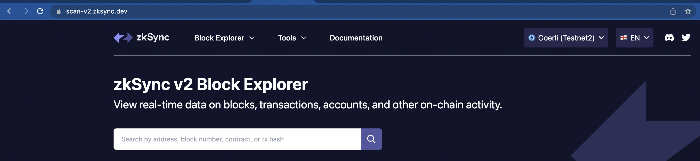

# The search bar

## Overview
Our user-friendly search tool gives you easy access to data from multiple search points and provides a more intuitive understanding of what you are searching for.

The main search bar is where you can look up something specific right away. You can search by:
‍
1. Block number: The number of the desired block for inspection. For example, enter `0` to see the contents of the chain’s genesis block. 
2. Transaction hash/ID: The ID of a specific transaction. A transaction implies that byte code has been executed by the EVM. These include deployments of smart contracts and subsequent invocations.
3. Wallet address: The wallet address of a sender or a receiver of a token.
4. Contract address: The callable address of an Ethereum smart contract deployed on zkSync.

One common use case that you can try on the block explorer is checking on the status of a transaction. This can be done by copying and pasting the transaction ID into the search bar. Users can also confirm whether the cryptocurrency they are waiting on has arrived yet by pasting their wallet address into the search bar, other use cases include searching for a contract address that has been deployed on zkSync.

In terms of transactions, the block explorer will display the address and its most recent transactions, as well as all transactions that have been carried out to and from that address. Within a block, there can be thousands of approved transactions. However, if you are interested in the exact order of a transaction in comparison to another (in the same block), you can utilize other indicators such as the transaction amount, and the payment’s timestamp to point you to the correct transactions.